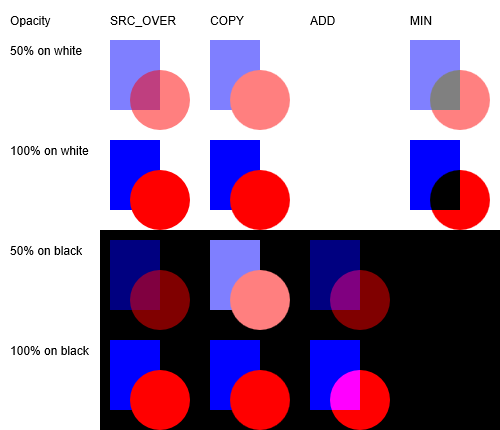

# ID2D1CommandSink1::SetPrimitiveBlend1 method

Sets a new primitive blend mode.

## Syntax


```C++
HRESULT SetPrimitiveBlend1(
   D2D1_PRIMITIVE_BLEND primitiveBlend
);
```


## Parameters

<dl> <dt>

*primitiveBlend* 
</dt> <dd>

Type: **[**D2D1\_PRIMITIVE\_BLEND**](/windows/desktop/api/D2d1_1/ne-d2d1_1-d2d1_primitive_blend)**

The primitive blend that will apply to subsequent primitives.

</dd> </dl>

## Return value

Type: **HRESULT**

If the method succeeds, it returns **S\_OK**. If it fails, it returns an **HRESULT** error code.

## Remarks

### Blend modes

For aliased rendering (except for MIN mode), the output value O is computed by linearly interpolating the value *blend(S, D)* with the destination pixel value, based on the amount that the primitive covers the destination pixel.

The table here shows the primitive blend modes for both aliased and antialiased blending. The equations listed in the table use these elements:

-   O = Output
-   S = Source
-   SA = Source Alpha
-   D = Destination
-   DA = Destination Alpha
-   C = Pixel coverage


| Primitive blend mode                 | Aliased blending                            | Antialiased blending            | Description                                                                                                              |
|--------------------------------------|---------------------------------------------|---------------------------------|--------------------------------------------------------------------------------------------------------------------------|
| D2D1\_PRIMITIVE\_BLEND\_SOURCE\_OVER | O = (S + (1   SA) \* D) \* C + D \* (1   C) | O = S \* C + D \*(1   SA \*C)   | The standard source-over-destination blend mode.                                                                         |
| D2D1\_PRIMITIVE\_BLEND\_COPY         | O = S \* C + D \* (1   C)                   | O = S \* C + D \* (1   C)       | The source is copied to the destination; the destination pixels are ignored.                                             |
| D2D1\_PRIMITIVE\_BLEND\_MIN          | O = Min(S + 1-SA, D)                        | O = Min(S \* C + 1   SA \*C, D) | The resulting pixel values use the minimum of the source and destination pixel values. Available in Windows 8 and later. |
| D2D1\_PRIMITIVE\_BLEND\_ADD          | O = (S + D) \* C + D \* (1   C)             | O = S \* C + D                  | The resulting pixel values are the sum of the source and destination pixel values. Available in Windows 8 and later.     |


 



An illustration of the primitive blend modes with varying opacity and backgrounds.

The primitive blend will apply to all of the primitive drawn on the context, unless this is overridden with the *compositeMode* parameter on the [**DrawImage**](/windows/win32/api/d2d1_1/nf-d2d1_1-id2d1devicecontext-drawimage(id2d1image_constd2d1_point_2f_constd2d1_rect_f_d2d1_interpolation_mode_d2d1_composite_mode)) API.

The primitive blend applies to the interior of any primitives drawn on the context. In the case of [**DrawImage**](/windows/win32/api/d2d1_1/nf-d2d1_1-id2d1devicecontext-drawimage(id2d1image_constd2d1_point_2f_constd2d1_rect_f_d2d1_interpolation_mode_d2d1_composite_mode)), this will be implied by the image rectangle, offset and world transform.

If the primitive blend is anything other than **D2D1\_PRIMITIVE\_BLEND\_OVER** then ClearType rendering will be turned off. If the application explicitly forces ClearType rendering in these modes, the drawing context will be placed in an error state. D2DERR\_WRONG\_STATE will be returned from either [**EndDraw**](/windows/win32/api/d2d1/nf-d2d1-id2d1rendertarget-enddraw) or [**Flush**](/windows/win32/api/d2d1/nf-d2d1-id2d1rendertarget-flush).

## Requirements


| Requirement | Value |
|-------------------------------------|-----------------------------------------------------------------------------------------|
| Minimum supported client<br/> | Windows 8.1 \[desktop apps \| UWP apps\]<br/>                                     |
| Minimum supported server<br/> | Windows Server 2012 R2 \[desktop apps \| UWP apps\]<br/>                          |
| Minimum supported phone<br/>  | Windows Phone 8.1 \[Windows Phone Silverlight 8.1 and Windows Runtime apps\]<br/> |


## See also

<dl> <dt>

[**ID2D1CommandSink1**](/windows/win32/api/d2d1_2/nn-d2d1_2-id2d1commandsink1)
</dt> </dl>

 

