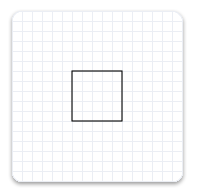
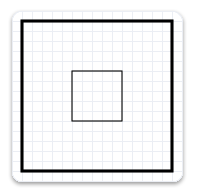

# ID2D1Factory::CreateTransformedGeometry methods

Transforms the specified geometry and stores the result as an [**ID2D1TransformedGeometry**](/previous-versions/windows/desktop/legacy/dd371304(v=vs.85)) object.

### Overload list


| Method                                                                                                                                                                                                                  | Description                                                                                                                                    |
|:------------------------------------------------------------------------------------------------------------------------------------------------------------------------------------------------------------------------|:-----------------------------------------------------------------------------------------------------------------------------------------------|
| [**CreateTransformedGeometry(ID2D1Geometry\*,D2D\_MATRIX\_3X2\_F\*,ID2D1TransformedGeometry\*\*)**](/previous-versions/windows/desktop/legacy/dd371304(v=vs.85)) | Transforms the specified geometry and stores the result as an [**ID2D1TransformedGeometry**](/previous-versions/windows/desktop/legacy/dd371304(v=vs.85)) object. <br/> |
| [**CreateTransformedGeometry(ID2D1Geometry\*,D2D\_MATRIX\_3X2\_F&,ID2D1TransformedGeometry\*\*)**](/windows/win32/api/d2d1/nf-d2d1-id2d1factory-createtransformedgeometry(id2d1geometry_constd2d1_matrix_3x2_f__id2d1transformedgeometry))  | Transforms the specified geometry and stores the result as an [**ID2D1TransformedGeometry**](/previous-versions/windows/desktop/legacy/dd371304(v=vs.85)) object. <br/> |


## Remarks

Like other resources, a transformed geometry inherits the resource space and threading policy of the factory that created it. This object is immutable.

When stroking a transformed geometry with the [**DrawGeometry**](/windows/win32/api/d2d1/nf-d2d1-id2d1rendertarget-drawgeometry) method, the stroke width is not affected by the transform applied to the geometry. The stroke width is only affected by the world transform.

## Examples

The following example creates an [**ID2D1RectangleGeometry**](/windows/win32/api/d2d1/nf-d2d1-id2d1factory-createrectanglegeometry(constd2d1_rect_f_id2d1rectanglegeometry)), then draws it without transforming it. It produces the output shown in the following illustration.




```C++
hr = m_pD2DFactory->CreateRectangleGeometry(
    D2D1::RectF(150.f, 150.f, 200.f, 200.f),
    &m_pRectangleGeometry
    );
```


The next example uses the render target to scale the geometry by a factor of 3, then draws it. The following illustration shows the result of drawing the rectangle without the transform and with the transform; notices that the stroke is thicker after the transform, even though the stroke thickness is 1.




```C++
// Transform the render target, then draw the rectangle geometry again.
m_pRenderTarget->SetTransform(
    D2D1::Matrix3x2F::Scale(
        D2D1::SizeF(3.f, 3.f),
        D2D1::Point2F(175.f, 175.f))
    );

m_pRenderTarget->DrawGeometry(m_pRectangleGeometry, m_pBlackBrush, 1);
```


The next example uses the **CreateTransformedGeometry** method to scale the geometry by a factor of 3, then draws it. It produces the output shown in the following illustration. Notice that, although the rectangle is larger, its stroke hasn't increased.


```C++
 // Create a geometry that is a scaled version
 // of m_pRectangleGeometry.
 // The new geometry is scaled by a factory of 3
 // from the center of the geometry, (35, 35).

 hr = m_pD2DFactory->CreateTransformedGeometry(
     m_pRectangleGeometry,
     D2D1::Matrix3x2F::Scale(
         D2D1::SizeF(3.f, 3.f),
         D2D1::Point2F(175.f, 175.f)),
     &m_pTransformedGeometry
     );


// Replace the previous render target transform.
m_pRenderTarget->SetTransform(D2D1::Matrix3x2F::Identity());

// Draw the transformed geometry.
m_pRenderTarget->DrawGeometry(m_pTransformedGeometry, m_pBlackBrush, 1);
```


## Requirements


| Requirement | Value |
|--------------------|-------------------------------------------------------------------------------------|
| Header<br/>  | <dl> <dt>D2d1.h</dt> </dl>   |
| Library<br/> | <dl> <dt>D2d1.lib</dt> </dl> |
| DLL<br/>     | <dl> <dt>D2d1.dll</dt> </dl> |


## See also

<dl> <dt>

[**ID2D1Factory**](/windows/win32/api/d2d1/nn-d2d1-id2d1factory)
</dt> </dl>
