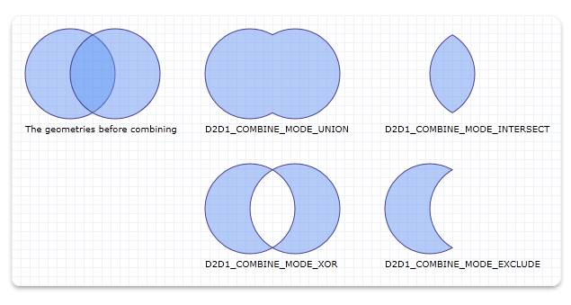

# ID2D1Geometry::CombineWithGeometry methods

Combines this geometry with the specified geometry and stores the result in an [**ID2D1SimplifiedGeometrySink**](/windows/win32/api/d2d1/nn-d2d1-id2d1simplifiedgeometrysink).

### Overload list


| Method                                                                                                                                                                                                                                                          | Description                                                                                                                                                    |
|:----------------------------------------------------------------------------------------------------------------------------------------------------------------------------------------------------------------------------------------------------------------|:---------------------------------------------------------------------------------------------------------------------------------------------------------------|
| [**CombineWithGeometry(ID2D1Geometry\*,D2D1\_COMBINE\_MODE,D2D1\_MATRIX\_3X2\_F&,ID2D1SimplifiedGeometrySink\*)**](/windows/win32/api/d2d1/nf-d2d1-id2d1geometry-combinewithgeometry(id2d1geometry_d2d1_combine_mode_constd2d1_matrix_3x2_f__id2d1simplifiedgeometrysink))              | Combines this geometry with the specified geometry and stores the result in an [**ID2D1SimplifiedGeometrySink**](/windows/win32/api/d2d1/nn-d2d1-id2d1simplifiedgeometrysink).<br/>  |
| [**CombineWithGeometry(ID2D1Geometry\*,D2D1\_COMBINE\_MODE,D2D1\_MATRIX\_3X2\_F\*,ID2D1SimplifiedGeometrySink\*)**](/windows/win32/api/d2d1/nf-d2d1-id2d1geometry-combinewithgeometry(id2d1geometry_d2d1_combine_mode_constd2d1_matrix_3x2_f_id2d1simplifiedgeometrysink))             | Combines this geometry with the specified geometry and stores the result in an [**ID2D1SimplifiedGeometrySink**](/windows/win32/api/d2d1/nn-d2d1-id2d1simplifiedgeometrysink).<br/>  |
| [**CombineWithGeometry(ID2D1Geometry\*,D2D1\_COMBINE\_MODE,D2D1\_MATRIX\_3X2\_F&,FLOAT,ID2D1SimplifiedGeometrySink\*)**](/windows/win32/api/d2d1/nf-d2d1-id2d1geometry-combinewithgeometry(id2d1geometry_d2d1_combine_mode_constd2d1_matrix_3x2_f__float_id2d1simplifiedgeometrysink))  | Combines this geometry with the specified geometry and stores the result in an [**ID2D1SimplifiedGeometrySink**](/windows/win32/api/d2d1/nn-d2d1-id2d1simplifiedgeometrysink).<br/>  |
| [**CombineWithGeometry(ID2D1Geometry\*,D2D1\_COMBINE\_MODE,D2D1\_MATRIX\_3X2\_F\*,FLOAT,ID2D1SimplifiedGeometrySink\*)**](/windows/win32/api/d2d1/nf-d2d1-id2d1geometry-combinewithgeometry(id2d1geometry_d2d1_combine_mode_constd2d1_matrix_3x2_f_float_id2d1simplifiedgeometrysink)) | Combines this geometry with the specified geometry and stores the result in an [**ID2D1SimplifiedGeometrySink**](/windows/win32/api/d2d1/nn-d2d1-id2d1simplifiedgeometrysink). <br/> |


## Examples

The following code uses each of the different combine modes to combine two [**ID2D1EllipseGeometry**](/windows/win32/api/d2d1/nn-d2d1-id2d1ellipsegeometry) objects.


```C++
HRESULT DemoApp::CreateGeometryResources()
{
    HRESULT hr = S_OK;
    ID2D1GeometrySink *pGeometrySink = NULL;

    // Create the first ellipse geometry to merge.
    const D2D1_ELLIPSE circle1 = D2D1::Ellipse(
        D2D1::Point2F(75.0f, 75.0f),
        50.0f,
        50.0f
        );

    hr = m_pD2DFactory->CreateEllipseGeometry(
        circle1,
        &m_pCircleGeometry1
        );

    if (SUCCEEDED(hr))
    {
        // Create the second ellipse geometry to merge.
        const D2D1_ELLIPSE circle2 = D2D1::Ellipse(
            D2D1::Point2F(125.0f, 75.0f),
            50.0f,
            50.0f
            );

        hr = m_pD2DFactory->CreateEllipseGeometry(circle2, &m_pCircleGeometry2);
    }


    if (SUCCEEDED(hr))
    {
        //
        // Use D2D1_COMBINE_MODE_UNION to combine the geometries.
        //
        hr = m_pD2DFactory->CreatePathGeometry(&m_pPathGeometryUnion);

        if (SUCCEEDED(hr))
        {
            hr = m_pPathGeometryUnion->Open(&pGeometrySink);

            if (SUCCEEDED(hr))
            {
                hr = m_pCircleGeometry1->CombineWithGeometry(
                    m_pCircleGeometry2,
                    D2D1_COMBINE_MODE_UNION,
                    NULL,
                    NULL,
                    pGeometrySink
                    );
            }

            if (SUCCEEDED(hr))
            {
                hr = pGeometrySink->Close();
            }

            SafeRelease(&pGeometrySink);
        }
    }

    if (SUCCEEDED(hr))
    {
        //
        // Use D2D1_COMBINE_MODE_INTERSECT to combine the geometries.
        //
        hr = m_pD2DFactory->CreatePathGeometry(&m_pPathGeometryIntersect);

        if (SUCCEEDED(hr))
        {
            hr = m_pPathGeometryIntersect->Open(&pGeometrySink);

            if (SUCCEEDED(hr))
            {
                hr = m_pCircleGeometry1->CombineWithGeometry(
                    m_pCircleGeometry2,
                    D2D1_COMBINE_MODE_INTERSECT,
                    NULL,
                    NULL,
                    pGeometrySink
                    );
            }

            if (SUCCEEDED(hr))
            {
                hr = pGeometrySink->Close();
            }

            SafeRelease(&pGeometrySink);
        }
    }

    if (SUCCEEDED(hr))
    {
        //
        // Use D2D1_COMBINE_MODE_XOR to combine the geometries.
        //
        hr = m_pD2DFactory->CreatePathGeometry(&m_pPathGeometryXOR);

        if (SUCCEEDED(hr))
        {
            hr = m_pPathGeometryXOR->Open(&pGeometrySink);

            if (SUCCEEDED(hr))
            {
                hr = m_pCircleGeometry1->CombineWithGeometry(
                    m_pCircleGeometry2,
                    D2D1_COMBINE_MODE_XOR,
                    NULL,
                    NULL,
                    pGeometrySink
                    );
            }

            if (SUCCEEDED(hr))
            {
                hr = pGeometrySink->Close();
            }

            SafeRelease(&pGeometrySink);
        }
    }

    if (SUCCEEDED(hr))
    {
        //
        // Use D2D1_COMBINE_MODE_EXCLUDE to combine the geometries.
        //
        hr = m_pD2DFactory->CreatePathGeometry(&m_pPathGeometryExclude);

        if (SUCCEEDED(hr))
        {
            hr = m_pPathGeometryExclude->Open(&pGeometrySink);

            if (SUCCEEDED(hr))
            {
                hr = m_pCircleGeometry1->CombineWithGeometry(
                    m_pCircleGeometry2,
                    D2D1_COMBINE_MODE_EXCLUDE,
                    NULL,
                    NULL,
                    pGeometrySink
                    );
            }

            if (SUCCEEDED(hr))
            {
                hr = pGeometrySink->Close();
            }

            SafeRelease(&pGeometrySink);
        }
    }

    return hr;
}
```


This code produces the output shown in the following illustration.



## Requirements


| Requirement | Value |
|--------------------|-------------------------------------------------------------------------------------|
| Library<br/> | <dl> <dt>D2d1.lib</dt> </dl> |
| DLL<br/>     | <dl> <dt>D2d1.dll</dt> </dl> |


## See also

<dl> <dt>

[**ID2D1Geometry**](/windows/win32/api/d2d1/nn-d2d1-id2d1geometry)
</dt> </dl>

 

