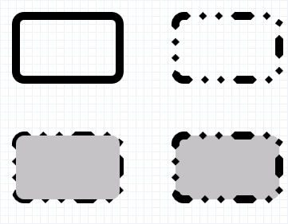

# ID2D1RenderTarget::FillRoundedRectangle methods

Paints the interior of the specified rounded rectangle.

### Overload list


| Method                                                                                                                                          | Description                                                         |
|:------------------------------------------------------------------------------------------------------------------------------------------------|:--------------------------------------------------------------------|
| [**FillRoundedRectangle(D2D1\_ROUNDED\_RECT&,ID2D1Brush\*)**](/windows/win32/api/d2d1/nf-d2d1-id2d1rendertarget-fillroundedrectangle(constd2d1_rounded_rect__id2d1brush))  | Paints the interior of the specified rounded rectangle. <br/> |
| [**FillRoundedRectangle(D2D1\_ROUNDED\_RECT\*,ID2D1Brush\*)**](/windows/win32/api/d2d1/nf-d2d1-id2d1rendertarget-fillroundedrectangle(constd2d1_rounded_rect__id2d1brush)) | Paints the interior of the specified rounded rectangle.<br/>  |


## Remarks

This method doesn't return an error code if it fails. To determine whether a drawing operation (such as **FillRoundedRectangle**) failed, check the result returned by the [**ID2D1RenderTarget::EndDraw**](/windows/win32/api/d2d1/nf-d2d1-id2d1rendertarget-enddraw) or [**ID2D1RenderTarget::Flush**](/windows/win32/api/d2d1/nf-d2d1-id2d1rendertarget-flush) methods.

## Examples

The following example uses the [**DrawRoundedRectangle**](id2d1rendertarget-drawroundedrectangle.md) and **FillRoundedRectangle** methods to outline and fill a rounded rectangle. This example produces the output shown in the following illustration.




```C++
//  Called whenever the application needs to display the client
//  window.
HRESULT DrawAndFillRoundedRectangleExample::OnRender()
{
    HRESULT hr;

    // Create the render target and brushes if they
    // don't already exists.
    hr = CreateDeviceResources();

    if (SUCCEEDED(hr))
    {
        // Retrieve the size of the render target.
        D2D1_SIZE_F renderTargetSize = m_pRenderTarget->GetSize();

        m_pRenderTarget->BeginDraw();
        m_pRenderTarget->SetTransform(D2D1::Matrix3x2F::Identity());
        m_pRenderTarget->Clear(D2D1::ColorF(D2D1::ColorF::White));

        // Paint a grid background.
        m_pRenderTarget->FillRectangle(
            D2D1::RectF(0.0f, 0.0f, renderTargetSize.width, renderTargetSize.height),
            m_pGridPatternBitmapBrush
            );

        // Define a rounded rectangle.
        D2D1_ROUNDED_RECT roundedRect = D2D1::RoundedRect(
            D2D1::RectF(20.f, 20.f, 150.f, 100.f),
            10.f,
            10.f
            );

        // Draw the rectangle.
        m_pRenderTarget->DrawRoundedRectangle(roundedRect, m_pBlackBrush, 10.f);

        // Apply a translation transform.
        m_pRenderTarget->SetTransform(D2D1::Matrix3x2F::Translation(200.f, 0.f));

        // Draw the rounded rectangle again, this time with a dashed stroke.
        m_pRenderTarget->DrawRoundedRectangle(roundedRect, m_pBlackBrush, 10.f, m_pStrokeStyle);

        // Apply another translation transform.
        m_pRenderTarget->SetTransform(D2D1::Matrix3x2F::Translation(0.f, 150.f));

        // Draw, then fill the rounded rectangle.
        m_pRenderTarget->DrawRoundedRectangle(roundedRect, m_pBlackBrush, 10.f, m_pStrokeStyle);
        m_pRenderTarget->FillRoundedRectangle(roundedRect, m_pSilverBrush);

        // Apply another translation transform.
        m_pRenderTarget->SetTransform(D2D1::Matrix3x2F::Translation(200.f, 150.f));

        // Fill, then draw the rounded rectangle.
        m_pRenderTarget->FillRoundedRectangle(roundedRect, m_pSilverBrush);
        m_pRenderTarget->DrawRoundedRectangle(roundedRect, m_pBlackBrush, 10.f, m_pStrokeStyle);

        hr = m_pRenderTarget->EndDraw();

        if (hr == D2DERR_RECREATE_TARGET)
        {
            hr = S_OK;
            DiscardDeviceResources();
        }
    }

    return hr;
}
```


## Requirements


| Requirement | Value |
|--------------------|-------------------------------------------------------------------------------------|
| Header<br/>  | <dl> <dt>D2d1.h</dt> </dl>   |
| Library<br/> | <dl> <dt>D2d1.lib</dt> </dl> |
| DLL<br/>     | <dl> <dt>D2d1.dll</dt> </dl> |


## See also

<dl> <dt>

[**ID2D1RenderTarget**](/windows/win32/api/d2d1/nn-d2d1-id2d1rendertarget)
</dt> <dt>

[How to Draw and Fill a Basic Shape](how-to-draw-an-ellipse.md)
</dt> <dt>

[**D2D1::RoundedRect**](/windows/win32/api/d2d1/nf-d2d1-id2d1roundedrectanglegeometry-getroundedrect)
</dt> </dl>

�

�
