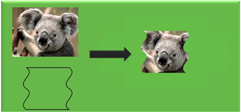

# Improving the performance of Direct2D apps

Although [Direct2D](./direct2d-portal.md) is hardware accelerated and is meant for high performance, you must use the features correctly to maximize throughput. The techniques we show here are derived from studying common scenarios and might not apply to all app scenarios. Therefore, careful understanding of app behavior and performance goals can help achieve the results that you want.

-   [Resource usage](#resource-usage)
    -   [Reuse resources](#reuse-resources)
-   [Restrict the use of flush](#restrict-the-use-of-flush)
-   [Bitmaps](#create-large-bitmaps)
    -   [Create large bitmaps](#create-large-bitmaps)
    -   [Create an atlas of bitmaps](#create-an-atlas-of-bitmaps)
    -   [Create shared bitmaps](#create-shared-bitmaps)
    -   [Copying bitmaps](#copying-bitmaps)
-   [Use tiled bitmap over dashing](#use-tiled-bitmap-over-dashing)
-   [General guidelines for rendering complex static content](#general-guidelines-for-rendering-complex-static-content)
    -   [Full scene caching using a color bitmap](#full-scene-caching-using-a-color-bitmap)
    -   [Per primitive caching using an A8 bitmap and the FillOpacityMask method](#per-primitive-caching-using-an-a8-bitmap-and-the-fillopacitymask-method)
-   [Per-primitive caching using geometry realizations](#per-primitive-caching-using-geometry-realizations)
-   [Geometry rendering](#geometry-rendering)
    -   [Use specific draw primitive over draw geometry](#use-specific-draw-primitive-over-draw-geometry)
    -   [Rendering static geometry](#rendering-static-geometry)
    -   [Use a multithreaded device context](#use-a-multithreaded-device-context)
-   [Drawing text with Direct2D](#use-a-multithreaded-device-context)
    -   [DrawTextLayout Vs. DrawText](#drawtextlayout-vs-drawtext)
    -   [Choosing the right text rendering mode](#choosing-the-right-text-rendering-mode)
    -   [Caching](#full-scene-caching-using-a-color-bitmap)
-   [Clipping an arbitrary shape](#clipping-an-arbitrary-shape)
    -   [PushLayer in Windows 8](#pushlayer-in-windows-8)
    -   [Axis-aligned clips](#axis-aligned-clips)
-   [DXGI interoperability: avoid frequent switches](#dxgi-interoperability-avoid-frequent-switches)
-   [Know Your Pixel Format](#know-your-pixel-format)
-   [Scene Complexity](#scene-complexity)
    -   [Understand Scene Complexity](#understand-scene-complexity)
-   [Improving performance for Direct2D printing apps](#improving-performance-for-direct2d-printing-apps)
    -   [Set the right property values when you create the D2D print control](#set-the-right-property-values-when-you-create-the-d2d-print-control)
    -   [Avoid using certain Direct2D drawing patterns](#avoid-using-certain-direct2d-drawing-patterns)
    -   [Draw text in a direct and plain way](#draw-text-in-a-direct-and-plain-way)
    -   [Draw the original bitmaps when possible](#draw-the-original-bitmaps-when-possible)
-   [Conclusion](#conclusion)

## Resource usage

A resource is an allocation of some kind, either in video or system memory. Bitmaps and brushes are examples of resources.

In Direct2D, resources can be created both in software and hardware. Resource creation and deletion on hardware are expensive operations because they require lots of overhead for communicating with the video card. Let's see how Direct2D renders content to a target.

In Direct2D, all the rendering commands are enclosed between a call to [**BeginDraw**](/windows/win32/api/d2d1/nf-d2d1-id2d1rendertarget-begindraw) and a call to [**EndDraw**](/windows/win32/api/d2d1/nf-d2d1-id2d1rendertarget-enddraw). These calls are made to a render target. You must call the **BeginDraw** method before you call rendering operations . After you call **BeginDraw** , a context typically builds up a batch of rendering commands, but delays processing of these commands until one of these statements is true:

-   [**EndDraw**](/windows/win32/api/d2d1/nf-d2d1-id2d1rendertarget-enddraw) occurred. When **EndDraw** is called, it causes any batched drawing operations to complete and returns the status of the operation.
-   You make an explicit call to [**Flush**](/windows/win32/api/d2d1/nf-d2d1-id2d1rendertarget-flush): The **Flush** method causes the batch to be processed and all pending commands to be issued.
-   The buffer holding the rendering commands is full. If this buffer becomes full before the previous two conditions are fulfilled, the rendering commands are flushed out.

Until the primitives are flushed, Direct2D keeps internal references to corresponding resources like bitmaps and brushes.

### Reuse resources

As already mentioned, resource creation and deletion is expensive on hardware. So reuse resources when possible. Take the example of bitmap creation in game development. Usually, bitmaps that make up a scene in a game are all created at the same time with all the different variations that are required for later frame-to-frame rendering. At the time of actual scene rendering and re-rendering, these bitmaps are reused instead of re-created.

> [!Note]  
> You can't reuse resources for the window resize operation. When a window is resized, some scale-dependent resources such as compatible render targets and possibly some layer resources must be re-created because the window content has to be redrawn. This can be important for maintaining the overall quality of the rendered scene.

 

## Restrict the use of flush

Because the [**Flush**](/windows/win32/api/d2d1/nf-d2d1-id2d1rendertarget-flush) method causes the batched rendering commands to be processed, we recommend that you don't use it. For most common scenarios, leave resource management to Direct2D.

## Bitmaps

As mentioned earlier, resource creation and deletion are very expensive operations in hardware. A bitmap is a kind of resource that is used often. Creating bitmaps on the video card is expensive. Reusing them can help make the application faster.

### Create large bitmaps

Video cards typically have a minimum memory allocation size. If an allocation is requested that is smaller than this, a resource of this minimum size is allocated and the surplus memory is wasted and unavailable for other things. If you need many small bitmaps, a better technique is to allocate one large bitmap and store all the small bitmap contents in this large bitmap. Then subareas of the larger bitmap can be read where the smaller bitmaps are needed. Often, you should include padding (transparent black pixels) in between the small bitmaps to avoid any interaction between the smaller images during operations. This is also known as an *atlas*, and it has the benefit of reducing bitmap creation overhead and the memory waste of small bitmap allocations. We recommend that you keep most bitmaps to at least 64 KB and limit the number of bitmaps that are smaller than 4 KB.

### Create an atlas of bitmaps

There are some common scenarios for which a bitmap atlas can serve very well. Small bitmaps can be stored inside a large bitmap. These small bitmaps can be pulled out of the larger bitmap when you need them by specifying the destination rectangle. For example, an application has to draw multiple icons. All the bitmaps associated with the icons can be loaded into a large bitmap up front. And at rendering time, they can be retrieved from the large bitmap.

> [!Note]  
> A Direct2D bitmap created in video memory is limited to the maximum bitmap size supported by the adapter on which it is stored. Creating a bitmap larger than that might result in an error.

 

> [!Note]  
> Starting in Windows 8, Direct2D includes an [Atlas effect](atlas.md) that can make this process easier.

 

### Create shared bitmaps

Creating shared bitmaps enables advanced callers to create Direct2D bitmap objects that are backed directly by an existing object, already compatible with the render target. This avoids creating multiple surfaces and helps in reducing performance overhead.

> [!Note]  
> Shared bitmaps are usually limited to software targets or to targets interoperable with DXGI. Use the [**CreateBitmapFromDxgiSurface**](/windows/win32/api/d2d1_1/nf-d2d1_1-id2d1devicecontext-createbitmapfromdxgisurface(idxgisurface_constd2d1_bitmap_properties1_id2d1bitmap1)), [**CreateBitmapFromWicBitmap**](/windows/win32/api/d2d1_1/nf-d2d1_1-id2d1devicecontext-createbitmapfromwicbitmap(iwicbitmapsource_constd2d1_bitmap_properties1_id2d1bitmap1)), and [**CreateSharedBitmap**](/windows/win32/api/d2d1/nf-d2d1-id2d1rendertarget-createsharedbitmap) methods to create shared bitmaps.

 

### Copying bitmaps

Creating a DXGI surface is an expensive operation so reuse existing surfaces when you can. Even in software, if a bitmap is mostly in the form you want except for a small portion, it is better to update that portion than to throw the whole bitmap away and re-create everything. Although you can use [**CreateCompatibleRenderTarget**](/windows/desktop/api/d2d1/nf-d2d1-id2d1rendertarget-createcompatiblerendertarget(id2d1bitmaprendertarget)) to achieve the same results, rendering is generally a much more expensive operation than copying. This is because, to improve cache locality, the hardware doesn't actually store a bitmap in the same memory order that the bitmap is addressed. Instead, the bitmap might be swizzled. The swizzling is hidden from the CPU either by the driver (which is slow and used only on lower-end parts), or by the memory manager on the GPU. Because of constraints on how data is written into a render target when rendering, render targets are typically either not swizzled, or swizzled in a way that is less optimal than can be achieved if you know that you never have to render to the surface. Therefore, the [CopyFrom](/windows/desktop/api/d2d1/nn-d2d1-id2d1bitmap)\* methods are provided for copying rectangles from a source to the Direct2D bitmap.

CopyFrom can be used in any of its three forms:

-   [**CopyFromBitmap**](/windows/win32/api/d2d1/nf-d2d1-id2d1bitmap-copyfrombitmap)
-   [**CopyFromRenderTarget**](/windows/win32/api/d2d1/nf-d2d1-id2d1bitmap-copyfromrendertarget)
-   [**CopyFromMemory**](/windows/win32/api/d2d1/nf-d2d1-id2d1bitmap-copyfrommemory)

## Use tiled bitmap over dashing

Rendering a dashed line is a very expensive operation because of the high quality and accuracy of the underlying algorithm. For most of the cases not involving rectilinear geometries, the same effect can be generated faster by using tiled bitmaps.

## General guidelines for rendering complex static content

Cache content if you render the same content frame over frame, especially when the scene is complex.

There are three caching techniques that you can use:

-   Full scene caching using a color bitmap.
-   Per primitive caching using an A8 bitmap and the [**FillOpacityMask**](/windows/win32/api/d2d1_1/nf-d2d1_1-id2d1devicecontext-fillopacitymask(id2d1bitmap_id2d1brush_constd2d1_rect_f_constd2d1_rect_f)) method.
-   Per-primitive caching using geometry realizations.

Let's look at each of these in more detail.

### Full scene caching using a color bitmap

When you render static content, in scenarios like animation, create another full color bitmap instead of writing directly to the screen bitmap. Save the current target, set target to the intermediate bitmap, and render the static content. Then, switch back to the original screen bitmap and draw the intermediate bitmap on it.

Here's an example:


```C++
// Create a bitmap.
m_d2dContext->CreateBitmap(size, nullptr, 0,
    D2D1::BitmapProperties(
        D2D1_BITMAP_OPTIONS_TARGET,
        D2D1::PixelFormat(
            DXGI_FORMAT_B8G8R8A8_UNORM,
            D2D1_ALPHA_MODE_PREMULTIPLIED),
        dpiX, dpiY),
    &sceneBitmap);

// Preserve the pre-existing target.
ComPtr<ID2D1Image> oldTarget;
m_d2dContext->GetTarget(&oldTarget);

// Render static content to the sceneBitmap.
m_d2dContext->SetTarget(sceneBitmap.Get());
m_d2dContext->BeginDraw();
…
m_d2dContext->EndDraw();

// Render sceneBitmap to oldTarget.
m_d2dContext->SetTarget(oldTarget.Get());
m_d2dContext->DrawBitmap(sceneBitmap.Get());
```


This example uses intermediate bitmaps for caching and switches the bitmap that the device context points to when it renders. This avoids the need to create a compatible render target for the same purpose.

### Per primitive caching using an A8 bitmap and the FillOpacityMask method

When the full scene is not static, but consists of elements like geometry or text that are static, you can use a per primitive caching technique. This technique preserves the antialiasing characteristics of the primitive being cached and works with changing brush types. It uses an A8 bitmap where A8 is a kind of pixel format which represents an alpha channel with 8 bits. A8 bitmaps are useful for drawing geometry/text as a mask. When you must manipulate the opacity of static content , instead of manipulating the content itself, you can translate, rotate, skew, or scale the opacity of the mask.

Here's an example:


```C++
// Create an opacity bitmap.
m_d2dContext->CreateBitmap(size, nullptr, 0,
    D2D1::BitmapProperties(
        D2D1_BITMAP_OPTIONS_TARGET,
        D2D1::PixelFormat(
            DXGI_FORMAT_A8_UNORM,
            D2D1_ALPHA_MODE_PREMULTIPLIED),
        dpiX, dpiY),
    &opacityBitmap);

// Preserve the pre-existing target.
ComPtr<ID2D1Image> oldTarget;
m_d2dContext->GetTarget(&oldTarget);

// Render to the opacityBitmap.
m_d2dContext->SetTarget(opacityBitmap.Get());
m_d2dContext->BeginDraw();
…
m_d2dContext->EndDraw();

// Call the FillOpacityMask method
// Note: for this call to work correctly the anti alias mode must be D2D1_ANTIALIAS_MODE_ALIASED. 
m_d2dContext->SetTarget(oldTarget.Get());
m_d2dContext->FillOpacityMask(
    opacityBitmap.Get(),
    m_contentBrush().Get(),
    D2D1_OPACITY_MASK_CONTENT_GRAPHICS);
```


## Per-primitive caching using geometry realizations

Another per-primitive caching technique, called geometry realizations, provides greater flexibility when dealing with geometry. When you want to repeatedly draw aliased or anti-aliased geometries, it is faster to convert them to geometry realizations and repeatedly draw the realizations than it is to repeatedly draw the geometries themselves. Geometry realizations also generally consume less memory than opacity masks (especially for large geometries), and they are less sensitive to changes in scale. For more information, see [Geometry Realizations Overview](geometry-realizations-overview.md).

Here's an example:


```C++
    // Compute a flattening tolerance based on the scales at which the realization will be used.
    float flatteningTolerance = D2D1::ComputeFlatteningTolerance(...);

    ComPtr<ID2D1GeometryRealization> geometryRealization;

    // Create realization of the filled interior of the geometry.
    m_d2dDeviceContext1->CreateFilledGeometryRealization(
        geometry.Get(),
        flatteningTolerance,
        &geometryRealization
        );

    // In your app's rendering code, draw the geometry realization with a brush.
    m_d2dDeviceContext1->BeginDraw();
    m_d2dDeviceContext1->DrawGeometryRealization(
        geometryRealization.Get(),
        m_brush.Get()
        );
    m_d2dDeviceContext1->EndDraw();
```


## Geometry rendering

### Use specific draw primitive over draw geometry

Use more specific draw*primitive* calls like [**DrawRectangle**](/windows/win32/api/d2d1/nf-d2d1-id2d1rendertarget-drawrectangle(constd2d1_rect_f__id2d1brush_float_id2d1strokestyle)) over generic [**DrawGeometry**](/windows/win32/api/d2d1/nf-d2d1-id2d1rendertarget-drawgeometry) calls. This is because with **DrawRectangle**, the geometry is already known so rendering is faster.

### Rendering static geometry

In scenarios where the geometry is static, use the per-primitive caching techniques explained above. Opacity masks and geometry realizations can greatly improve the rendering speed of scenes that contain static geometry..

### Use a multithreaded device context

Applications that expect to render significant amounts of complex geometric content should consider specifying the [**D2D1\_DEVICE\_CONTEXT\_OPTIONS\_ENABLE\_MULTI\_THREADED\_OPTIMIZATIONS**](/windows/desktop/api/D2d1_1/ne-d2d1_1-d2d1_device_context_options) flag when creating a [Direct2D](./direct2d-portal.md) device context. When this flag is specified, Direct2D will distribute rendering across all of the logical cores present on the system, which can significantly decrease overall rendering time.

Notes:

-   As of Windows 8.1, this flag only affects path geometry rendering. It has no impact on scenes containing only other primitive types (such as text, bitmaps, or geometry realizations).
-   This flag also has no impact when rendering in software (i.e. when rendering with a WARP Direct3D device). To control software multithreading, callers should use the D3D11\_CREATE\_DEVICE\_PREVENT\_INTERNAL\_THREADING\_OPTIMIZATIONS flag when creating the WARP Direct3D device.
-   Specifying this flag can increase peak working set during rendering and can also increase thread contention in applications that already take advantage of multithreaded processing.

## Drawing text with Direct2D

Direct2D text rendering functionality is offered in two parts. The first part, exposed as the [**ID2D1RenderTarget::DrawText**](/windows/win32/api/d2d1/nf-d2d1-id2d1rendertarget-drawtext(constwchar_uint32_idwritetextformat_constd2d1_rect_f__id2d1brush_d2d1_draw_text_options_dwrite_measuring_mode)) and [**ID2D1RenderTarget::DrawTextLayout**](/windows/win32/api/d2d1/nf-d2d1-id2d1rendertarget-drawtextlayout) method, enables a caller to pass either a string and formatting parameters or a DWrite text layout object for multiple formats. This should be suitable for most callers. The second way to render text, exposed as the [**ID2D1RenderTarget::DrawGlyphRun**](/windows/win32/api/d2d1/nf-d2d1-id2d1rendertarget-drawglyphrun) method, provides rasterization for customers who already know the position of the glyphs they want to render. The following two general rules can help improve text performance when drawing in Direct2D.

### DrawTextLayout Vs. DrawText

Both [**DrawText**](/windows/win32/api/d2d1/nf-d2d1-id2d1rendertarget-drawtext(constwchar_uint32_idwritetextformat_constd2d1_rect_f__id2d1brush_d2d1_draw_text_options_dwrite_measuring_mode)) and [**DrawTextLayout**](/windows/win32/api/d2d1/nf-d2d1-id2d1rendertarget-drawtextlayout) enable an application to easily render text that is formatted by the [DirectWrite](/windows/desktop/DirectWrite/direct-write-portal) API. **DrawTextLayout** draws an existing [**DWriteTextLayout**](/windows/desktop/api/dwrite/nn-dwrite-idwritetextlayout) object to the [**RenderTarget**](/windows/win32/api/d2d1/nn-d2d1-id2d1rendertarget), and **DrawText** constructs a DirectWrite layout for the caller, based on the parameters that are passed in. If the same text has to be rendered multiple times, use **DrawTextLayout** instead of **DrawText**, because **DrawText** creates a layout every time that it is called.

### Choosing the right text rendering mode

Set the text antialias mode to [**D2D1\_TEXT\_ANTIALIAS\_MODE\_GRAYSCALE**](/windows/desktop/api/d2d1/ne-d2d1-d2d1_text_antialias_mode) explicitly. The quality of rendering grayscale text is comparable to ClearType but is much faster.

### Caching

Use full scene or per primitive bitmap caching like with drawing other primitives.

## Clipping an arbitrary shape

The figure here shows the result of applying a clip to an image.



You can get this result by using layers with a geometry mask or the [**FillGeometry**](/windows/win32/api/d2d1/nf-d2d1-id2d1rendertarget-fillgeometry) method with an opacity brush.

Here's an example that uses a layer:


```C++
// Call PushLayer() and pass in the clipping geometry.
m_d2dContext->PushLayer(
    D2D1::LayerParameters(
        boundsRect,
        geometricMask));
```


Here's an example that uses the [**FillGeometry**](/windows/win32/api/d2d1/nf-d2d1-id2d1rendertarget-fillgeometry) method:


```C++
// Create an opacity bitmap and render content.
m_d2dContext->CreateBitmap(size, nullptr, 0,
    D2D1::BitmapProperties(
        D2D1_BITMAP_OPTIONS_TARGET,
        D2D1::PixelFormat(
            DXGI_FORMAT_A8_UNORM,
            D2D1_ALPHA_MODE_PREMULTIPLIED),
        dpiX, dpiY),
    &opacityBitmap);

m_d2dContext->SetTarget(opacityBitmap.Get());
m_d2dContext->BeginDraw();
…
m_d2dContext->EndDraw();

// Create an opacity brush from the opacity bitmap.
m_d2dContext->CreateBitmapBrush(opacityBitmap.Get(),
    D2D1::BitmapBrushProperties(),
    D2D1::BrushProperties(),
    &bitmapBrush);

// Call the FillGeometry method and pass in the clip geometry and the opacity brush
m_d2dContext->FillGeometry( 
    clipGeometry.Get(),
    brush.Get(),
    opacityBrush.Get()); 
```


In this code example, when you call the PushLayer method, you don't pass in an app created layer. Direct2D creates a layer for you. Direct2D is able to manage the allocation and destruction of this resource without any involvement from the app. This allows Direct2D to reuse layers internally and apply resource management optimizations.

In Windows 8 many optimizations have been made to the usage of layers and we recommend you try using layer APIs instead of [**FillGeometry**](/windows/win32/api/d2d1/nf-d2d1-id2d1rendertarget-fillgeometry) whenever possible.

### PushLayer in Windows 8

The [**ID2D1DeviceContext**](/windows/win32/api/d2d1_1/nn-d2d1_1-id2d1devicecontext) interface is derived from the [**ID2D1RenderTarget**](/windows/win32/api/d2d1/nn-d2d1-id2d1rendertarget) interface and is key to displaying Direct2D content in Windows 8, for more information about this interface see [Devices and Device Contexts](devices-and-device-contexts.md). With the device context interface, you can skip calling the [**CreateLayer**](/windows/desktop/api/d2d1/nf-d2d1-id2d1rendertarget-createlayer(id2d1layer)) method and then pass NULL to the [**ID2D1DeviceContext::PushLayer**](/windows/win32/api/d2d1_1/nf-d2d1_1-id2d1devicecontext-pushlayer(constd2d1_layer_parameters1_id2d1layer)) method. Direct2D automatically manages the layer resource and can share resources between layers and effect graphs.

### Axis-aligned clips

If the region to be clipped is aligned to the axis of the drawing surface, instead of arbitrary. This case is suited for using a clip rectangle instead of a layer. The performance gain is more for aliased geometry than antialiased geometry. For more info on axis aligned clips, see the [**PushAxisAlignedClip**](/windows/win32/api/d2d1/nf-d2d1-id2d1rendertarget-pushaxisalignedclip(constd2d1_rect_f__d2d1_antialias_mode)) topic.

## DXGI interoperability: avoid frequent switches

Direct2D can interoperate seamlessly with Direct3D surfaces. This is very useful for creating applications that render a mixture of 2D and 3D content. But each switch between drawing Direct2D and Direct3D content affects performance.

When rendering to a DXGI surface, Direct2D saves the state of the Direct3D devices while rendering and restores it when rendering is completed. Every time that a batch of Direct2D rendering is completed, the cost of this save and restore and the cost of flushing all the 2D operations are paid, and yet, the Direct3D device is not flushed. Therefore, to increase performance, limit the number of rendering switches between Direct2D and Direct3D.

## Know Your Pixel Format

When you create a render target, you can use the [**D2D1\_PIXEL\_FORMAT**](/windows/desktop/api/dcommon/ns-dcommon-d2d1_pixel_format) structure specify the pixel format and alpha mode used by the render target. An alpha channel is part of the pixel format that specifies the coverage value or opacity information. If a render target does not use the alpha channel, it should be created by using the [**D2D1\_ALPHA\_MODE\_IGNORE**](/windows/desktop/api/dcommon/ne-dcommon-d2d1_alpha_mode) alpha mode. This spares the time that is spent on rendering an alpha channel that is not needed.

For more information about pixel formats and alpha modes, see [Supported Pixel Formats and Alpha Modes](supported-pixel-formats-and-alpha-modes.md).

## Scene Complexity

When you analyze performance hot spots in a scene that will be rendered, knowing whether the scene is fill-rate bound or vertex bound can provide useful information.

-   Fill Rate: Fill rate refers to the number of pixels that a graphics card can render and write to video memory per second.
-   Vertex Bound: A scene is vertex bound when it contains lots of complex geometry.

### Understand Scene Complexity

You can analyze your scene complexity by altering the size of the render target. If performance gains are visible for a proportional reduction in size of the render target, then the application is fill-rate bound. Otherwise, the scene complexity is the performance bottleneck.

When a scene is fill-rate bound, reducing the size of the render target can improve the performance. This is because the number of pixels to be rendered will be reduced proportionally with the size of the render target.

When a scene is vertex bound, reduce the complexity of the geometry. But remember that this is done at the expense of image quality. Therefore, a careful tradeoff decision should be made between the desired quality and the performance that is required.

## Improving performance for Direct2D printing apps

[Direct2D](./direct2d-portal.md) offers compatibility with printing. You can send the same Direct2D drawing commands (in the form of Direct2D command lists) to the Direct2D print control for printing, if you don't know what devices you are drawing to, or how the drawing is translated to printing.

You can further fine-tune their usage of the [Direct2D](./direct2d-portal.md) print control and your Direct2D drawing commands to deliver printing results with better performance.

The [Direct2D](./direct2d-portal.md) print control outputs debug messages when it sees a Direct2D code pattern that leads to lower printing quality or performance (like, code patterns listed later in this topic) to remind you where you can avoid performance problems. To see those debug messages, you need to enable [Direct2D Debug Layer](direct2ddebuglayer-portal.md) in your code. See [Debug Messages](direct2ddebuglayer-debugmessages.md) for instructions to enable debug message output.

### Set the right property values when you create the D2D print control

There are three properties that you can set when you create the [Direct2D](./direct2d-portal.md) print control. Two of these properties impact how the Direct2D print control handles certain Direct2D commands and in turn impact the overall performance.

-   Font Subset Mode: The [Direct2D](./direct2d-portal.md) print control subsets font resources used in each page before it sends the page to be printed. This mode reduces the size of page resources needed to print. Depending on font usage on the page, you can choose different font subset modes for the best performance.
    -   [**D2D1\_PRINT\_FONT\_SUBSET\_MODE\_DEFAULT**](/windows/desktop/api/d2d1_1/ne-d2d1_1-d2d1_print_font_subset_mode) provides the best printing performance in most cases. When set to this mode, the [Direct2D](./direct2d-portal.md) print control uses a heuristic strategy to decide when to subset fonts.
    -   For short print jobs with 1 or 2 pages, we recommend [**D2D1\_PRINT\_FONT\_SUBSET\_MODE\_EACHPAGE**](/windows/desktop/api/d2d1_1/ne-d2d1_1-d2d1_print_font_subset_mode) , where the [Direct2D](./direct2d-portal.md) print control subsets and embeds font resources in each page, then discards that font subset after the page prints. This option makes sure each page can be printed immediately after it is generated but slightly increases size of page resources needed for printing (with usually large font subsets).
    -   For print jobs with many pages of texts and small font sizes (like 100 pages of text that uses a single font), we recommend [**D2D1\_PRINT\_FONT\_SUBSET\_MODE\_NONE**](/windows/desktop/api/d2d1_1/ne-d2d1_1-d2d1_print_font_subset_mode), where the [Direct2D](./direct2d-portal.md) print control doesn't subset font resources at all; instead, it sends out the original font resources along with the page that first uses the font, and re-uses the font resources for later pages without resending them.
-   Rasterization DPI: When the [Direct2D](./direct2d-portal.md) print control needs to rasterize Direct2D commands during Direct2D-XPS conversion, it uses this DPI for rasterization. In other words, if the page doesn't have any rasterized contents, setting any DPI won't change performance and quality. Depending on rasterization usage on the page, you can choose different rasterization DPIs for the best balance between fidelity and performance.
    -   150 is the default value if you don't specify a value when you create the [Direct2D](./direct2d-portal.md) print control, which is the best balance of printing quality and printing performance in most cases.
    -   Higher DPI values usually result in better printing quality (as in more details preserved) but lower performance due to the larger bitmaps it generates. We don't recommend any DPI value greater than 300 since that won't introduce extra information visually perceivable by human eyes.
    -   Lower DPI may mean better performance but may also produce lower quality.

### Avoid using certain Direct2D drawing patterns

There are differences between what [Direct2D](./direct2d-portal.md) can represent visually and what the print subsystem can maintain and transport along the whole print pipeline. The Direct2D print control bridges those gaps by either approximating or rasterizing Direct2D primitives that the print subsystem doesn't natively support. Such approximation usually results in lower printing fidelity, lower printing performance, or both. Therefore, even though a customer can use the same drawing patterns for both screen and print rendering, it is not ideal in all cases. It's best not to use such Direct2D primitives and patterns as much as possible for the print path, or to do you own rasterization where you have full control of the quality and the size of the rasterized images.

The here is a list of cases where the print performance and quality won't be ideal and the you might want to consider varying the code path for optimal print performance.

-   Avoid using primitive blend mode other than [**D2D1\_PRIMITIVE\_BLEND\_SOURCEOVER**](/windows/desktop/api/D2d1_1/ne-d2d1_1-d2d1_primitive_blend).
-   Avoid using Composition Modes when drawing an image other than [**D2D1\_COMPOSITE\_MODE\_SOURCE\_OVER**](/windows/desktop/api/D2d1_1/ne-d2d1_1-d2d1_composite_mode) and **D2D1\_COMPOSITE\_MODE\_DESTINATION\_OVER**.
-   Avoid drawing a GDI Meta File.
-   Avoid pushing a layer resource that copies the source background (calling [**PushLayer**](/windows/win32/api/d2d1_1/nf-d2d1_1-id2d1commandsink-pushlayer) with passing [**D2D1\_LAYER\_OPTIONS1\_INITIALIZE\_FROM\_BACKGROUND**](/windows/desktop/api/d2d1_1/ns-d2d1_1-d2d1_layer_parameters1) to the **D2D1\_LAYER\_PARAMETERS1** struct).
-   Avoid creating Bitmap Brush or Image Brush with D2D1\_EXTEND\_MODE\_CLAMP. We recommend you use D2D1\_EXTEND\_MODE\_MIRROR if don't care about pixels outside of the image bound at all (like, the image attached to the brush is known to be larger than the filled target region).
-   Avoid drawing Bitmaps with [Perspective Transforms](3d-perspective-transform.md).

### Draw text in a direct and plain way

Direct2D has several optimizations when rendering texts to display for better performance and/or better visual quality. But not all optimizations improve the printing performance and quality since the printing on paper is usually in a much higher DPI, and printing does not need to accommodate scenarios like animation. So, we recommend you draw the original text or glyphs directly and avoid any of the following optimizations when creating the command list for printing.

-   Avoid drawing text with the [**FillOpacityMask**](/windows/win32/api/d2d1_1/nf-d2d1_1-id2d1commandsink-fillopacitymask) method.
-   Avoid drawing text in Aliased Mode.

### Draw the original bitmaps when possible

If the target bitmap is a JPEG, PNG, TIFF, or JPEG-XR, you can create a WIC bitmap either from a disk file or from an in-memory stream, then create a [Direct2D](./direct2d-portal.md) bitmap from that WIC bitmap using [**ID2D1DeviceContext::CreateBitmapFromWicBitmap**](/windows/win32/api/d2d1_1/nf-d2d1_1-id2d1devicecontext-createbitmapfromwicbitmap(iwicbitmapsource_constd2d1_bitmap_properties1_id2d1bitmap1)), and finally directly pass that Direct2D bitmap to the Direct2D print control without further manipulation. By doing so, the Direct2D print control is able to reuse the bitmap stream, which usually leads to better printing performance (by skipping redundant bitmap encoding and decoding), and better printing quality (when metadata, such as color profiles, in the bitmap will be preserved).

Drawing the original bitmap provides the following benefit for applications.

-   In general, [Direct2D](./direct2d-portal.md) print preserves the original information (without loss or noise) until late in the pipeline, especially when apps don't know (or do not want to know) the details of the print pipeline (like which printer it is printing to, what DPI is the target printer, and so on).
-   In many cases, delaying bitmap rasterization means better performance (like when printing an 96dpi photo to a 600dpi printer).
-   In certain cases, passing the original images is the only way to honor high fidelity (like embedded color profiles).

However, an you can't opt in such optimization because:

-   By querying printer info and early rasterization, you can rasterize contents themselves with full control of the final appearance on paper.
-   In certain cases, early rasterization might actually improves an app’s end-to-end performance (like printing wallets-size photos).
-   In certain cases, passing the original bitmaps require significant change of existing code architecture (like image delay loading and resource update paths found in certain applications).

## Conclusion

Although Direct2D is hardware accelerated and is meant for high performance, you must use the features correctly to maximize throughput. The techniques we looked at here are derived from studying common scenarios and might not apply to all application scenarios.

 

 
