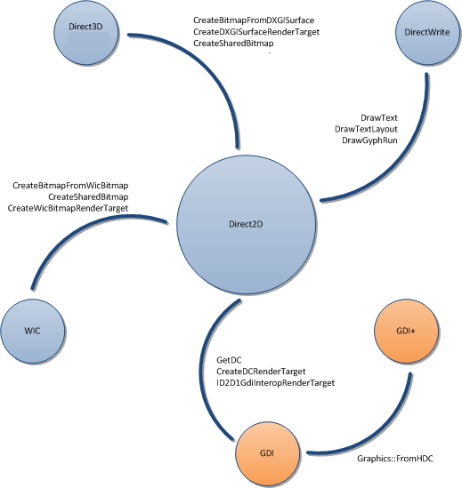

# Interoperability Overview

One of Direct2D's key features is enabling interoperability between Direct2D and other rendering platforms so that developers can use the specific strengths of each platform without being forced into compromises by choosing one platform for all needs. This topic summarizes the different platforms with which Direct2D is interoperable. It contains the following sections.

-   [GDI Interoperability](#gdi-interoperability)
-   [GDI+ Interoperability](#gdi-interoperability)
-   [Direct3D Interoperability](#direct3d-interoperability)
-   [DirectWrite Interoperability](#directwrite-interoperability)
-   [Windows Imaging Component (WIC) Interoperability](#windows-imaging-component-wic-interoperability)
-   [Related topics](#related-topics)

The following diagram summarizes the different platforms with which Direct2D is interoperable and lists some methods and interfaces that provide interoperability.

## GDI Interoperability

Direct2D enables two-way interoperability with GDI. You can use an [**ID2D1DCRenderTarget**](/windows/win32/api/d2d1/nn-d2d1-id2d1dcrendertarget) to write Direct2D content to a GDI [device context](/windows/desktop/gdi/device-contexts) (DC), or you can use [**ID2D1GdiInteropRenderTarget**](/windows/win32/api/d2d1/nn-d2d1-id2d1gdiinteroprendertarget) to obtain a DC representation of a render target.

For more information and examples, see the [Direct2D and GDI Interoperability Overview](direct2d-and-gdi-interoperation-overview.md).

## GDI+ Interoperability

You can use GDI+ with Direct2D in the same manner as GDI. You can use an [**ID2D1DCRenderTarget**](/windows/win32/api/d2d1/nn-d2d1-id2d1dcrendertarget) to write Direct2D content to the same DC as your GDI+ content. This approach enables you to start adding Direct2D content to applications that primarily render by using GDI+.

You can also use an [**ID2D1GdiInteropRenderTarget**](/windows/win32/api/d2d1/nn-d2d1-id2d1gdiinteroprendertarget) to provide access to a GDI DC that writes by using Direct2D, and then use the [**FromHDC**](/windows/win32/api/gdiplusgraphics/nf-gdiplusgraphics-graphics-fromhdc(inhdc)) method to create a object. This approach is useful for applications that primarily render with Direct2D, but have an extensibility model or other legacy content that requires the ability to render with GDI+.

## Direct3D Interoperability

Direct2D can use a DXGI surface render target (created by the [**CreateDxgiSurfaceRender**](/windows/desktop/api/d2d1/nf-d2d1-id2d1factory-createdxgisurfacerendertarget(idxgisurface_constd2d1_render_target_properties__id2d1rendertarget)) method) to write to an [IDXGISurface](/windows/win32/api/dxgi/nn-dxgi-idxgisurface). This action enables you to add 2-D backgrounds and interfaces to 3-D scenes and use Direct2D content as a texture for a 3-D model. Direct2D can also take an [IDXGISurface](/windows/win32/api/dxgi/nn-dxgi-idxgisurface) and use the [**CreateSharedBitmap**](/windows/win32/api/d2d1/nf-d2d1-id2d1rendertarget-createsharedbitmap) method to create a bitmap representation.

For more information and examples, see the [Direct2D and Direct3D Interoperability Overview](direct2d-and-direct3d-interoperation-overview.md).

## DirectWrite Interoperability

Direct2D is tightly integrated with DirectWrite. Direct2D makes it easy to render DirectWrite content by providing the [**DrawText**](id2d1rendertarget-drawtext.md), [**DrawTextLayout**](/windows/win32/api/d2d1/nf-d2d1-id2d1rendertarget-drawtextlayout), and [**DrawGlyphRun**](/windows/win32/api/d2d1/nf-d2d1-id2d1rendertarget-drawglyphrun) methods.

## Windows Imaging Component (WIC) Interoperability

Direct2D provides the [**CreateBitmapFromWicBitmap**](id2d1rendertarget-createbitmapfromwicbitmap.md), [**CreateSharedBitmap**](/windows/win32/api/d2d1/nf-d2d1-id2d1rendertarget-createsharedbitmap), and [**CreateWicBitmapRenderTarget**](id2d1factory-createwicbitmaprendertarget.md) methods for manipulating WIC bitmaps.

## Related topics

<dl> <dt>

[Direct2D and GDI Interoperability Overview](direct2d-and-gdi-interoperation-overview.md)
</dt> <dt>

[Direct2D and Direct3D Interoperability Overview](direct2d-and-direct3d-interoperation-overview.md)
</dt> </dl>

 

 