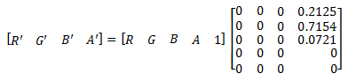

# Luminance to alpha effect

Use the luminance to alpha effect to set the alpha channel to the luminance of the image and sets the color channels to 0. You can use the output of this effect to make a semitransparent overlay based on the brightness of the input image. Or you can use it to make an image mask.

> [!Note]  
> This effect has no properties.

 

The CLSID for this effect is CLSID\_D2D1LuminanceToAlpha.

## Example image

This example shows the output of the luminance to alpha effect composited over a white surface to show opacity.


| Before                                                            |
|-------------------------------------------------------------------|
|         |
| After                                                             |
|  |


 


```C++
ComPtr<ID2D1Effect> luminanceToAlphaEffect;
m_d2dContext->CreateEffect(CLSID_D2D1LuminanceToAlpha, &luminanceToAlphaEffect);

luminanceToAlphaEffect->SetInput(0, bitmap);

// LuminanceToAlpha result is composited on top of a white surface to show opacity.
ComPtr<ID2D1Effect> floodEffect;
m_d2dContext->CreateEffect(CLSID_D2D1Flood, &floodEffect);
floodEffect->SetValue(D2D1_FLOOD_PROP_COLOR, D2D1::Vector4F(1.0f, 1.0f, 1.0f, 1.0f));

ComPtr<ID2D1Effect> compositeEffect;
m_d2dContext->CreateEffect(CLSID_D2D1Composite, &compositeEffect);

compositeEffect->SetInputEffect(0, floodEffect.Get());
compositeEffect->SetInputEffect(1, luminanceToAlphaEffect.Get());

m_d2dContext->BeginDraw();
m_d2dContext->DrawImage(compositeEffect.Get());
m_d2dContext->EndDraw();
```


This effect sets the alpha channel of the output to the luminance of the input image using this color matrix.



This effect consumes and outputs premultiplied alpha images. The effect won't work on straight alpha images unless they are fully opaque.

> [!Note]
>
> Because images are stored in a gamma-compensated format, before you calculate the luminance for an image you should first perform inverse gamma correction to get the true color values for the image. Since images are normally stored at 2.2 gamma, you can use the Gamma transfer effect with an exponent of (1/2.2) and then use the output of that effect.

 

## Requirements


| Requirement | Value |
|--------------------------|------------------------------------------------------------------------------------|
| Minimum supported client | Windows 8 and Platform Update for Windows 7 \[desktop apps \| Windows Store apps\] |
| Minimum supported server | Windows 8 and Platform Update for Windows 7 \[desktop apps \| Windows Store apps\] |
| Header                   | d2d1effects.h                                                                      |
| Library                  | d2d1.lib, dxguid.lib                                                               |


 

## Output bitmap

The output is the same size as the input image.

## Related topics

<dl> <dt>

[**ID2D1Effect**](/windows/win32/api/d2d1_1/nn-d2d1_1-id2d1effect)
</dt> </dl>

 

 
