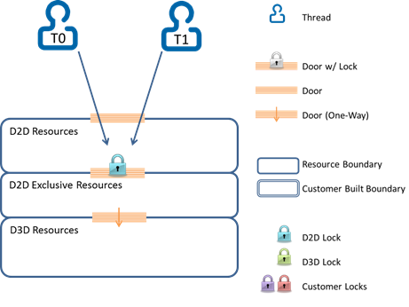
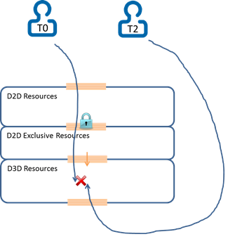
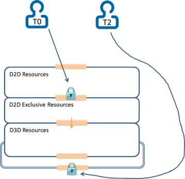
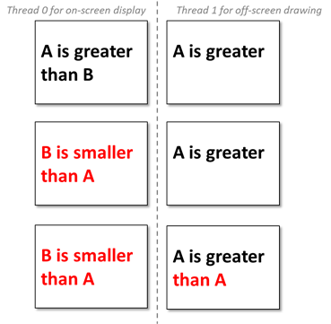

# Multithreaded Direct2D Apps

If you develop [Direct2D](./direct2d-portal.md) apps, you may need to access Direct2D resources from more than one thread. In other cases, you may want to use multi-threading to get better performance or better responsiveness (like using one thread for screen display and a separate thread for offline rendering).

This topic describes the best practices for developing multithreaded [Direct2D](./direct2d-portal.md) apps with little to no [Direct3D](/windows/desktop/direct3d11/atoc-dx-graphics-direct3d-11) rendering. Software defects caused by concurrency issues can be difficult to track down, and it is helpful to plan your multithreading policy and to follow the best practices described here.

> [!Note]  
> If you access two [Direct2D](./direct2d-portal.md) resources created from two different single threaded Direct2D factories it doesn't cause access conflicts as long as the underlying [Direct3D](/windows/desktop/direct3d11/atoc-dx-graphics-direct3d-11) devices and device contexts are also distinct. When talking about "accessing Direct2D resources" in this article, it really means "accessing Direct2D resources created from the same Direct2D Device" unless stated otherwise.

## Developing Thread-Safe Apps that Call Only Direct2D APIs

You can create a multithreaded [Direct2D](./direct2d-portal.md) factory instance. You can use and share a multithreaded factory and all its resources from more than one thread, but accesses to those resources (via Direct2D calls) are serialized by Direct2D, so no access conflicts occur. If your app calls only Direct2D APIs, such protection is automatically done by Direct2D in a granular level with minimum overhead. The code to create a multithreaded factory here.

```cpp
ID2D1Factory* m_D2DFactory;

// Create a Direct2D factory.
HRESULT hr = D2D1CreateFactory(
    D2D1_FACTORY_TYPE_MULTI_THREADED,
    &m_D2DFactory
);
```

The image here shows how [Direct2D](./direct2d-portal.md) serializes two threads that make calls using only the Direct2D API.



## Developing Thread-Safe Direct2D Apps with minimal Direct3D or DXGI Calls

It is more than often that a [Direct2D](./direct2d-portal.md) app also makes some [Direct3D](/windows/desktop/direct3d11/atoc-dx-graphics-direct3d-11) or DXGI calls. For example, a display thread will draw in Direct2D then present using a [**DXGI swap chain**](/windows/desktop/api/dxgi/nn-dxgi-idxgiswapchain).

In this case, assuring thread-safety is more complicated: some [Direct2D](./direct2d-portal.md) calls indirectly access the underlying [Direct3D](/windows/desktop/direct3d11/atoc-dx-graphics-direct3d-11) resources, which might be simultaneously accessed by another thread which calls Direct3D or DXGI. Since those Direct3D or DXGI calls are out of Direct2D’s awareness and control, you need to create a multithreaded Direct2D factory, but you must do mor to avoid access conflicts.

The diagram here shows a [Direct3D](/windows/desktop/direct3d11/atoc-dx-graphics-direct3d-11) resource access conflict due to thread T0 accessing a resource indirectly via a [Direct2D](./direct2d-portal.md) call and T2 accessing the same resource directly via a Direct3D or DXGI call.

> [!Note]  
> The thread protection that [Direct2D](./direct2d-portal.md) provides (the blue lock in this image) doesn't help in this case.

 



To avoid resource access conflict here, we recommend you explicitly acquire the lock that [Direct2D](./direct2d-portal.md) uses for internal access synchronization, and apply that lock when a thread needs to make [Direct3D](/windows/desktop/direct3d11/atoc-dx-graphics-direct3d-11) or DXGI calls that might cause access conflict as shown here. In particular, you should take special care with code that uses exceptions or an early out system based on HRESULT return codes. For this reason, we recommend you use an RAII (Resource Acquisition Is Initialization) pattern to call the [**Enter**](/windows/win32/api/d2d1_1/nf-d2d1_1-id2d1multithread-enter) and [**Leave**](/windows/win32/api/d2d1_1/nf-d2d1_1-id2d1multithread-leave) methods.

> [!Note]  
> It is important that you pair up calls to the [**Enter**](/windows/win32/api/d2d1_1/nf-d2d1_1-id2d1multithread-enter) and [**Leave**](/windows/win32/api/d2d1_1/nf-d2d1_1-id2d1multithread-leave) methods, otherwise your app can deadlock.

 

The code here shows an example of when to lock and then and unlock around [Direct3D](/windows/desktop/direct3d11/atoc-dx-graphics-direct3d-11) or DXGI calls.


```C++
void MyApp::DrawFromThread2()
{
    // We are accessing Direct3D resources directly without Direct2D's knowledge, so we
    // must manually acquire and apply the Direct2D factory lock.
    ID2D1Multithread* m_D2DMultithread;
    m_D2DFactory->QueryInterface(IID_PPV_ARGS(&m_D2DMultithread));
    m_D2DMultithread->Enter();
    
    // Now it is safe to make Direct3D/DXGI calls, such as IDXGISwapChain::Present
    MakeDirect3DCalls();

    // It is absolutely critical that the factory lock be released upon
    // exiting this function, or else any consequent Direct2D calls will be blocked.
    m_D2DMultithread->Leave();
}
```


> [!Note]  
> Some [Direct3D](/windows/desktop/direct3d11/atoc-dx-graphics-direct3d-11) or DXGI calls (notably [**IDXGISwapChain::Present**](/windows/desktop/api/dxgi/nf-dxgi-idxgiswapchain-present)) may acquire locks and/or trigger callbacks into the code of the calling function or method. You should be aware of this and make sure that such behavior doesn't cause deadlocks. For more info, see the [DXGI Overview](/windows/desktop/direct3ddxgi/d3d10-graphics-programming-guide-dxgi) topic.

 



When you use the [**Enter**](/windows/win32/api/d2d1_1/nf-d2d1_1-id2d1multithread-enter) and [**Leave**](/windows/win32/api/d2d1_1/nf-d2d1_1-id2d1multithread-leave) methods, the calls are protected by the automatic [Direct2D](./direct2d-portal.md) and the explicit lock, so the app doesn't hit access conflict.

There are other approaches to work around this issue. However, we recommend you explicitly guard [Direct3D](/windows/desktop/direct3d11/atoc-dx-graphics-direct3d-11) or DXGI calls with the [Direct2D](./direct2d-portal.md) lock because it usually provides better performance as it protects concurrency at a much finer level and with lower overhead under Direct2D’s cover.

## Ensuring Atomicity of Stateful Operations

While thread-safety features of [DirectX](/previous-versions//ee663301(v=vs.85)) can help ensure that no two individual API calls are made concurrently, you must also ensure that threads that make stateful API calls don't interfere with each other. Here is an example.

1.  There are two lines of text that you want to render to both on-screen (by Thread 0) and off-screen (by Thread 1): Line \#1 is "A is greater" and Line \#2 is "than B", both of which will be drawn using a solid black brush.
2.  Thread 1 draws the first line of text.
3.  Thread 0 reacts to a user input, updates both text lines to "B is smaller" and "than A" respectively, and changed the brush color to solid red for its own drawing;
4.  Thread 1 continues drawing the second line of text, which is now "than A", with the red color brush;
5.  Finally, we get two lines of text on the off-screen drawing target: "A is greater" in black and "than A" in red.



In the top row, Thread 0 draws with current text strings and the current black brush. Thread 1 only finishes off-screen drawing on the top half.

In the middle row, Thread 0 responds to user interaction, updates the text strings and the brush, then refreshes the screen. At this point, Thread 1 is blocked. In the bottom row, the final off-screen rendering after Thread 1 resumes drawing the bottom half with an altered brush and an altered text string.

To address this issue, we recommend you have a separate context for each thread, so that:

-   You should create a copy of the device context so that mutable resources (i.e. resources that may vary during display or printing, such as text contents or the solid color brush in the example) don't change when you render. In this sample, you should maintain a copy of those two lines of texts and the color brush before you draw. By doing so, you guarantee each thread has complete and consistent content to draw and present.
-   You should share heavy-weight resources (like bitmaps and complex effect graphs) that are initialized once and then never modified across threads to increase performance.
-   You can either share light-weight resources (like solid color brushes and text formats) that are initialized once and then never modified across threads or not

## Summary

When you develop multithreaded [Direct2D](./direct2d-portal.md) apps, you must create a multithreaded Direct2D factory then derive all Direct2D resources from that factory. If a thread will make [Direct3D](/windows/desktop/direct3d11/atoc-dx-graphics-direct3d-11) or DXGI calls, you also must explicitly acquire then apply the Direct2D lock to guard those Direct3D or DXGI calls. Moreover, you must ensure context integrity by having a copy of mutable resources for each thread.
