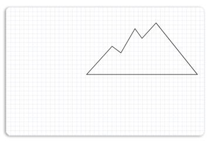

# Path Geometries Overview

This topic describes how to use Direct2D path geometries to create complex drawings. It contains the following sections.

-   [Prerequisites](#prerequisites)
-   [Path Geometries in Direct2D](#path-geometries-in-direct2d)
-   [Using an ID2D1GeometrySink to Populate a Path Geometry](#using-an-id2d1geometrysink-to-populate-a-path-geometry)
-   [Example: Create a Complex Drawing](#example-create-a-complex-drawing)
    -   [Create a Path Geometry for the Left Mountain](#create-a-path-geometry-for-the-left-mountain)
    -   [Create a Path Geometry for the Right Mountain](#create-a-path-geometry-for-the-right-mountain)
    -   [Create a Path Geometry for the Sun](#create-a-path-geometry-for-the-sun)
    -   [Create a Path Geometry for the River](#create-a-path-geometry-for-the-river)
    -   [Render the Path Geometries onto the Display](#render-the-path-geometries-onto-the-display)
-   [Related topics](#related-topics)

## Prerequisites

This overview assumes that you are familiar with creating basic Direct2D applications, as described in [Create a simple Direct2D application](direct2d-quickstart.md). It also assumes that you are familiar with the basic features of Direct2D geometries, as described in the [Geometries Overview](direct2d-geometries-overview.md).

## Path Geometries in Direct2D

Path geometries are represented by the [**ID2D1PathGeometry**](/windows/win32/api/d2d1/nn-d2d1-id2d1pathgeometry) interface. To instantiate a path geometry, call the [**ID2D1Factory::CreatePathGeometry**](/windows/win32/api/d2d1/nf-d2d1-id2d1factory-createpathgeometry) method. These objects can be used to describe complex geometric figures composed of segments such as arcs, curves, and lines. To populate a path geometry with figures and segments, call the [**Open**](/windows/win32/api/d2d1/nf-d2d1-id2d1pathgeometry-open) method to retrieve an [**ID2D1GeometrySink**](/windows/win32/api/d2d1/nn-d2d1-id2d1geometrysink) and use the geometry sink's methods to add figures and segments to the path geometry.

## Using an ID2D1GeometrySink to Populate a Path Geometry

[**ID2D1GeometrySink**](/windows/win32/api/d2d1/nn-d2d1-id2d1geometrysink) describes a geometric path that can contain lines, arcs, cubic Bezier curves, and quadratic Bezier curves.

A geometry sink consists of one or more figures. Each figure is made up of one or more line, curve, or arc segments. To create a figure, call the [**BeginFigure**](/windows/win32/api/d2d1/nf-d2d1-id2d1simplifiedgeometrysink-beginfigure) method, passing in the figure's starting point, and then use its Add methods (such as [**AddLine**](/windows/win32/api/d2d1/nf-d2d1-id2d1geometrysink-addline) and [**AddBezier**](/windows/desktop/api/d2d1/nf-d2d1-id2d1factory-createdxgisurfacerendertarget(idxgisurface_constd2d1_render_target_properties__id2d1rendertarget)) to add segments. When you are finished adding segments, call the [**EndFigure**](/windows/win32/api/d2d1/nf-d2d1-id2d1simplifiedgeometrysink-endfigure) method. You can repeat this sequence to create additional figures. When you are finished creating figures, call the [**Close**](/windows/win32/api/d2d1/nf-d2d1-id2d1simplifiedgeometrysink-close) method.

## Example: Create a Complex Drawing

The following illustration shows a complex drawing with lines, arcs, and Bezier curves. The code example that follows shows how to create the drawing by using four path geometry objects, one for the left mountain, one for the right mountain, one for the river, and one for the sun with flares.


### Create a Path Geometry for the Left Mountain

The example first creates a path geometry for the left mountain as shown in the following illustration.


To create the left mountain, the example calls the [**ID2D1Factory::CreatePathGeometry**](/windows/win32/api/d2d1/nf-d2d1-id2d1factory-createpathgeometry) method to create an [**ID2D1PathGeometry**](/windows/win32/api/d2d1/nn-d2d1-id2d1pathgeometry).


```C++
hr = m_pD2DFactory->CreatePathGeometry(&m_pLeftMountainGeometry);
```


The example then uses the [**Open**](/windows/win32/api/d2d1/nf-d2d1-id2d1pathgeometry-open) method to obtain a geometry sink from an [**ID2D1PathGeometry**](/windows/win32/api/d2d1/nn-d2d1-id2d1pathgeometry) and stores it in the *pSink* variable.


```C++
ID2D1GeometrySink *pSink = NULL;
hr = m_pLeftMountainGeometry->Open(&pSink);
```


The example then calls [**BeginFigure**](/windows/win32/api/d2d1/nf-d2d1-id2d1simplifiedgeometrysink-beginfigure), passing in [**D2D1\_FIGURE\_BEGIN\_FILLED**](/windows/desktop/api/d2d1/ne-d2d1-d2d1_figure_begin) that indicates this figure is filled, then calls [**AddLines**](/windows/win32/api/d2d1/nf-d2d1-id2d1simplifiedgeometrysink-addlines), passing in an array of [**D2D1\_POINT\_2F**](d2d1-point-2f.md) points, (267, 177), (236, 192), (212, 160), (156, 255) and (346, 255).

The following code shows how to do this.


```C++
pSink->SetFillMode(D2D1_FILL_MODE_WINDING);

pSink->BeginFigure(
    D2D1::Point2F(346,255),
    D2D1_FIGURE_BEGIN_FILLED
    );
D2D1_POINT_2F points[5] = {
   D2D1::Point2F(267, 177),
   D2D1::Point2F(236, 192),
   D2D1::Point2F(212, 160),
   D2D1::Point2F(156, 255),
   D2D1::Point2F(346, 255), 
   };
pSink->AddLines(points, ARRAYSIZE(points));
pSink->EndFigure(D2D1_FIGURE_END_CLOSED);
```


### Create a Path Geometry for the Right Mountain

The example then creates another path geometry for the right mountain with points (481, 146), (449, 181), (433, 159), (401, 214), (381, 199), (323, 263), and (575, 263). The following illustration shows how the right mountain is displayed.



The following code shows how to do this.


```C++
        hr = m_pD2DFactory->CreatePathGeometry(&m_pRightMountainGeometry);
        if(SUCCEEDED(hr))
        {
            ID2D1GeometrySink *pSink = NULL;

            hr = m_pRightMountainGeometry->Open(&pSink);
            if (SUCCEEDED(hr))
            {
                pSink->SetFillMode(D2D1_FILL_MODE_WINDING);

                pSink->BeginFigure(
                    D2D1::Point2F(575,263),
                    D2D1_FIGURE_BEGIN_FILLED
                    );
                D2D1_POINT_2F points[] = {
                   D2D1::Point2F(481, 146),
                   D2D1::Point2F(449, 181),
                   D2D1::Point2F(433, 159),
                   D2D1::Point2F(401, 214),
                   D2D1::Point2F(381, 199), 
                   D2D1::Point2F(323, 263), 
                   D2D1::Point2F(575, 263)
                   };
                pSink->AddLines(points, ARRAYSIZE(points));
                pSink->EndFigure(D2D1_FIGURE_END_CLOSED);
            }
            hr = pSink->Close();

            SafeRelease(&pSink);
       }
```


### Create a Path Geometry for the Sun

The example then populates another path geometry for the sun as shown in the following illustration.


To do this, the path geometry creates a sink, and adds a figure for the arc and a figure for each flare to the sink. By repeating the sequence of [**BeginFigure**](/windows/win32/api/d2d1/nf-d2d1-id2d1simplifiedgeometrysink-beginfigure), its Add (such as [**AddBezier**](/windows/desktop/api/d2d1/nf-d2d1-id2d1factory-createdxgisurfacerendertarget(idxgisurface_constd2d1_render_target_properties__id2d1rendertarget))) methods, and [**EndFigure**](/windows/win32/api/d2d1/nf-d2d1-id2d1simplifiedgeometrysink-endfigure), multiple figures are added to the sink.

The following code shows how to do this.


```C++
        hr = m_pD2DFactory->CreatePathGeometry(&m_pSunGeometry);
        if(SUCCEEDED(hr))
        {
            ID2D1GeometrySink *pSink = NULL;

            hr = m_pSunGeometry->Open(&pSink);
            if (SUCCEEDED(hr))
            {
                pSink->SetFillMode(D2D1_FILL_MODE_WINDING);
            
                pSink->BeginFigure(
                    D2D1::Point2F(270, 255),
                    D2D1_FIGURE_BEGIN_FILLED
                    );
                pSink->AddArc(
                    D2D1::ArcSegment(
                        D2D1::Point2F(440, 255), // end point
                        D2D1::SizeF(85, 85),
                        0.0f, // rotation angle
                        D2D1_SWEEP_DIRECTION_CLOCKWISE,
                        D2D1_ARC_SIZE_SMALL
                        ));            
                pSink->EndFigure(D2D1_FIGURE_END_CLOSED);

                pSink->BeginFigure(
                    D2D1::Point2F(299, 182),
                    D2D1_FIGURE_BEGIN_HOLLOW
                    );
                pSink->AddBezier(
                   D2D1::BezierSegment(
                       D2D1::Point2F(299, 182),
                       D2D1::Point2F(294, 176),
                       D2D1::Point2F(285, 178)
                       ));
                pSink->AddBezier(
                   D2D1::BezierSegment(
                       D2D1::Point2F(276, 179),
                       D2D1::Point2F(272, 173),
                       D2D1::Point2F(272, 173)
                       ));
                pSink->EndFigure(D2D1_FIGURE_END_OPEN);

                pSink->BeginFigure(
                    D2D1::Point2F(354, 156),
                    D2D1_FIGURE_BEGIN_HOLLOW
                    );
                pSink->AddBezier(
                   D2D1::BezierSegment(
                       D2D1::Point2F(354, 156),
                       D2D1::Point2F(358, 149),
                       D2D1::Point2F(354, 142)
                       ));
                pSink->AddBezier(
                   D2D1::BezierSegment(
                       D2D1::Point2F(349, 134),
                       D2D1::Point2F(354, 127),
                       D2D1::Point2F(354, 127)
                       ));
                pSink->EndFigure(D2D1_FIGURE_END_OPEN);

                pSink->BeginFigure(
                    D2D1::Point2F(322,164),
                    D2D1_FIGURE_BEGIN_HOLLOW
                    );
                pSink->AddBezier(
                   D2D1::BezierSegment(
                       D2D1::Point2F(322, 164),
                       D2D1::Point2F(322, 156),
                       D2D1::Point2F(314, 152)
                       ));
                pSink->AddBezier(
                   D2D1::BezierSegment(
                       D2D1::Point2F(306, 149),
                       D2D1::Point2F(305, 141),
                       D2D1::Point2F(305, 141)
                       ));              
                pSink->EndFigure(D2D1_FIGURE_END_OPEN);

                pSink->BeginFigure(
                    D2D1::Point2F(385, 164),
                    D2D1_FIGURE_BEGIN_HOLLOW
                    );
                pSink->AddBezier(
                   D2D1::BezierSegment(
                       D2D1::Point2F(385,164),
                       D2D1::Point2F(392,161),
                       D2D1::Point2F(394,152)
                       ));
                pSink->AddBezier(
                   D2D1::BezierSegment(
                       D2D1::Point2F(395,144),
                       D2D1::Point2F(402,141),
                       D2D1::Point2F(402,142)
                       ));                
                pSink->EndFigure(D2D1_FIGURE_END_OPEN);

                pSink->BeginFigure(
                    D2D1::Point2F(408,182),
                    D2D1_FIGURE_BEGIN_HOLLOW
                    );
                pSink->AddBezier(
                   D2D1::BezierSegment(
                       D2D1::Point2F(408,182),
                       D2D1::Point2F(416,184),
                       D2D1::Point2F(422,178)
                       ));
                pSink->AddBezier(
                   D2D1::BezierSegment(
                       D2D1::Point2F(428,171),
                       D2D1::Point2F(435,173),
                       D2D1::Point2F(435,173)
                       ));
                pSink->EndFigure(D2D1_FIGURE_END_OPEN);
            }
            hr = pSink->Close();

            SafeRelease(&pSink);
       }
```


### Create a Path Geometry for the River

The example then creates another geometry path for the river that contains Bezier curves. The following illustration shows how the river is displayed.


The following code shows how to do this.


```C++
        hr = m_pD2DFactory->CreatePathGeometry(&m_pRiverGeometry);
    
        if(SUCCEEDED(hr))
        {
            ID2D1GeometrySink *pSink = NULL;

            hr = m_pRiverGeometry->Open(&pSink);
            if (SUCCEEDED(hr))
            {
                pSink->SetFillMode(D2D1_FILL_MODE_WINDING);
                pSink->BeginFigure(
                    D2D1::Point2F(183, 392),
                    D2D1_FIGURE_BEGIN_FILLED
                    );
                pSink->AddBezier(
                   D2D1::BezierSegment(
                       D2D1::Point2F(238, 284),
                       D2D1::Point2F(472, 345),
                       D2D1::Point2F(356, 303)
                       ));
                pSink->AddBezier(
                   D2D1::BezierSegment(
                       D2D1::Point2F(237, 261),
                       D2D1::Point2F(333, 256),
                       D2D1::Point2F(333, 256)
                       ));
                pSink->AddBezier(
                   D2D1::BezierSegment(
                       D2D1::Point2F(335, 257),
                       D2D1::Point2F(241, 261),
                       D2D1::Point2F(411, 306)
                       ));
                pSink->AddBezier(
                   D2D1::BezierSegment(
                       D2D1::Point2F(574, 350),
                       D2D1::Point2F(288, 324),
                       D2D1::Point2F(296, 392)
                       ));
                pSink->EndFigure(D2D1_FIGURE_END_OPEN);
            }
```


### Render the Path Geometries onto the Display

The following code shows how to render the populated path geometries on the display. It first draws and paints the sun geometry, next the left mountain geometry, then the river geometry, and finally the right mountain geometry.


```C++
 m_pRenderTarget->BeginDraw();

 m_pRenderTarget->SetTransform(D2D1::Matrix3x2F::Identity());

 m_pRenderTarget->Clear(D2D1::ColorF(D2D1::ColorF::White));

 D2D1_SIZE_F rtSize = m_pRenderTarget->GetSize();
 m_pRenderTarget->FillRectangle(
     D2D1::RectF(0, 0, rtSize.width, rtSize.height),
     m_pGridPatternBitmapBrush
     );

 m_pRenderTarget->FillGeometry(m_pSunGeometry, m_pRadialGradientBrush);

 m_pSceneBrush->SetColor(D2D1::ColorF(D2D1::ColorF::Black, 1.f));
 m_pRenderTarget->DrawGeometry(m_pSunGeometry, m_pSceneBrush, 1.f);

 m_pSceneBrush->SetColor(D2D1::ColorF(D2D1::ColorF::OliveDrab, 1.f));
 m_pRenderTarget->FillGeometry(m_pLeftMountainGeometry, m_pSceneBrush);

 m_pSceneBrush->SetColor(D2D1::ColorF(D2D1::ColorF::Black, 1.f));
 m_pRenderTarget->DrawGeometry(m_pLeftMountainGeometry, m_pSceneBrush, 1.f);

 m_pSceneBrush->SetColor(D2D1::ColorF(D2D1::ColorF::LightSkyBlue, 1.f));
 m_pRenderTarget->FillGeometry(m_pRiverGeometry, m_pSceneBrush);

 m_pSceneBrush->SetColor(D2D1::ColorF(D2D1::ColorF::Black, 1.f));
 m_pRenderTarget->DrawGeometry(m_pRiverGeometry, m_pSceneBrush, 1.f);

 m_pSceneBrush->SetColor(D2D1::ColorF(D2D1::ColorF::YellowGreen, 1.f));
 m_pRenderTarget->FillGeometry(m_pRightMountainGeometry, m_pSceneBrush);

 m_pSceneBrush->SetColor(D2D1::ColorF(D2D1::ColorF::Black, 1.f));
 m_pRenderTarget->DrawGeometry(m_pRightMountainGeometry, m_pSceneBrush, 1.f);


 hr = m_pRenderTarget->EndDraw();
```


The complete example outputs the following illustration.


## Related topics

<dl> <dt>

[Create a simple Direct2D application](direct2d-quickstart.md)
</dt> <dt>

[Geometries Overview](direct2d-geometries-overview.md)
</dt> </dl>

 

 