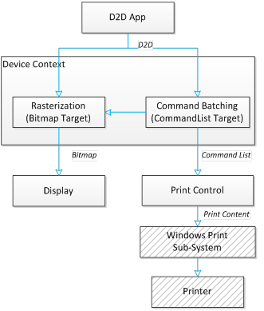

# Printing and command lists

The [Direct2D](./direct2d-portal.md) [**print control**](/windows/win32/api/d2d1_1/nn-d2d1_1-id2d1printcontrol) is a new component in the Direct2D module in Windows 8. This component lets Direct2D apps reuse their Direct2D drawing calls (in terms of state changes and rending primitives) to deliver printing results that are similar to what you see on the screen.

The [**ID2D1PrintControl**](/windows/win32/api/d2d1_1/nn-d2d1_1-id2d1printcontrol) interface represents a virtual print job: you can create a [Direct2D](./direct2d-portal.md) print control to initiate a new print job, pass in Direct2D contents for each page you want to print, then close the print control to complete a print job.

> [!Note]  
> A print control maps to one and exactly one print job, and you can't reuse it.

The [Direct2D](./direct2d-portal.md) print control converts and optimizes the passed in Direct2D contents for the print sub-system, which works with the real printers to deliver the actual printout. All print-specific details are hidden from Direct2D apps, which means Direct2D apps can print without knowing what devices they are drawing to, or how the drawings are translated to printing.

To print with [Direct2D](./direct2d-portal.md), you need to prepare one Direct2D command list for each page you want to print, then pass that command list to the Direct2D print control. To prepare that Direct2D command list, you simply create and set a command list as the drawing target of the current device context, and then draw to that device context, exactly as if you are drawing to a bitmap target for display. See [Devices and Device Contexts](devices-and-device-contexts.md) for more info on devices and targets.

The diagram here illustrates the interaction between the app, device context, bitmap target, command list target, and the print control.

> [!Note]  
> The Windows Print Sub-System and Printer components are in gray because they are completely hidden from [Direct2D](./direct2d-portal.md) apps.



## Example

The complete process of printing Direct2D content includes the following steps.

1.  Create a print control to initiate a print job.
2.  Add a page to the print control by passing in a command list.
3.  Repeat step 2 for each page in the rest of the document
4.  Close the print control to complete the print job.

Here is a code example showing the process.

```cpp
ID2D1CommandList* commandList;
// Skip command list creation and drawing for simplicity.

// Set print control properties.
D2D1_PRINT_CONTROL_PROPERTIES printControlProperties;
printControlProperties.rasterDPI = 150.0f; // Use the default rasterization DPI for all unsupported Direct2D commands 
                                                                                                                                                                            //  or options.
printControlProperties.fontSubset = D2D1_PRINT_FONT_SUBSET_MODE_DEFAULT; // Using the default font subset strategy.
printControlProperties.colorSpace = D2D1_COLOR_SPACE_SRGB; // Color space for vector graphics in Direct2D print control.

// Create a Direct2D Print Control to initiate a print job.
ID2D1PrintControl* d2dPrintControl;
d2dDevice->CreatePrintControl(
    wicFactory,
    documentTarget,
    printControlProperties,
    &d2dPrintControl
    );

// Add Direct2D drawing commands encapsulated in a command list.
// You can add in more pages by calling this API multiple times.
d2dPrintControl->AddPage(commandList);

// Close the print control to complete a print job.
d2dPrintControl->Close();
```

## Related topics

[**ID2D1CommandList**](/windows/win32/api/d2d1_1/nn-d2d1_1-id2d1commandlist)

[**ID2D1PrintControl**](/windows/win32/api/d2d1_1/nn-d2d1_1-id2d1printcontrol)

[Improving the Performance of Direct2D Applications and Printing](improving-direct2d-performance.md)