# Profiling DirectX Apps

This shows you how to measure some of the most important performance time measurements for a [DirectX](/previous-versions/windows/apps/jj262109(v=win.10)) app using the **XPerf** and **GPUView** tools that ship as part of the Windows Performance Toolkit. This is not a comprehensive guide for understanding the tools, rather their specific applicability for analyzing DirectX app performance. While most of the techniques discussed here are relevant to all DirectX apps, it is most relevant to apps that use swap chains and not to DirectX applications built on XAML that use SIS/VSIS and XAML animations. We walk you through key performance time measurements, how to acquire and install the tools, and take performance measurement traces then analyze them to understand app bottlenecks.

## About the Tools

### **XPerf**

**XPerf** is a set of performance analysis tools built on top of Event Tracing for Windows (ETW) designed for measuring and analyzing detailed system and app performance and resource usage. Starting in Windows 8 this command line tool has a graphical user interface and is called the Windows Performance Recorder (WPR) and Windows Performance Analyzer (WPA). More information about these tools can be found at the web page for [Windows Performance Toolkit](/previous-versions/windows/it-pro/windows-8.1-and-8/hh162945(v=win.10)) (WPT): [Windows Performance Toolkit](/previous-versions/windows/it-pro/windows-8.1-and-8/hh162945(v=win.10)).

An ETW collects requested kernel events and saves them into a file called an event trace log (ETL) file. These kernel events provide extensive information about an app and system characteristics when running the app. Data is collected by enabling trace capture, performing the desired app scenario that needs analysis, stopping the capture which saves the data in an ETL file. You can then analyze the file on the same or a different machine using either the command line tool **xperf.exe** or the visual trace analysis tool **xperfview.exe**.

### GPUView

**GPUView** is a development tool for determining the performance of the graphics processing unit (GPU) and CPU. It looks at performance with regard to direct memory access (DMA) buffer processing and all other video processing on the video hardware.

For [DirectX](/previous-versions/windows/apps/jj262109(v=win.10)) apps that rely heavily on the GPU, **GPUView** is a powerful tool for understanding the relationship between work done on the CPU vs. GPU. For more info about **GPUView**see [Using GPUView](/windows-hardware/drivers/display/using-gpuview).

Similar to **XPerf**, an ETW trace is first taken by starting the tracing service, exercising the scenario that needs analysis for the app under consideration, stopping the service and saving the information in an ETL file. **GPUView** presents the data present in the ETL file in a graphical format.

After installing the **GPUView** tool, it is we recommend you read the "**GPUView**’s Main Display" topic under the "**GPUView** Help" menu. It contains useful information about how to interpret the **GPUView** UI.

## Installing the Tools

Both **XPerf** and **GPUView** are included in the Windows Performance Toolkit (WPT).

**XPerf** ships as part of the Windows Software Development Kit (SDK) for Windows. [Download the Windows SDK](https://dev.windows.com/downloads).

**GPUView** is available in the Windows Assessment and Deployment Kit (Windows ADK). [Download the Windows ADK](/windows-hardware/get-started/adk-install).

After installation, you must add the directories that contain **XPerf** and **GPUView** to the system "Path" variable.

Click the Start button and type "System Variables". The System Properties window opens. Click "Edit the system environment variables". Select "Environment Variables" from the "System Properties" dialog box. The "Path" variable is found under "System variables". Append the directory containing **xperf.exe** and **GPUView.exe** to the path. These executables are found in the "Windows Performance Toolkit" directory inside the "Windows Kits". The default location is: **C:\\Program Files (x86)\\Windows Kits\\10\\Windows Performance Toolkit**.

## Performance Time Measurements

Most apps expect to run smoothly and be responsive to user input. However, depending upon the scenario the you want, one aspect of performance might be more important than another. For instance, for a news reader app running on a touch tablet PC, the most important aspect is to view a single article at a time and to pan/zoom/scroll through the same or a different article. In this scenario the ability to render all the content every frame is not necessary. However, the ability to scroll through the article smoothly upon a touch gesture is extremely important.

In another instance, a game or a video rendering app that uses lots of animations glitches if frames are dropped. In this case, the ability to present content on the screen without interuption from user input is extremely important.

In order to understand which part of the app is problematic, the first step is to decide on the most important scenarios. Once the core aspects of the app are understood and how they will be exercised, looking for problems using the tools becomes easier.

Some of the most common performance time metrics are as follows:

### Startup-time

Time measured from process launch to first present hitting the screen. This measurement is more useful when the system is warm meaning the measurement is taken after the app is launched a few times.

### CPU time per frame

The time for which CPU actively processes the app workload for one frame. If the app is running smoothly, all the processing required for one frame happens within one v-sync interval. With the monitor refresh rate of 60Hz, this comes to 16ms per frame. If CPU time/frame is greater than 16ms, CPU optimizations might be needed to produce a glitch free app experience.

### GPU time per frame

The time for which GPU actively processes the app workload for one frame. An app is GPU bound when the time taken to process a frame worth of data is more than 16ms.

Being able to understand whether an app is CPU or GPU bound will narrow the problematic part of the code.

## Taking performance time measurement trace

Perform these steps to take a trace:

1.  Open a command window as an administrator.
2.  Close the app if it is already running.
3.  Change directories to the *gpuview* directory inside the Windows Performance Toolkit folder.
4.  Type "log.cmd" to start event tracing. This option logs the most interesting events. Other available options log different scope of the events. For instance ‘v’ or verbose log mode captures all events that the **GPUView** is aware of.
5.  Launch the sample, and exercise the sample in a manner that covers the performance path that you need to analyze.
6.  Go back to the command windows and type "log.cmd" again to stop logging.
7.  This outputs a file called "merged.etl" in the *gpuview* folder. You can save this file to another location and you can analyze it on the same or a different machine. In order to view stack capture details, save the symbol file (.pdb) associated with the app.

## Measurements

> [!Note]  
> The measurements for geometry realization sample are taken on a Quad Core machine with an integrated DirectX11 graphics card. The measurements vary depending upon the machine configuration.

 

This section demonstrates how to measure the startup-time, CPU and GPU time per frame measurements. You can capture a performance trace for the same sample on your machine and see the differences in the various measurements.

To analyze the trace in **GPUView**, open the "merged.elt" file using **GPUView.exe**.

### Startup-time

The startup time is measured by the total time spent from the app start until the content first appears on the screen.

The startup-time measurement is best taken by following the steps listed in the previous section with these variations:

-   If the you take the start-up measurements the very first time you launch the app, it is called cold startup. This may vary from measurements taken after you launch the app a few times over in a small duration of time. This is called warm startup. Depending upon how many resources an app creates at launch, there can be a big difference between the two startup times. Depending upon app goals, measuring one or the other might be desirable.
-   When you log performance information, terminate the app as soon as the first frame shows up on the screen.

### Calculating start-up time using **GPUView**

1.  In **GPUView**, scroll down to the relevant process, in this case GeometryRealization.exe.

    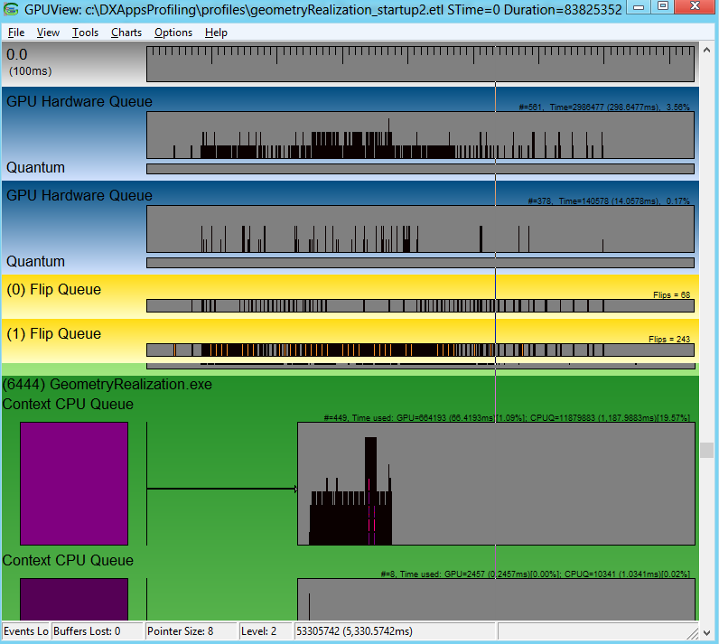

2.  The context CPU queue represents the graphics workload queued to the hardware, but not necessarily being processed by the hardware. When the trace file is opened, it shows all the events logged between the time the trace was taken. In order to calculate the startup-time, select the region of interest, zoom into the initial portion of the first Context CPU Queue (this is the one that shows activity) using Ctrl +Z. More information about **GPUView** Controls can be found in the **GPUView** Help file section "Summary of **GPUView** Controls". The figure below only shows the GeometryRealization.exe process zoomed in to the first part of the Context CPU Queue. The color of the Context CPU Queue is denoted by the rectangle right below the queue and same color data packets in the queue show GPU work queued up on the hardware. The hatch pattern packet in the context queue shows the present packet which means that the app wants the hardware to present the content on the screen.

    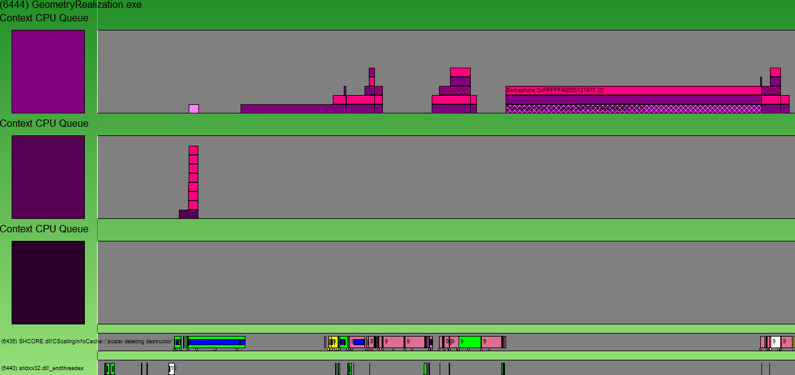

3.  The startup-time is the time when the app first starts (in this case UI thread entry point module SHCORE.dll) till the time the context first appears (marked by a hatch packet). The figure here highlights the area of interest.

    > [!Note]  
    > The actual present info is represented in the flip queue and thus the time take is extended till the present packet actually completes in the flip queue.

     

    The complete status bar is not visible in the figure below which also shows the elapsed time between the highlighted portions. This is the startup-time of the app. In this case for the machine mentioned above, it came out to be around 240ms.

    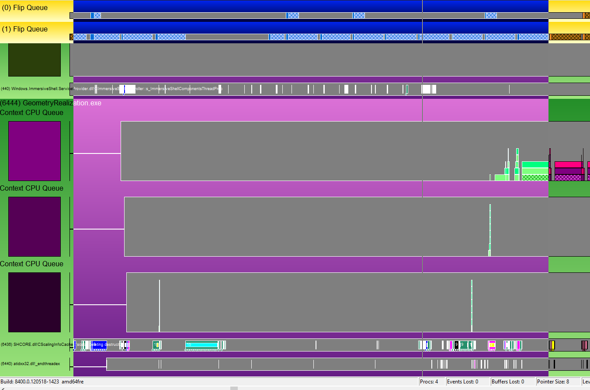

### CPU and GPU Time per frame

There are a few things to think about when measuring CPU time. Look for the areas in the trace where you have exercised the scenario to be analyzed. For instance, in the geometry realization sample one of the scenarios that has been analyzed is the transition between rendering 2048 and 8192 primitives, all unrealized (as in, geometry is not tessellated every frame). The trace clearly shows difference in CPU and GPU activity before and after the transition in the number of primitives.

Two scenarios are being analyzed to calculate CPU and GPU time per frame. They are as follows.

-   Transitioning from rendering 2048 unrealized primitives to 8192 unrealized primitives.
-   Transitioning from rendering 8192 realized primitives to 8192 unrealized primitives.

In both the cases, it was observed that the frame rate dropped drastically. Measuring CPU and GPU time, the relationship between the two as well as a few other patterns in the trace can give useful info about problematic areas in the app.

### Calculating CPU and GPU time when 2048 primitives are being rendered unrealized

1.  Open the trace file using **GPUView.exe**.
2.  Scroll down to the GeometryRealization.exe process.
3.  Select an area for calculating CPU time and zoom into it using CTRL + Z.

    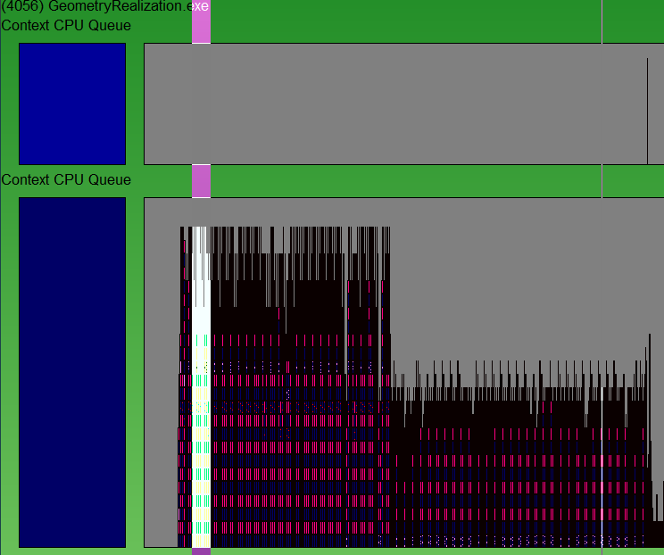

4.  Show v-sync information by toggling between F8. Keeping zooming in till it is easy to see one vsync worth of data clearly. The blue lines are where the v-sync times. Usually, these occur once every 16 ms (60 fps), but if DWM is encountering a performance problem, it runs slower so they will occur once every 32 ms (30 fps). To get a sense of time, select from one blue bar to the next and then look at the number of ms reported in the lower right hand corner of the **GPUView** window.

    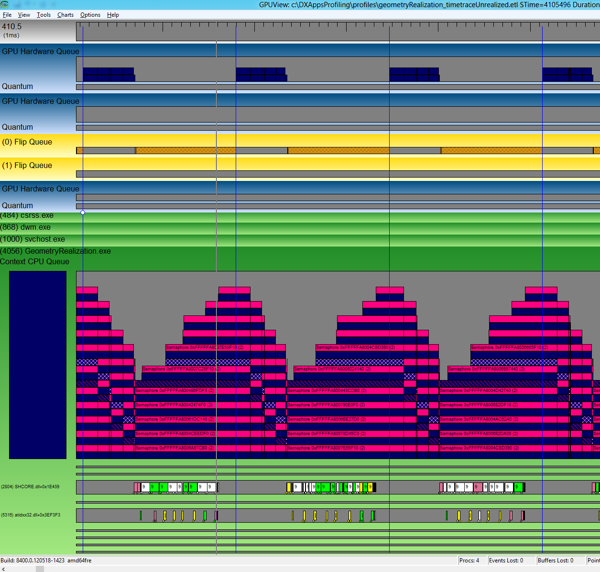

5.  To measure the CPU time per frame, measure the length of time taken by all the threads involved in rendering. It might be worthwhile to narrow down the thread that is expected to be most relevant from a performance standpoint. For instance in the geometry realization sample, the content is animating and needs to be rendered on the screen every frame making the UI thread the important one. Once you determine which thread to look at, measure the length of the bars on this thread. Averaging a few of these yields CPU time per frame. The figure below shows time taken up on the UI thread. It also shows that this time fits well between two consecutive v-syncs which mean that it is hitting 60FPS.

    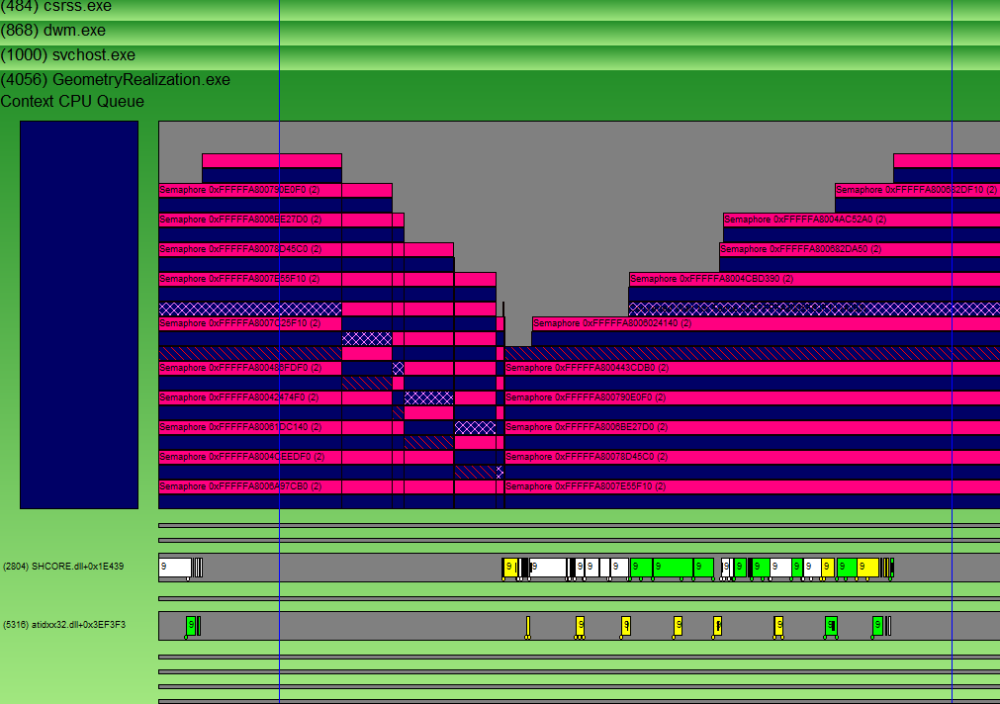

    You can also verify by looking at the flip queue for the corresponding time frame which shows that DWM is able to present every frame.

    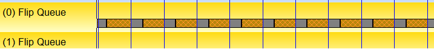

6.  The GPU time can be measured in the same way as the CPU time. Zoom into the relevant area as in the case of measuring CPU time. Measure the length of the bars in the GPU hardware Queue with the same color as the color of the Context CPU Queue. As long as the bars fit within consecutive v-syncs, the app is running smoothly at 60FPS.

    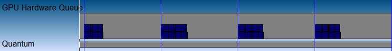

### Calculating CPU and GPU time when 8192 primitives are being rendered unrealized

1.  If you follow the same steps again, the trace shows that all the CPU work for one frame does not fit between one v-sync and the next. This means that the app is CPU bound. The UI thread is saturating the CPU.

    

    Looking at the flip queue, it is also clear that DWM is not able to present every frame.

    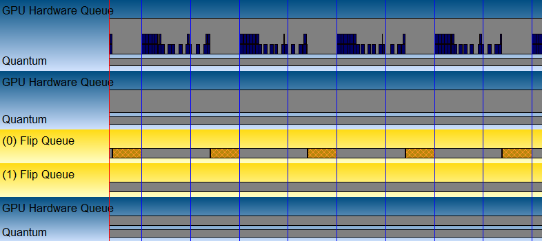

2.  In order to analyze where the time is getting spent, open the trace in **XPerf**. To analyze startup time in **XPerf**, first find the time interval in **GPUView**. Mouse over the left of the interval and the right and take note of the absolute time shown in the bottom of the **GPUView** window. Then open the same .etl file in **XPerf** and, scroll down to the "CPU Sampling by CPU" graph, right click and select "Select Interval…" This allows for typing in the interval of interest which was discovered by looking at the GPU trace.

    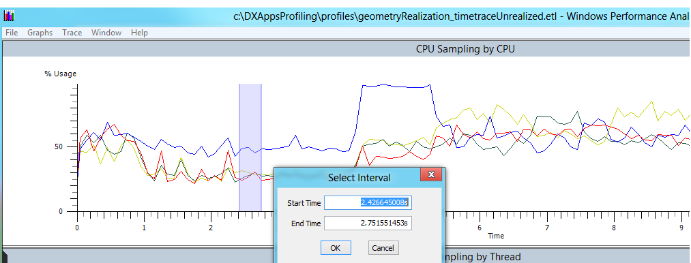

3.  Go to the Trace menu, and make sure "Load Symbols" is checked. Also, go to Trace -> Configure Symbol Paths, and type in the app symbol path. A symbol file contains debugging information about a compiled executable in a separate database (.pdb). This file is commonly referred to as a PDB. More on symbol files can be found here: [Symbol Files](/windows/desktop/Debug/symbol-files). This file can be located in the "Debug" folder of the app directory.

4.  In order to get the breakdown of where the time is being spent in the app, right click on the interval selected in the previous step and click Summary Table. To get an overview of how much time is spent in each dll, uncheck "Stack" from the "Columns" menu. Note that the "Count" column here shows how many samples are within the given dll/function. Because approximately one sample is taken per ms, this number can be used as a best guess for how much time is spent in each dll/function. Checking the "Stack" from Columns menu will give the inclusive time spent in each function in the call graph. This will help to break down the problem points further.

5.  Stack trace information for 2048 unrealized primitives reveals that 30% of CPU time is spent in geometry realization process. Of that around 36% of the time is being spent in geometry tessellation and stroking.

6.  Stack trace information for 8192 unrealized primitives reveals that around 60% of the CPU time (4 cores) is spent in the geometry realization.

    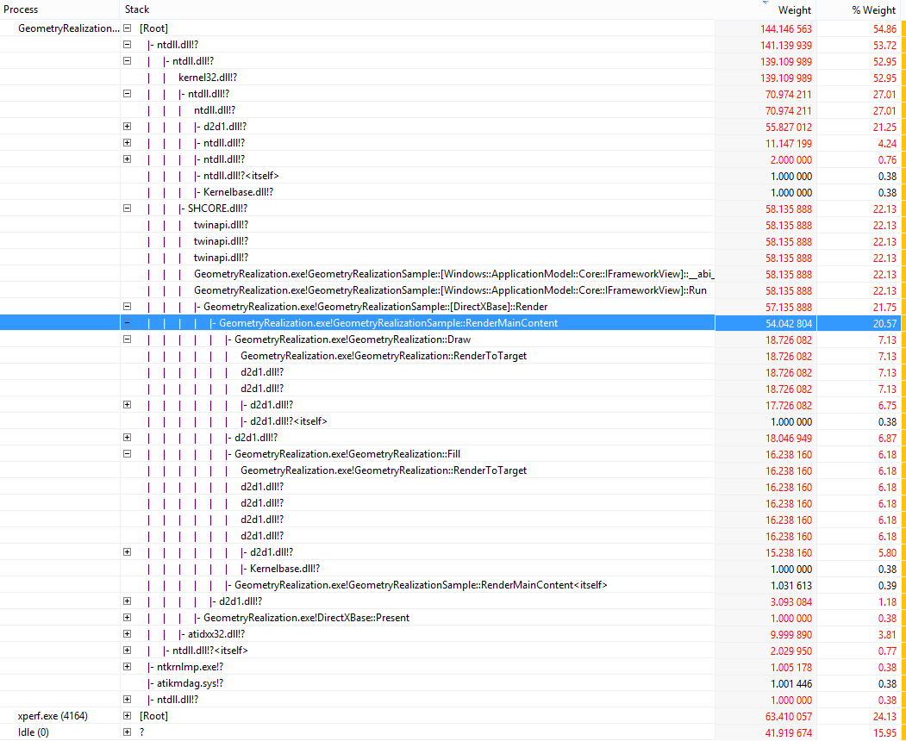

### Calculating CPU time when 8192 primitives are being rendered realized

It is clear from the profiles that the app is CPU bound. In order to reduce the time spent by the CPU, geometries can be created once and cached. The cached content can be rendered every frame without incurring the geometry tessellation cost per frame. When looking at the trace in **GPUView** for the realized part of the app, it is clear that DWM is able to present every frame and the CPU time has reduced drastically.

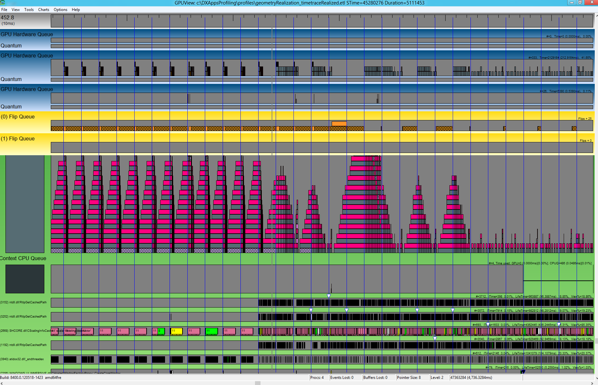

The first part of the graph shows realized 8192 primitives. The corresponding CPU time per frame is able to fit within two consecutive v-syncs. In the later part of the graph this is not true.

Looking in **XPerf**, CPU is sitting idle for the longest time with only about 25% of the CPU time being spent on the geometry realization app.

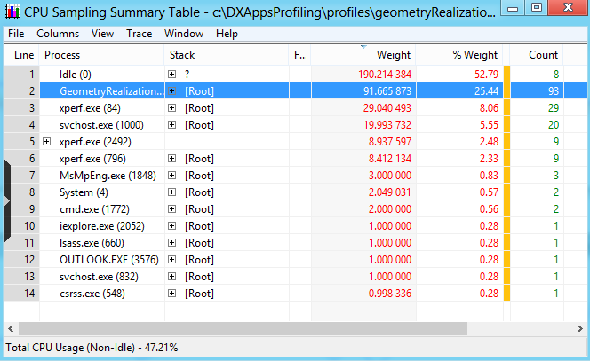

## Summary

Both **GPUView** and **XPerf** and powerful tools for analyzing performance of [DirectX](/previous-versions/windows/apps/jj262109(v=win.10)) apps. This article is a primer for using these tools and understanding basic performance measurements and app characteristics. Apart from understanding usage of tools, it is first important to understand the app being analyzed. Start with finding answers to questions like what is the app trying to achieve? Which threads in the system are most important? What trade-offs are you willing to make? When analyzing performance traces, start by looking at obvious problematic places. Is the app CPU or GPU bound? Is the app able to present every frame? Tools together with an understanding of the app can give very useful information in understanding, finding and finally solving performance problems.

 

 