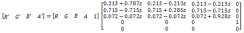

# Saturation effect

Use this effect to alter the saturation of an image. The saturation effect is a specialization of the [color matrix](color-matrix.md) effect.

The CLSID for this effect is CLSID\_D2D1Saturation.

-   [Example image](#example-image)
-   [Effect properties](#effect-properties)
-   [Requirements](#requirements)
-   [Related topics](#related-topics)

## Example image

The example here shows the input and output images of the saturation effect with a saturation of 0%.


| Before                                                      |
|-------------------------------------------------------------|
|   |
| After                                                       |
|  |


 


```C++
ComPtr<ID2D1Effect> saturationEffect;
m_d2dContext->CreateEffect(CLSID_D2D1Saturation, &saturationEffect);

saturationEffect->SetInput(0, bitmap);

saturationEffect->SetValue(D2D1_SATURATION_PROP_SATURATION, 0.0f);

m_d2dContext->BeginDraw();
m_d2dContext->DrawImage(saturationEffect.Get());
m_d2dContext->EndDraw();
```


The effect calculates a color matrix based on the saturation value (*s* in the equation here) you specify with the D2D1\_SATURATION\_PROP\_SATURATION property. The matrix equation is shown here.



The matrix created depends only on the saturation value. You can use the [color matrix](color-matrix.md) effect if you need a specific matrix.

This effect consumes and outputs premultiplied alpha images. The effect won't work on straight alpha images unless they are fully opaque.

## Effect properties


| Display name and index enumeration                                  | Type and default value           | Description                                                                                                                                                                                                                      |
|---------------------------------------------------------------------|----------------------------------|----------------------------------------------------------------------------------------------------------------------------------------------------------------------------------------------------------------------------------|
| Saturation<br/> D2D1\_SATURATION\_PROP\_SATURATION<br/> | FLOAT<br/> 0.5f<br/> | The saturation of the image. You can set the saturation to a value between 0 and 1. If you set it to 1 the output image is fully saturated. If you set it to 0 the output image is monochrome. The saturation value is unitless. |


 

## Requirements


| Requirement | Value |
|--------------------------|------------------------------------------------------------------------------------|
| Minimum supported client | Windows 8 and Platform Update for Windows 7 \[desktop apps \| Windows Store apps\] |
| Minimum supported server | Windows 8 and Platform Update for Windows 7 \[desktop apps \| Windows Store apps\] |
| Header                   | d2d1effects.h                                                                      |
| Library                  | d2d1.lib, dxguid.lib                                                               |


 

## Related topics

<dl> <dt>

[**ID2D1Effect**](/windows/win32/api/d2d1_1/nn-d2d1_1-id2d1effect)
</dt> </dl>

 

