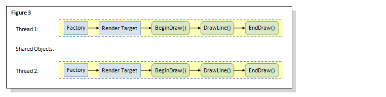

# Using Direct2D for Server-Side Rendering

Direct2D is well-suited for graphics applications that require server-side rendering on Windows Server. This overview describes the basics of using Direct2D for server-side rendering. It contains the following sections:

-   [Requirements for Server-Side Rendering](#requirements-for-server-side-rendering)
-   [Options for Available APIs](#options-for-available-apis)
    -   [GDI](#gdi)
    -   [GDI+](#gdi)
    -   [Direct2D](#using-direct2d-for-server-side-rendering)
-   [How to Use Direct2D for Server-Side Rendering](#how-to-use-direct2d-for-server-side-rendering)
    -   [Software Rendering](#software-rendering)
    -   [Multithreading](#multithreading)
    -   [Generating a Bitmap File](#generating-a-bitmap-file)
-   [Conclusion](#conclusion)
-   [Related topics](#related-topics)

## Requirements for Server-Side Rendering

The following is a typical scenario for a chart server: charts and graphics are rendered on a server and delivered as bitmaps in response to Web requests. The server might be equipped with a low-end graphics card or no graphics card at all.

This scenario reveals three application requirements. First, the application must handle multiple concurrent requests efficiently, especially on multicore servers. Second, the application must use software rendering when running on servers with a low-end graphics card or no graphics card. Finally, the application must run as a service in Session 0 so that it does not require a user to be logged in. For more information about Session 0, see [Impact of Session 0 Isolation on Services and Drivers in Windows](https://www.microsoft.com/whdc/system/sysinternals/Session0Changes.mspx).

## Options for Available APIs

There are three options for server-side rendering: GDI, GDI+ and Direct2D. Like GDI and GDI+, Direct2D is a native 2D rendering API that gives applications more control over the use of graphics devices. In addition, Direct2D uniquely supports a single-threaded and a multithreaded factory. The following sections compare each API in terms of drawing qualities and multithreaded server-side rendering.

### GDI

Unlike Direct2D and GDI+, GDI does not support high-quality drawing features. For instance, GDI does not support antialiasing for creating smooth lines and has only limited support for transparency. Based on the graphics performance test results on Windows 7 and Windows Server 2008 R2, Direct2D scales more efficiently than GDI, despite the redesign of locks in GDI. For more information about these test results, see [Engineering Windows 7 Graphics Performance](/archive/blogs/e7/engineering-windows-7-graphics-performance).

In addition, applications using GDI are limited to 10240 GDI handles per process and 65536 GDI handles per session. The reason is that internally Windows uses a 16-bit WORD to store the index of handles for each session.

### GDI+

While GDI+ supports antialiasing and alpha blending for high-quality drawing, the main problem with GDI+ for server-scenarios is that it does not support running in Session 0. Since Session 0 only supports non-interactive functionality, functions that directly or indirectly interact with display devices will therefore receive errors. Specific examples of functions include not only those dealing with display devices, but also those indirectly dealing with device drivers.

Similar to GDI, GDI+ is limited by its locking mechanism. The locking mechanisms in GDI+ are the same in Windows 7 and Windows Server 2008 R2 as in previous versions.

### Direct2D

Direct2D is a hardware-accelerated, immediate-mode, 2-D graphics API that provides high performance and high-quality rendering. It offers a single-threaded and a multithreaded factory and the linear scaling of course-grained software rendering.

To do this, Direct2D defines a root factory interface. As a rule, an object created on a factory can only be used with other objects created from the same factory. The caller can request either a single-threaded or a multithreaded factory when it is created. If a single-threaded factory is requested, then no locking of threads is performed. If the caller requests a multithreaded factory, then, a factory-wide thread lock is acquired whenever a call is made into Direct2D.

In addition, the locking of threads in Direct2D is more granular than in GDI and GDI+, so that the increase of the number of threads has minimal impact on the performance.

## How to Use Direct2D for Server-Side Rendering

The following sections describe how to use software rendering, how to optimally use a single-threaded and a multithreaded factory, and how to draw and save a complex drawing to a file.

### Software Rendering

Server-side applications use software rendering by creating [IWICBitmap](/windows/win32/api/wincodec/nn-wincodec-iwicbitmap) render target, with the render target type set to either D2D1\_RENDER\_TARGET\_TYPE\_SOFTWARE or D2D1\_RENDER\_TARGET\_TYPE\_DEFAULT. For more information about [IWICBitmap](/windows/win32/api/wincodec/nn-wincodec-iwicbitmap) render targets, see the [**ID2D1Factory::CreateWicBitmapRenderTarget**](id2d1factory-createwicbitmaprendertarget.md) method; for more information about the render target types, see [**D2D1\_RENDER\_TARGET\_TYPE**](/windows/desktop/api/d2d1/ne-d2d1-d2d1_render_target_type).

### Multithreading

Knowing how to create and share factories and render targets across threads can significantly impact the performance of an application. The following three figures show three varied approaches. The optimal approach is shown in figure 3.


In figure 1, different threads share the same factory and the same render target. This approach can lead to unpredictable results in cases when multiple threads simultaneously change the state of the shared render target, such as simultaneously setting the transformation matrix. As the internal locking in Direct2D does not synchronize a shared resource such as render targets, this approach can cause the [**BeginDraw**](/windows/win32/api/d2d1/nf-d2d1-id2d1rendertarget-begindraw) call to fail in thread 1, because in thread 2, the **BeginDraw** call is already using the shared render target.


To avoid the unpredictable results encountered in figure 1, figure 2 shows a multithreaded factory with each thread having its own render target. This approach works but it effectively functions as a single-threaded application. The reason is that the factory-wide lock applies only to the drawing-operation level and all the drawing calls in the same factory consequently are serialized. As a result, thread 1 becomes blocked when trying to enter a drawing call, while thread 2 is in the middle of executing another drawing call.



Figure 3 shows the optimal approach, where a single-threaded factory and a single-threaded render target are used. Since no locking is performed when using a single-threaded factory, drawing operations in each thread can run concurrently to achieve optimal performance.

### Generating a Bitmap File

To generate a bitmap file using software rendering, use an [IWICBitmap](/windows/win32/api/wincodec/nn-wincodec-iwicbitmap) render target. Use an [IWICStream](/windows/win32/api/wincodec/nn-wincodec-iwicstream) to write the bitmap to a file. Use [IWICBitmapFrameEncode](/windows/win32/api/wincodec/nn-wincodec-iwicbitmapframeencode) to encode the bitmap into a specified image format. The following code example shows how to draw and save the following image to a file.


This code example first creates an [IWICBitmap](/windows/win32/api/wincodec/nn-wincodec-iwicbitmap) and an [IWICBitmap](/windows/win32/api/wincodec/nn-wincodec-iwicbitmap) render target. It then renders a drawing with some text, a path geometry representing an hour glass, and a transformed hour glass into a WIC bitmap. It then uses [IWICStream::InitializeFromFilename](/windows/win32/api/wincodec/nf-wincodec-iwicstream-initializefromfilename) to save the bitmap to a file. If your application needs to save the bitmap in memory, use [IWICStream::InitializeFromMemory](/windows/win32/api/wincodec/nf-wincodec-iwicstream-initializefrommemory) instead. Finally, it uses [IWICBitmapFrameEncode](/windows/win32/api/wincodec/nn-wincodec-iwicbitmapframeencode) to encode the bitmap.


```C++
// Create an IWICBitmap and RT
static const UINT sc_bitmapWidth = 640;
static const UINT sc_bitmapHeight = 480;
if (SUCCEEDED(hr))
{
    hr = pWICFactory->CreateBitmap(
        sc_bitmapWidth,
        sc_bitmapHeight,
        GUID_WICPixelFormat32bppBGR,
        WICBitmapCacheOnLoad,
        &pWICBitmap
        );
}

// Set the render target type to D2D1_RENDER_TARGET_TYPE_DEFAULT to use software rendering.
if (SUCCEEDED(hr))
{
    hr = pD2DFactory->CreateWicBitmapRenderTarget(
        pWICBitmap,
        D2D1::RenderTargetProperties(),
        &pRT
        );
}

// Create text format and a path geometry representing an hour glass. 
if (SUCCEEDED(hr))
{
    static const WCHAR sc_fontName[] = L"Calibri";
    static const FLOAT sc_fontSize = 50;

    hr = pDWriteFactory->CreateTextFormat(
        sc_fontName,
        NULL,
        DWRITE_FONT_WEIGHT_NORMAL,
        DWRITE_FONT_STYLE_NORMAL,
        DWRITE_FONT_STRETCH_NORMAL,
        sc_fontSize,
        L"", //locale
        &pTextFormat
        );
}
if (SUCCEEDED(hr))
{
    pTextFormat->SetTextAlignment(DWRITE_TEXT_ALIGNMENT_CENTER);
    pTextFormat->SetParagraphAlignment(DWRITE_PARAGRAPH_ALIGNMENT_CENTER);
    hr = pD2DFactory->CreatePathGeometry(&pPathGeometry);
}
if (SUCCEEDED(hr))
{
    hr = pPathGeometry->Open(&pSink);
}
if (SUCCEEDED(hr))
{
    pSink->SetFillMode(D2D1_FILL_MODE_ALTERNATE);

    pSink->BeginFigure(
        D2D1::Point2F(0, 0),
        D2D1_FIGURE_BEGIN_FILLED
        );

    pSink->AddLine(D2D1::Point2F(200, 0));

    pSink->AddBezier(
        D2D1::BezierSegment(
            D2D1::Point2F(150, 50),
            D2D1::Point2F(150, 150),
            D2D1::Point2F(200, 200))
        );

    pSink->AddLine(D2D1::Point2F(0, 200));

    pSink->AddBezier(
        D2D1::BezierSegment(
            D2D1::Point2F(50, 150),
            D2D1::Point2F(50, 50),
            D2D1::Point2F(0, 0))
        );

    pSink->EndFigure(D2D1_FIGURE_END_CLOSED);

    hr = pSink->Close();
}
if (SUCCEEDED(hr))
{
    static const D2D1_GRADIENT_STOP stops[] =
    {
        {   0.f,  { 0.f, 1.f, 1.f, 1.f }  },
        {   1.f,  { 0.f, 0.f, 1.f, 1.f }  },
    };

    hr = pRT->CreateGradientStopCollection(
        stops,
        ARRAYSIZE(stops),
        &pGradientStops
        );
}
if (SUCCEEDED(hr))
{
    hr = pRT->CreateLinearGradientBrush(
        D2D1::LinearGradientBrushProperties(
            D2D1::Point2F(100, 0),
            D2D1::Point2F(100, 200)),
        D2D1::BrushProperties(),
        pGradientStops,
        &pLGBrush
        );
}
if (SUCCEEDED(hr))
{
    hr = pRT->CreateSolidColorBrush(
        D2D1::ColorF(D2D1::ColorF::Black),
        &pBlackBrush
        );
}
if (SUCCEEDED(hr))
{
    // Render into the bitmap.
    pRT->BeginDraw();
    pRT->Clear(D2D1::ColorF(D2D1::ColorF::White));
    D2D1_SIZE_F rtSize = pRT->GetSize();

    // Set the world transform to a 45 degree rotation at the center of the render target
    // and write "Hello, World".
    pRT->SetTransform(
        D2D1::Matrix3x2F::Rotation(
            45,
            D2D1::Point2F(
                rtSize.width / 2,
                rtSize.height / 2))
            );

    static const WCHAR sc_helloWorld[] = L"Hello, World!";
    pRT->DrawText(
        sc_helloWorld,
        ARRAYSIZE(sc_helloWorld) - 1,
        pTextFormat,
        D2D1::RectF(0, 0, rtSize.width, rtSize.height),
        pBlackBrush);

    // Reset back to the identity transform.
    pRT->SetTransform(D2D1::Matrix3x2F::Translation(0, rtSize.height - 200));
    pRT->FillGeometry(pPathGeometry, pLGBrush);
    pRT->SetTransform(D2D1::Matrix3x2F::Translation(rtSize.width - 200, 0));
    pRT->FillGeometry(pPathGeometry, pLGBrush);
    hr = pRT->EndDraw();
}

if (SUCCEEDED(hr))
{
    // Save the image to a file.
    hr = pWICFactory->CreateStream(&pStream);
}

WICPixelFormatGUID format = GUID_WICPixelFormatDontCare;

// Use InitializeFromFilename to write to a file. If there is need to write inside the memory, use InitializeFromMemory. 
if (SUCCEEDED(hr))
{
    static const WCHAR filename[] = L"output.png";
    hr = pStream->InitializeFromFilename(filename, GENERIC_WRITE);
}
if (SUCCEEDED(hr))
{
    hr = pWICFactory->CreateEncoder(GUID_ContainerFormatPng, NULL, &pEncoder);
}
if (SUCCEEDED(hr))
{
    hr = pEncoder->Initialize(pStream, WICBitmapEncoderNoCache);
}
if (SUCCEEDED(hr))
{
    hr = pEncoder->CreateNewFrame(&pFrameEncode, NULL);
}
// Use IWICBitmapFrameEncode to encode the bitmap into the picture format you want.
if (SUCCEEDED(hr))
{
    hr = pFrameEncode->Initialize(NULL);
}
if (SUCCEEDED(hr))
{
    hr = pFrameEncode->SetSize(sc_bitmapWidth, sc_bitmapHeight);
}
if (SUCCEEDED(hr))
{
    hr = pFrameEncode->SetPixelFormat(&format);
}
if (SUCCEEDED(hr))
{
    hr = pFrameEncode->WriteSource(pWICBitmap, NULL);
}
if (SUCCEEDED(hr))
{
    hr = pFrameEncode->Commit();
}
if (SUCCEEDED(hr))
{
    hr = pEncoder->Commit();
}

```


## Conclusion

As seen from the above, using Direct2D for server-side rendering is simple and straightforward. In addition, it provides high quality and highly parallelizable rendering that can run in low-privilege environments of the server.

## Related topics

<dl> <dt>

[Direct2D Reference](reference.md)
</dt> </dl>

 

 