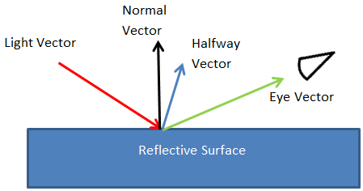
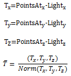

# Spot-specular lighting effect

Use the spot-specular lighting effect to create an image that appears to be a reflective surface where the light source is limited to a directed cone of light. This effect uses the alpha channel as a height map and lights the image with a point light source.

The color of the output bitmap is a result of light color, light position, the direction of the cone and the surface geometry according to the specular portion of the Phong lighting model. The alpha channel output for each pixel with specular lighting is the maximum of the red, green, and blue channel outputs for that pixel.

The CLSID for this effect is CLSID\_D2D1SpotSpecular.

-   [Example image](#example-image)
-   [Spot light source](#spot-light-source)
-   [Effect properties](#effect-properties)
-   [Scale modes](#scale-modes)
-   [Requirements](#requirements)
-   [Related topics](#related-topics)

## Example image

The example here shows the input and output images of the spot-specular lighting effect.

Specular light refers to light that is reflected in a particular direction.

The effect calculates the final output pixel values are calculated using the equations here:

where

## Spot light source

A spot light source emits light in a cone in a specific direction and doesn't emit light outside of the cone.

The spot light source calculates the Light Vector L and the Halfway Vector H the same way as the [point-specular](point-specular.md) effect.

The effect calculates the light color, Lr, Lg, Lb, as a function of position of the light source as shown with the equations here:

The vector  is defined by these equations:

The vector  is defined by these equations:

## Effect properties

| Display name and index enumeration                                                        | Description                                                                                                                                                                                                                                                                                                                                                                                                                                                                           |
|-------------------------------------------------------------------------------------------|---------------------------------------------------------------------------------------------------------------------------------------------------------------------------------------------------------------------------------------------------------------------------------------------------------------------------------------------------------------------------------------------------------------------------------------------------------------------------------------|
| LightPosition  D2D1\_SPOTSPECULAR\_PROP\_LIGHT\_POSITION              | The light position of the point light source. The property is a D2D1\_VECTOR\_3F defined as (x, y, z). The units are in device-independent pixels (DIPs) and are unbounded. The type is D2D1\_VECTOR\_3F.  The default value is {0.0f, 0.0f, 0.0f}.                                                                                                                                                                                                               |
| PointsAt  D2D1\_SPOTSPECULAR\_PROP\_POINTS\_AT                        | Where the spot light is focused. The property is exposed as a D2D1\_VECTOR\_3F with   (x, y, z). The units are in DIPs and the values are unbounded. The type is D2D1\_VECTOR\_3F.  The default value is {0.0f, 0.0f, 0.0f}.                                                                                                                                                                                                                                      |
| Focus  D2D1\_SPOTSPECULAR\_PROP\_FOCUS                                | The focus of the spot light. This property is unitless and is defined between 0 and 200. The type is FLOAT.  The default value is 1.0f.                                                                                                                                                                                                                                                                                                                           |
| LimitingConeAngle  D2D1\_SPOT\_SPECULAR\_PROP\_LIMITING\_CONE\_ANGLE  | The cone angle that restricts the region where the light is projected. No light is projected outside the cone. The limiting cone angle is the angle between the spot light axis (the axis between the *LightPosition* and *PointsAt* properties) and the spot light cone. This property is defined in degrees and must be between 0 to 90 degrees. The type is FLOAT.  The default value is 90.0f.                                                                |
| SpecularExponent  D2D1\_SPOTSPECULAR\_PROP\_SPECULAR\_EXPONENT        | The exponent for the specular term in the Phong lighting equation. A larger value corresponds to a more reflective surface. This value is unitless and must be between 1.0 and 128. The type is FLOAT.  The default value is 1.0f.                                                                                                                                                                                                                                |
| SpecularConstant  D2D1\_SPOTSPECULAR\_PROP\_SPECULAR\_CONSTANT        | The ratio of specular reflection to the incoming light. The value is unitless and must be between 0 and 10,000. The type is FLOAT.  The default value is 1.0f.                                                                                                                                                                                                                                                                                                    |
| SurfaceScale  D2D1\_SPOTSPECULAR\_PROP\_SURFACE\_SCALE                | The scale factor in the Z direction for generating a height map. The value is unitless and must be between 0 and 10,000. The type is FLOAT.  The default value is 1.0f.                                                                                                                                                                                                                                                                                           |
| Color  D2D1\_SPOTSPECULAR\_PROP\_COLOR                                | The color of the incoming light. This property is exposed as a Vector 3   (R, G, B) and used to compute LR, LG, LB. The type is D2D1\_VECTOR\_3F.  The default value is {1.0f, 1.0f, 1.0f}.                                                                                                                                                                                                                                      |
| KernelUnitLength  D2D1\_SPOTSPECULAR\_PROP\_KERNEL\_UNIT\_LENGTH      | The size of an element in the Sobel kernel used to generate the surface normal in the X and Y direction. This property maps to the dx and dy values in the Sobel gradient. This property is a D2D1\_VECTOR\_2F (Kernel Unit Length X, Kernel Unit Length Y) and is defined in (DIPs/Kernel Unit). The effect uses bilinear interpolation to scale the bitmap to match size of kernel elements. The type is D2D1\_VECTOR\_2F.  The default value is {1.0f, 1.0f}.  |
| ScaleMode  D2D1\_SPOTSPECULAR\_PROP\_SCALE\_MODE                      | The interpolation mode the effect uses to scale the image to the corresponding kernel unit length. There are six scale modes that range in quality and speed. See [Scale modes](#scale-modes) for more info.   The type is D2D1\_SPOTSPECULAR\_SCALE\_MODE.  The default value is D2D1\_SPOTSPECULAR\_SCALE\_MODE\_LINEAR.                                                                                                                              |

 

## Scale modes

| Enumeration                                            | Description                                                                                                                                                                                          |
|--------------------------------------------------------|------------------------------------------------------------------------------------------------------------------------------------------------------------------------------------------------------|
| D2D1\_SPOTSPECULAR\_SCALE\_MODE\_NEAREST\_NEIGHBOR     | Samples the nearest single point and uses that. This mode uses less processing time, but outputs the lowest quality image.                                                                           |
| D2D1\_SPOTSPECULAR\_SCALE\_MODE\_LINEAR                | Uses a four point sample and linear interpolation. This mode outputs a higher quality image than nearest neighbor.                                                                                   |
| D2D1\_SPOTSPECULAR\_SCALE\_MODE\_CUBIC                 | Uses a 16 sample cubic kernel for interpolation. This mode uses the most processing time, but outputs a higher quality image.                                                                        |
| D2D1\_SPOTSPECULAR\_SCALE\_MODE\_MULTI\_SAMPLE\_LINEAR | Uses 4 linear samples within a single pixel for good edge anti-aliasing. This mode is good for scaling down by small amounts on images with few pixels.                                              |
| D2D1\_SPOTSPECULAR\_SCALE\_MODE\_ANISOTROPIC           | Uses anisotropic filtering to sample a pattern according to the transformed shape of the bitmap.                                                                                                     |
| D2D1\_SPOTSPECULAR\_SCALE\_MODE\_HIGH\_QUALITY\_CUBIC  | Uses a variable size high quality cubic kernel to perform a pre-downscale the image if downscaling is involved in the transform matrix. Then uses the cubic interpolation mode for the final output. |

 

> [!Note]  
> If you don't select a mode, the effect defaults to D2D1\_SPOTSPECULAR\_SCALE\_MODE\_LINEAR.

## Requirements

| Requirement | Value |
|--------------------------|------------------------------------------------------------------------------------|
| Minimum supported client | Windows 8 and Platform Update for Windows 7 \[desktop apps \| Windows Store apps\] |
| Minimum supported server | Windows 8 and Platform Update for Windows 7 \[desktop apps \| Windows Store apps\] |
| Header                   | d2d1effects.h                                                                      |
| Library                  | d2d1.lib, dxguid.lib                                                               |

 

## Related topics

<dl> <dt>

[**ID2D1Effect**](/windows/win32/api/d2d1_1/nn-d2d1_1-id2d1effect)
</dt> </dl>

 

