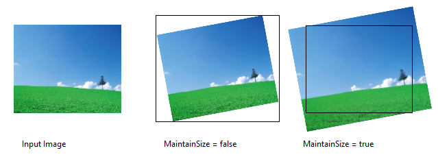

# Straighten Effect

Rotates and optionally scales an image.

The CLSID for this effect is CLSID\_D2D1Straighten.

-   [Example Image](#example-image)
-   [Sample Code](#sample-code)
-   [Effect Properties](#effect-properties)
-   [Requirements](#requirements)
-   [Related topics](#related-topics)

## Example Image



## Sample Code


```C++
ComPtr<ID2D1Effect> straightenEffect;
m_d2dContext->CreateEffect(CLSID_D2D1Straighten, &amp;straightenEffect);
 
straightenEffect->SetInput(0, bitmap);
straightenEffect->SetValue(D2D1_STRAIGHTEN_PROP_ANGLE, 12.0f);
straightenEffect->SetValue(D2D1_STRAIGHTEN_PROP_MAINTAIN_SIZE, true);
straightenEffect->SetValue(D2D1_STRAIGHTEN_PROP_SCALE_MODE, D2D1_STRAIGHTEN_SCALE_MODE_LINEAR);
 
m_d2dContext->BeginDraw();
m_d2dContext->DrawImage(straightenEffect.Get());
m_d2dContext->EndDraw();


```


## Effect Properties

The properties for the straighten effect are defined by the [**D2D1\_STRAIGHTEN\_PROP**](/windows/win32/d2d1effects_2/ne-d2d1effects_2-d2d1_straighten_prop?branch=master) enumeration.

## Requirements


|                          |                                                   |
|--------------------------|---------------------------------------------------|
| Minimum supported client | Windows 10 \[desktop apps \| Windows Store apps\] |
| Minimum supported server | Windows 10 \[desktop apps \| Windows Store apps\] |
| Header                   | d2d1effects\_2.h                                  |
| Library                  | d2d1.lib, dxguid.lib                              |


 

## Related topics

<dl> <dt>

[**ID2D1Effect**](/windows/win32/D2d1_1/?branch=master)
</dt> </dl>

 

 


