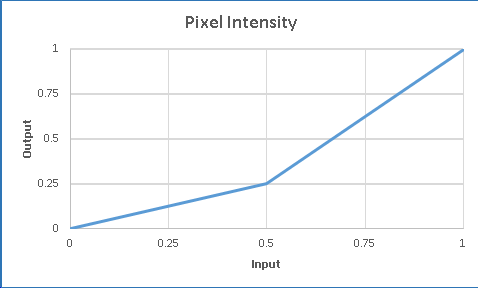

# Table transfer effect

Use the table transfer effect to map the color intensities of an image using a transfer function created from interpolating a list of values you provide.

The CLSID for this effect is CLSID\_D2D1TableTransfer.

-   [Example image](#example-image)
-   [Effect properties](#effect-properties)
-   [Requirements](#requirements)
-   [Related topics](#related-topics)

## Example image

The image here shows the input and output of the table transfer effect.


| Before                                                         |
|----------------------------------------------------------------|
|      |
| After                                                          |
|  |


 


```C++
ComPtr<ID2D1Effect> tableTransferEffect;
m_d2dContext->CreateEffect(CLSID_D2D1TableTransfer, &tableTransferEffect);

tableTransferEffect->SetInput(0, bitmap);

float table[2] = {0.75f, 1.0f};
tableTransferEffect->SetValue(D2D1_TABLETRANSFER_PROP_BLUE_TABLE, table);

m_d2dContext->BeginDraw();
m_d2dContext->DrawImage(tableTransferEffect.Get());
m_d2dContext->EndDraw();
```


The transfer function is based on a list of inputs V=(V0,V1,V2,V3, V? ,V<sub>N</sub>) where N is the number of elements - 1.

The input pixel intensity is represented as C. The output pixel intensity, C  can be calculated with the equation.

For a value C, pick a value k, such that: k/N = C < (k+1)/N

The output C  is calculated using the following equation: C' = V? + (C -  k/N) \* N \* (V???1? - V?)

This effect works on straight and premultiplied alpha images. The effect outputs premultiplied alpha bitmaps.

Here is what the graph of table transfer function looks like if the table property is set to `[0.0, 0.25, 1.0]`.



## Effect properties

> [!Note]  
> The values of all channels of the table transfer properties are unitless and have a minimum of 0.0 and a maximum 1.0.

 


| Display name and index enumeration                                           | Type and default value                       | Description                                                                                                                                                                                                                                                                                                                                                                                                                                                   |
|------------------------------------------------------------------------------|----------------------------------------------|---------------------------------------------------------------------------------------------------------------------------------------------------------------------------------------------------------------------------------------------------------------------------------------------------------------------------------------------------------------------------------------------------------------------------------------------------------------|
| RedTable<br/> D2D1\_TABLETRANSFER\_PROP\_RED\_TABLE<br/>         | FLOAT\[\]<br/> {0.0f, 1.0f}<br/> | The list of values used to define the transfer function for the Red channel.                                                                                                                                                                                                                                                                                                                                                                                  |
| RedDisable<br/> D2D1\_TABLETRANSFER\_PROP\_RED\_DISABLE<br/>     | BOOL<br/> FALSE<br/>             | If you set this to TRUE the effect does not apply the transfer function to the Red channel. If you set this to FALSE it applies the RedTableTransfer function to the Red channel.                                                                                                                                                                                                                                                                             |
| GreenTable<br/> D2D1\_TABLETRANSFER\_PROP\_GREEN\_TABLE<br/>     | FLOAT\[\]<br/> {0.0f, 1.0f}<br/> | The list of values used to define the transfer function for the Green channel.                                                                                                                                                                                                                                                                                                                                                                                |
| GreenDisable<br/> D2D1\_TABLETRANSFER\_PROP\_GREEN\_DISABLE<br/> | BOOL<br/> FALSE<br/>             | If you set this to TRUE the effect does not apply the transfer function to the Green channel. If you set this to FALSE it applies the GreenTableTransfer function to the Green channel.                                                                                                                                                                                                                                                                       |
| BlueTable<br/> D2D1\_TABLETRANSFER\_PROP\_BLUE\_TABLE<br/>       | FLOAT\[\]<br/> {0.0f, 1.0f}<br/> | The list of values used to define the transfer function for the Blue channel.                                                                                                                                                                                                                                                                                                                                                                                 |
| BlueDisable<br/> D2D1\_TABLETRANSFER\_PROP\_BLUE\_DISABLE<br/>   | BOOL<br/> FALSE<br/>             | If you set this to TRUE the effect does not apply the transfer function to the Blue channel. If you set this to FALSE it applies the BlueTableTransfer function to the Blue channel.                                                                                                                                                                                                                                                                          |
| AlphaTable<br/> D2D1\_TABLE\_TRANSFER\_PROP\_ALPHA\_TABLE<br/>   | FLOAT\[\]<br/> {0.0f, 1.0f}<br/> | The list of values used to define the transfer function for the Alpha channel.                                                                                                                                                                                                                                                                                                                                                                                |
| AlphaDisable<br/> D2D1\_TABLETRANSFER\_PROP\_ALPHA\_DISABLE<br/> | BOOL<br/> FALSE<br/>             | If you set this to TRUE the effect does not apply the transfer function to the Alpha channel. If you set this to FALSE it applies the AlphaTableTransfer function to the Alpha channel.                                                                                                                                                                                                                                                                       |
| ClampOutput<br/> D2D1\_TABLETRANSFER\_PROP\_CLAMP\_OUTPUT<br/>   | BOOL<br/> FALSE<br/>             | Whether the effect clamps color values to between 0 and 1 before the effect passes the values to the next effect in the graph. The effect clamps the values before it premultiplies the alpha .<br/> If you set this to TRUE the effect will clamp the values. If you set this to FALSE, the effect will not clamp the color values, but other effects and the output surface may clamp the values if they are not of high enough precision.<br/> |


 

## Requirements


| Requirement | Value |
|--------------------------|------------------------------------------------------------------------------------|
| Minimum supported client | Windows 8 and Platform Update for Windows 7 \[desktop apps \| Windows Store apps\] |
| Minimum supported server | Windows 8 and Platform Update for Windows 7 \[desktop apps \| Windows Store apps\] |
| Header                   | d2d1effects.h                                                                      |
| Library                  | d2d1.lib, dxguid.lib                                                               |


 

## Related topics

<dl> <dt>

[**ID2D1Effect**](/windows/win32/api/d2d1_1/nn-d2d1_1-id2d1effect)
</dt> </dl>

 

