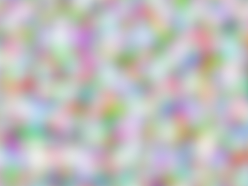

# Turbulence effect

Use the turbulence effect to generate a bitmap based on the Perlin noise function.

The turbulence effect has no input image.

The CLSID for this effect is CLSID\_D2D1Turbulence.

-   [Example image](#example-image)
-   [Effect properties](#effect-properties)
-   [Noise modes](#noise-modes)
-   [Output bitmap](#output-bitmap)
-   [Requirements](#requirements)
-   [Related topics](#related-topics)

## Example image

The Turbulence effect computes the sum of one or more octaves of the Perlin noise function. Perlin noise is a pseudo-random function whose value depends on the frequency, position, and seed value. The effect generates the RGBA values using one of these equations.

If you select the D2D1\_TURBULENCE\_NOISE\_FRACTAL\_SUM noise mode the effect uses this equation.

If you select the D2D1\_TURBULENCE\_NOISE\_TURBULENCE noise mode the effect uses this equation.

> [!Note]  
> The `PerlinNoise` function has a range of \[-1, 1\].

 

This effect outputs pixel values in premultiplied alpha.

## Effect properties

| Display name and index enumeration | Description | 
|------------------------------------|-------------|
| Offset  D2D1_TURBULENCE_PROP_OFFSET  | The coordinates where the turbulence output is generated.  The algorithm used to generate the Perlin noise is position dependent, so a different offset results in a different output. This property is not bounded and the units are specified in DIPs  <blockquote>[!Note] The offset does not have the same effect as a translation because the noise function output is infinite and the function will wrap around the tile.</blockquote>  The type is D2D1_VECTOR_2F.  The default value is {0.0f, 0.0f}.  | 
| Size  D2D1_TURBULENCE_PROP_SIZE  | The size of the turbulence output.  This property is not bounded and the units are specified in DIPs    The type is D2D1_VECTOR_2F.  The default value is {0.0f, 0.0f}.  | 
| BaseFrequency  D2D1_TURBULENCE_PROP_BASE_FREQUENCY  | The base frequencies in the X and Y direction. This property is a float and must be greater than 0. The units are specified in 1/DIPs.   A value of 1 (1/DIPs) for the base frequency results in the Perlin noise completing an entire cycle between two pixels. The ease interpolation for these pixels results in completely random pixels, since there is no correlation between the pixels.  A value of 0.1(1/DIPs) for the base frequency, the Perlin noise function repeats every 10 DIPs. This results in correlation between pixels and the typical turbulence effect is visible.  The type is D2D1_VECTOR_2F.  The default value is {0.01f, 0.01f}.  | 
| NumOctaves  D2D1_TURBULENCE_PROP_NUM_OCTAVES  | The number of octaves for the noise function. This property is a UINT32 and must be greater than 0.  The type is UINT32.  The default value is 1.  | 
| Seed  D2D1_TURBULENCE_PROP_SEED  | The seed for the pseudo random generator. This property is unbounded.  The type is UINT32.  The default value is 0.  | 
| Noise  D2D1_TURBULENCE_PROP_NOISE  | The turbulence noise mode. This property can be either <em>fractal sum</em> or <em>turbulence</em>. Indicates whether to generate a bitmap based on Fractal Noise or the Turbulence function. See <a href="#noise-modes">Noise modes</a> for more info.   The type is D2D1_TURBULENCE_NOISE.  The default value is D2D1_TURBULENCE_NOISE_FRACTAL_SUM.  | 
| Stitchable  D2D1_TURBULENCE_PROP_STITCHABLE  | Turns stitching on or off. The base frequency is adjusted so that output bitmap can be stitched. This is useful if you want to tile multiple copies of the turbulence effect output.<ul><li>True   The output bitmap can be tiled (using the tile effect) without the appearance of seams. The base frequency is adjusted so that output bitmap can be stitched.</li><li>False   The base frequency is not adjusted, so seams may appear between tiles if the bitmap is tiled.</li></ul>  The type is BOOL.  The default value is FALSE.  | 

 

## Noise modes

| Enumeration                           | Description                                                                           |
|---------------------------------------|---------------------------------------------------------------------------------------|
| D2D1\_TURBULENCE\_NOISE\_FRACTAL\_SUM | Computes a sum of the octaves, shifting the output range from \[-1, 1\], to \[0, 1\]. |
| D2D1\_TURBULENCE\_NOISE\_TURBULENCE   | Computes a sum of the absolute value of each octave.                                  |

 

> [!Note]  
> Neither mode contains an explicit clamp of the output values.

 

## Output bitmap

This effect generates a logically infinite sized bitmap.

## Requirements

| Requirement | Value |
|--------------------------|------------------------------------------------------------------------------------|
| Minimum supported client | Windows 8 and Platform Update for Windows 7 \[desktop apps \| Windows Store apps\] |
| Minimum supported server | Windows 8 and Platform Update for Windows 7 \[desktop apps \| Windows Store apps\] |
| Header                   | d2d1effects.h                                                                      |
| Library                  | d2d1.lib, dxguid.lib                                                               |

 

## Related topics

<dl> <dt>

[**ID2D1Effect**](/windows/win32/api/d2d1_1/nn-d2d1_1-id2d1effect)
</dt> </dl>

 

