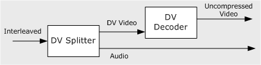
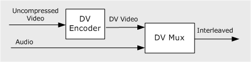

# About Digital Video in DirectShow

\[The feature associated with this page, [DirectShow](/windows/win32/directshow/directshow), is a legacy feature. It has been superseded by [MediaPlayer](/uwp/api/Windows.Media.Playback.MediaPlayer), [IMFMediaEngine](/windows/win32/api/mfmediaengine/nn-mfmediaengine-imfmediaengine), and [Audio/Video Capture in Media Foundation](windows/win32/medfound/audio-video-capture-in-media-foundation). Those features have been optimized for Windows 10 and Windows 11. Microsoft strongly recommends that new code use **MediaPlayer**, **IMFMediaEngine** and **Audio/Video Capture in Media Foundation** instead of **DirectShow**, when possible. Microsoft suggests that existing code that uses the legacy APIs be rewritten to use the new APIs if possible.\]

Digital video (DV) can be captured from a DV camera, stored in a file on the user's computer, or stored on tape using a video tape recorder (VTR). Thus, the operations that an application might perform on a DV stream include:

-   Capture live video from a DV camera.
-   Transmit DV data from VTR tape to the computer.
-   Transmit DV data from the computer to the VTR.
-   Read DV data from a file.
-   Write DV data to a file.
-   Render the audio and video in a DV stream.

DirectShow provides the following DV filters:

-   [MSDV Driver](msdv-driver.md). The MSDV driver controls a DV device, such as a camcorder. The device may have a camera subunit and a VTR subunit; MSDV controls both subunits. The MSDV driver appears to applications as a DirectShow filter.
-   [DV Splitter](dv-splitter-filter.md) filter. DV frames contain audio and video in the same frame. The DV Splitter filter extracts the audio data and outputs it as one or two audio streams. It outputs the original data as a separate DV video stream.
-   [DV Video Decoder](dv-video-decoder-filter.md) filter. Decodes DV video into uncompressed video.
-   [DV Video Encoder](dv-video-encoder-filter.md) filter. Encodes uncompressed video to DV-encoded video.
-   [DV Muxer](dv-muxer-filter.md). Combines a DV video stream with one or two audio streams, to create a single interleaved DV stream.

The DV Splitter and DV Video Decoder work together. The splitter takes the interleaved stream and outputs separate audio and DV video streams. The decoder converts the DV video to uncompressed video. The following image illustrates this process.

The DV Video Encoder and the DV Muxer reverse the process: The encoder converts uncompressed video to DV video, and the mux combines audio and DV video to create a single interleaved stream, as shown in the following diagram.

## Related topics

<dl> <dt>

[Digital Video in DirectShow](digital-video-in-directshow.md)
</dt> </dl>

 

 

