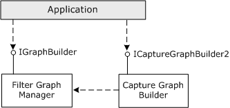
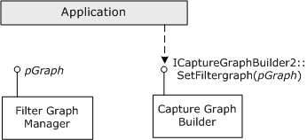

# About the Capture Graph Builder

\[The feature associated with this page, [DirectShow](/windows/win32/directshow/directshow), is a legacy feature. It has been superseded by [MediaPlayer](/uwp/api/Windows.Media.Playback.MediaPlayer), [IMFMediaEngine](/windows/win32/api/mfmediaengine/nn-mfmediaengine-imfmediaengine), and [Audio/Video Capture in Media Foundation](/windows/win32/medfound/audio-video-capture-in-media-foundation). Those features have been optimized for Windows 10 and Windows 11. Microsoft strongly recommends that new code use **MediaPlayer**, **IMFMediaEngine** and **Audio/Video Capture in Media Foundation** instead of **DirectShow**, when possible. Microsoft suggests that existing code that uses the legacy APIs be rewritten to use the new APIs if possible.\]

A filter graph that performs video or audio capture is called a *capture graph*. Capture graphs are often more complicated than file playback graphs. To make it easier for applications to build capture graphs, DirectShow provides a helper object called the Capture Graph Builder. The Capture Graph Builder exposes the [**ICaptureGraphBuilder2**](/windows/desktop/api/Strmif/nn-strmif-icapturegraphbuilder2) interface, which contains methods for building and controlling a capture graph. The following diagram illustrates the Capture Graph Builder and the **ICaptureGraphBuilder2** interface.



Start by calling CoCreateInstance to create new instances of the Capture Graph Builder and the Filter Graph Manager. Then initialize the Capture Graph Builder by calling [**ICaptureGraphBuilder2::SetFiltergraph**](/windows/desktop/api/Strmif/nf-strmif-icapturegraphbuilder2-setfiltergraph) with a pointer to the Filter Graph Manager's [**IGraphBuilder**](/windows/desktop/api/Strmif/nn-strmif-igraphbuilder) interface. The following diagram illustrates this process.



The following code shows a helper function to perform these steps:


```C++
HRESULT InitCaptureGraphBuilder(
  IGraphBuilder **ppGraph,  // Receives the pointer.
  ICaptureGraphBuilder2 **ppBuild  // Receives the pointer.
)
{
    if (!ppGraph || !ppBuild)
    {
        return E_POINTER;
    }
    IGraphBuilder *pGraph = NULL;
    ICaptureGraphBuilder2 *pBuild = NULL;

    // Create the Capture Graph Builder.
    HRESULT hr = CoCreateInstance(CLSID_CaptureGraphBuilder2, NULL, 
        CLSCTX_INPROC_SERVER, IID_ICaptureGraphBuilder2, (void**)&pBuild );
    if (SUCCEEDED(hr))
    {
        // Create the Filter Graph Manager.
        hr = CoCreateInstance(CLSID_FilterGraph, 0, CLSCTX_INPROC_SERVER,
            IID_IGraphBuilder, (void**)&pGraph);
        if (SUCCEEDED(hr))
        {
            // Initialize the Capture Graph Builder.
            pBuild->SetFiltergraph(pGraph);

            // Return both interface pointers to the caller.
            *ppBuild = pBuild;
            *ppGraph = pGraph; // The caller must release both interfaces.
            return S_OK;
        }
        else
        {
            pBuild->Release();
        }
    }
    return hr; // Failed
}
```


Throughout this section on video capture, it is assumed that you are using the Capture Graph Builder to create the capture graph. However, it is possible to build capture graphs entirely by using IGraphBuilder methods. This is considered an advanced topic, however, and the Capture Graph Builder methods are preferred. For more information, see [Advanced Capture Topics](advanced-capture-topics.md).

## Related topics

<dl> <dt>

[About Video Capture in DirectShow](about-video-capture-in-directshow.md)
</dt> </dl>

 

 


