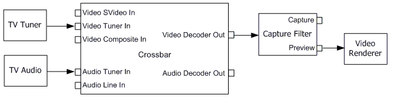

# Analog Television

\[The feature associated with this page, [DirectShow](/windows/win32/directshow/directshow), is a legacy feature. It has been superseded by [MediaPlayer](/uwp/api/Windows.Media.Playback.MediaPlayer) and [IMFMediaEngine](/windows/win32/api/mfmediaengine/nn-mfmediaengine-imfmediaengine). **MediaPlayer** and **IMFMediaEngine** have been optimized for Windows 10 and Windows 11. Microsoft strongly recommends that new code use **MediaPlayer** and **IMFMediaEngine** instead of **DirectShow**, when possible. Microsoft suggests that existing code that uses the legacy APIs be rewritten to use the new APIs if possible.\]

Analog television differs from other video capture scenarios in several ways:

-   The tuner card tunes to an analog signal, which is then digitized.
-   Audio is carried in the analog signal. How the audio reaches the sound card varies depending on the hardware.
-   The signal may contain additional data in the vertical blanking interval (VBI), such as closed captions (CC), World Standard Teletext (WST), and extended data services (XDS).

The following diagram shows a typical filter graph for television preview.

-   The [TV Tuner](tv-tuner-filter.md) filter controls tuning.
-   The [TV Audio](tv-audio-filter.md) filter controls the audio decoding.
-   If the tuner card has more than one physical input, the [Analog Video Crossbar](analog-video-crossbar-filter.md) filter enables the application to select which input is decoded and rendered.
-   The [WDM Video Capture](wdm-video-capture-filter.md) filter delivers the digitized video stream.

The Capture Graph Builder automatically inserts any filters that are required upstream from the capture filter.

This section contains the following topics:

-   [Analog Television Tuning](analog-television-tuning.md)
-   [Analog Television Audio](analog-television-audio.md)
-   [Closed Captions and Teletext](closed-captions-and-teletext.md)

## Related topics

<dl> <dt>

[Video Capture](video-capture.md)
</dt> </dl>

 

 

