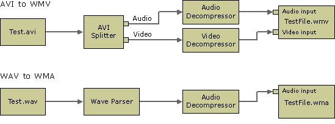
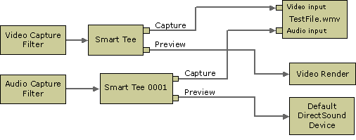

# Building Filter Graphs to Write ASF Files

\[The feature associated with this page, [DirectShow](/windows/win32/directshow/directshow), is a legacy feature. It has been superseded by [MediaPlayer](/uwp/api/Windows.Media.Playback.MediaPlayer) and [IMFMediaEngine](/windows/win32/api/mfmediaengine/nn-mfmediaengine-imfmediaengine). **MediaPlayer** and **IMFMediaEngine** have been optimized for Windows 10 and Windows 11. Microsoft strongly recommends that new code use **MediaPlayer** and **IMFMediaEngine** instead of **DirectShow**, when possible. Microsoft suggests that existing code that uses the legacy APIs be rewritten to use the new APIs if possible.\]

When creating Windows Media–based content, applications typically use one of the following scenarios:

-   Converting or transcoding content from some other format into Windows Media Format.
-   Inserting content that is not Windows Media-based (native stream formats) into ASF files.
-   Capturing live data and encoding it immediately into Windows Media Format.

Transcoding ASF Files

You can build a file-transcoding filter graph using the [WM ASF Writer](wm-asf-writer-filter.md) in various ways. The easiest way is to add the WM ASF Writer to the filter graph and then use the IGraphBuilder::RenderFile method to build the graph automatically.

An alternative way is to add each filter manually to the graph and connect the pins. After adding the WM ASF Writer, configure it by using the IConfigAsfWriter methods if the default profile is not suitable, and connect the WM ASF Writer input pins to the corresponding output pins on the upstream filters.

The following illustration shows typical WM ASF Writer transcoding filter graph configurations.



Inserting Native Stream Formats Into ASF Files

By default, the WM ASF Writer filter expects uncompressed audio and video streams on its input pins, and uses the Windows Media Audio and Windows Media Video codecs to compress the streams. However, the ASF file container can be used for any type of data. By placing digital media data into an ASF file container, you can add features provided by ASF, such as metadata and digital rights management (DRM), without having to transcode your content.

To create an ASF file that contains content that is not Windows Media–based, the application must compress the stream in the filter graph upstream of the WM ASF Writer and bypass the WM ASF Writer's compression mechanism by calling [**IConfigAsfWriter2::SetParam**](/previous-versions/windows/desktop/api/Dshowasf/nf-dshowasf-iconfigasfwriter2-setparam) as follows:


```C++
pConfigAsfWriter2->SetParam(AM_CONFIGASFWRITER_PARAM_DONTCOMPRESS,TRUE,0)
```


Then configure the filter with the desired profile. It is essential that the media type of the input stream exactly matches the format in the profile. In some cases, it may be necessary to examine the input stream's format, and create a custom profile to match it.

When you connect the WM ASF Writer to the upstream filter, use the IGraphBuilder::ConnectDirect method. Do not use any "intelligent connect" methods such as IGraphBuilder::Connect or IGraphBuilder::RenderFile to connect the filter because this will disable the filter's "bypass compression" mode.

Capturing Directly from a Device to an ASF File

When capturing audio or video directly to an ASF file, the filter graph will look similar to the following, depending on the type of capture device being used.



For more information about creating video and audio capture graphs, see the following topics:

-   [Audio Capture](audio-capture.md)
-   [Video Capture](video-capture.md)

The WM ASF Writer will not run unless all of its pins are connected. If you configure the WM ASF Writer with the default system profile (not recommended), or any profile with audio and video streams, then it will create an input pin for each stream and each of those pins must be connected. If you do not intend to capture audio, for example, then be sure to configure the filter with a video-only profile so that no audio pin is created.

## Related topics

<dl> <dt>

[Creating ASF Files in DirectShow](creating-asf-files-in-directshow.md)
</dt> </dl>

 

 


