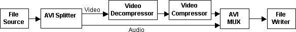
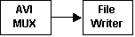
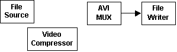

# Building the Recompression Graph

A typical filter graph for AVI file recompression looks like the following:



The [AVI Splitter Filter](avi-splitter-filter.md) pulls data from the [File Source (Async) Filter](file-source--async--filter.md) and parses it into video and audio streams. The video decompressor decodes the compressed video, where it is recompressed by the video compressor. The choice of decompressors depends on the source file; it will be handled automatically by [Intelligent Connect](intelligent-connect.md). The application must choose the compressor, typically by presenting a list to the user. (See [Choosing a Compression Filter](choosing-a-compression-filter.md).)

The compressed video then goes to the [AVI Mux Filter](avi-mux-filter.md). The audio stream in this example is not compressed, so it goes directly from the AVI Splitter to the AVI Mux. The AVI Mux interleaves the two streams, and the [File Writer Filter](file-writer-filter.md) writes the output to disk. Note that the AVI Mux is required even if the original file does not have an audio stream.

The easiest way to build this filter graph is to use the [Capture Graph Builder](capture-graph-builder.md), which is a DirectShow component for building capture graphs and other custom filter graphs.

Start by calling CoCreateInstance to create the Capture Graph Builder:


```C++
ICaptureGraphBuilder2 *pBuild = NULL;
hr = CoCreateInstance(CLSID_CaptureGraphBuilder2, 
                        NULL, CLSCTX_INPROC_SERVER,
    IID_ICaptureGraphBuilder2, (void **)&pBuild);
```


Then use the Capture Graph Builder to build the filter graph:

1.  Build the rendering section of the graph, which includes the AVI Mux filter and the [File Writer](file-writer-filter.md).
2.  Add the source filter and the compression filter to the graph.
3.  Connect the source filter to the MUX filter. The capture graph builder inserts whatever splitter and decoder filters are needed to parse the source file. It can also route the video and audio streams through compression filters.

The following sections explain each of these steps.

Build the Rendering Section

To build the rendering section of the graph, call the [**ICaptureGraphBuilder2::SetOutputFileName**](/windows/desktop/api/Strmif/nf-strmif-icapturegraphbuilder2-setoutputfilename) method. This method takes input parameters that specify the media subtype for the output and the name of the output file. It returns pointers to the MUX filter and the file writer. The MUX filter is needed for the next stage of graph building. The pointer to the file writer is not needed for this example, so that parameter can be **NULL**:


```C++
IBaseFilter *pMux = NULL;
hr = pBuild->SetOutputFileName(
        &MEDIASUBTYPE_Avi, // File type. 
        wszOutputFile,     // File name, as a wide-character string.
        &pMux,             // Receives a pointer to the multiplexer.
        NULL);             // Receives a pointer to the file writer. 
```


When the method returns, the MUX filter has an outstanding reference count, so be sure to release the pointer later.

The following diagram shows the filter graph at this point.



The MUX filter exposes two interfaces for controlling the AVI format:

-   [**IConfigInterleaving Interface**](/windows/desktop/api/Strmif/nn-strmif-iconfiginterleaving): Sets the interleaving mode.
-   [**IConfigAviMux Interface**](/windows/desktop/api/Strmif/nn-strmif-iconfigavimux): Sets the master stream and the AVI compatibility index.

Add the Source and Compression Filters

The next step is to add the source and compression filters to the filter graph. The Capture Graph Builder automatically creates an instance of the Filter Graph Manager when you call SetOutputFileName. Get a pointer to it by calling the [**ICaptureGraphBuilder2::GetFiltergraph**](/windows/desktop/api/Strmif/nf-strmif-icapturegraphbuilder2-getfiltergraph) method:


```C++
IGraphBuilder *pGraph = NULL;
hr = pBuild->GetFiltergraph(&pGraph);
```


Now call the [**IGraphBuilder::AddSourceFilter**](/windows/desktop/api/Strmif/nf-strmif-igraphbuilder-addsourcefilter) method to add the Async File Source filter, and the [**IFilterGraph::AddFilter**](/windows/desktop/api/Strmif/nf-strmif-ifiltergraph-addfilter) method to add the video compressor:


```C++
IBaseFilter *pSrc = NULL;
hr = pGraph->AddSourceFilter(wszInputFile, L"Source Filter", &pSrc);
hr = pGraph->AddFilter(pVComp, L"Compressor");
```


At this point, the source filter and the compression filter are not connected to anything else in the graph, as shown in the following illustration:



Connect the Source to the Mux

The final step is to connect the source filter to the AVI Mux filter, through the video compressor. Use the [**ICaptureGraphBuilder2::RenderStream**](/windows/desktop/api/Strmif/nf-strmif-icapturegraphbuilder2-renderstream) method, which connects an output pin on the source filter to a specified sink filter, optionally through a compression filter.

The first two parameters specify which of the source filter's pins to connect, by designating a pin category and a media type. The Async File Source filter has only one output pin, so these parameters should be **NULL**. The next three parameters specify the source filter, the compression filter (if any), and the Mux filter.

The following code example renders the video stream through the video compressor:


```C++
hr = pBuild->RenderStream(
        NULL,       // Output pin category
        NULL,       // Media type
        pSrc,       // Source filter
        pVComp,     // Compression filter
        pMux);      // Sink filter (the AVI Mux)
```


The following diagram shows the filter graph so far.


Assuming that the source file has an audio stream, the [AVI Splitter](avi-splitter-filter.md) filter has created an output pin for the audio. To connect this pin, call RenderStream again:


```C++
hr = pBuild->RenderStream(NULL, NULL, pSrc, NULL, pMux);
```


Here, no compression filter is specified. The source filter's output pin is already connected, so the RenderStream method searches for an unconnected output pin on the splitter filter. It finds the audio pin and connects it directly to the MUX filter. If the source file does not have an audio stream, the second call to RenderStream will fail. This is expected behavior. The graph is complete after the first call to RenderStream, so the failure in the second call is harmless.

In this example, the order of the two RenderStream calls is important. Because the second call does not specify a compressor, it will connect any unconnected pin from the AVI Splitter. If you make this call before the other one, it might connect the video stream to the AVI Mux, without your video compressor. Therefore, the more specific call (with the compression filter) must happen first.

The previous discussion has assumed that the source file is an AVI file. However, this technique also works with other file types, such as MPEG files. The resulting filter graph will be somewhat different.

## Related topics

<dl> <dt>

[Recompressing an AVI File](recompressing-an-avi-file.md)
</dt> </dl>

 

 


