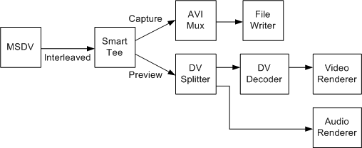

# Capture a Type-1 DV File

\[The feature associated with this page, [DirectShow](/windows/win32/directshow/directshow), is a legacy feature. It has been superseded by [MediaPlayer](/uwp/api/Windows.Media.Playback.MediaPlayer), [IMFMediaEngine](/windows/win32/api/mfmediaengine/nn-mfmediaengine-imfmediaengine), and [Audio/Video Capture in Media Foundation](/windows/win32/medfound/audio-video-capture-in-media-foundation). Those features have been optimized for Windows 10 and Windows 11. Microsoft strongly recommends that new code use **MediaPlayer**, **IMFMediaEngine** and **Audio/Video Capture in Media Foundation** instead of **DirectShow**, when possible. Microsoft suggests that existing code that uses the legacy APIs be rewritten to use the new APIs if possible.\]

A type-1 DV AVI file contains a single interleaved stream. To capture a type-1 file while previewing, use the filter graph shown in the following diagram.



Filters in this graph include:

-   The [Smart Tee](smart-tee-filter.md) filter splits the interleaved DV into a capture stream and a preview stream. Both streams contain the same interleaved data.
-   The [AVI Mux](avi-mux-filter.md) and [File Writer](file-writer-filter.md) write the interleaved stream to disk.
-   The [DV Splitter](dv-splitter-filter.md) splits the interleaved stream into a DV video stream and an audio stream. Both streams are rendererd for preview.
-   The [DV Video Decoder](dv-video-decoder-filter.md) decodes the DV video stream for previewing.

Build this graph as follows:


```C++
ICaptureGraphBuilder2 *pBuilder;  // Capture graph builder.
IBaseFilter           *pDV;       // DV capture filter (MSDV)
IBaseFilter           *pAviMux    // Avi Mux filter.

// Initialize pDV (not shown). 
// Create and initialize the Capture Graph Builder (not shown).

// Create the file-writing section of the graph.
hr = pBuilder->SetOutputFileName(&MEDIASUBTYPE_Avi, 
    OLESTR("C:\\Example1.avi"), &pAviMux, 0);

// Render the capture stream.
hr = pBuilder->RenderStream(&PIN_CATEGORY_CAPTURE, &MEDIATYPE_Interleaved, 
    pDV, 0, pAviMux);

// Render the preview stream.
hr = pBuilder->RenderStream(&PIN_CATEGORY_PREVIEW, &MEDIATYPE_Interleaved,
    pDV, 0, 0);

// Remember to release all interfaces.
```


1.  Call [**ICaptureGraphBuilder2::SetOutputFileName**](/windows/desktop/api/Strmif/nf-strmif-icapturegraphbuilder2-setoutputfilename) to connect the AVI Mux filter to the File Writer filter.
2.  Call [**ICaptureGraphBuilder2::RenderStream**](/windows/desktop/api/Strmif/nf-strmif-icapturegraphbuilder2-renderstream) with the pin category PIN\_CATEGORY\_CAPTURE to render the capture stream. The Capture Graph Builder automatically inserts the Smart Tee filter.
3.  Call RenderStream again, but with the pin category PIN\_CATEGORY\_PREVIEW, to render the preview stream. Skip this call if you do not want to preview the video.

For both calls to RenderStream, the media type is MEDIATYPE\_Interleaved, meaning interleaved DV video. In this code, the Capture Graph Builder automatically adds every filter that is needed, except for the MSDV capture filter.

## Related topics

<dl> <dt>

[Digital Video in DirectShow](digital-video-in-directshow.md)
</dt> </dl>

 

 


