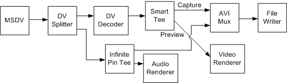

# Capture DV to Uncompressed RGB

\[The feature associated with this page, [DirectShow](/windows/win32/directshow/directshow), is a legacy feature. It has been superseded by [MediaPlayer](/uwp/api/Windows.Media.Playback.MediaPlayer), [IMFMediaEngine](/windows/win32/api/mfmediaengine/nn-mfmediaengine-imfmediaengine), and [Audio/Video Capture in Media Foundation](/windows/win32/medfound/audio-video-capture-in-media-foundation). Those features have been optimized for Windows 10 and Windows 11. Microsoft strongly recommends that new code use **MediaPlayer**, **IMFMediaEngine** and **Audio/Video Capture in Media Foundation** instead of **DirectShow**, when possible. Microsoft suggests that existing code that uses the legacy APIs be rewritten to use the new APIs if possible.\]

This example shows how to capture DV from the camcorder and save it to a file as uncompressed RGB while previewing. Use the filter graph shown in the following diagram.



The DV Splitter filter splits the interleaved audio/video into separate video and audio streams The DV-encoded video goes to the [DV Video Decoder](dv-video-decoder-filter.md) filter, which outputs uncompressed RGB video. The RGB video is routed through the Smart Tee filter to the AVI Mux filter (for capture) and the video renderer (for preview). Meanwhile, the audio stream from the DV Splitter goes through the Infinite Pin Tee filter to the AVI Mux and the audio renderer. The Filter Graph Manager keeps all of these streams synchronized, using the time stamps on the samples and the graph reference clock.

This graph might seem unnecessarily complicated, but it ensures that the DV-encoded video stream is decoded only once, which minimizes the CPU requirements. Also, note that the video goes through the Smart Tee filter while the audio goes through the Infinite Pin Tee filter. The Smart Tee can drop preview frames to improve capture performance, which is desirable for video but not for audio, where dropped samples are highly noticeable. Also, because the audio requires much lower bandwidth than the video, there is relatively little chance of dropping audio in the file.

You must build this graph one section at a time, but the RenderStream method can still help. Use the following code:


```C++
// Build the file-writing section of the graph.
hr = pBuilder->SetOutputFileName(&MEDIASUBTYPE_Avi, 
    OLESTR("C:\\Example3.avi"), &pMux, 0);

// MSDV to DV splitter.
IBaseFilter *pDVSplit;  // Create the DV Splitter (CLSID_DVSplitter)
hr = pBuilder->RenderStream(0, &MEDIATYPE_Interleaved, pDV, 0, pDVSplit);

// Splitter to DV Decoder to Smart Tee.
IBaseFilter *pDVDec; // Create the DV Decoder (CLSID_DVVideoCodec)
IBaseFilter *pSmartTee; // Create the Smart Tee (CLSID_SmartTee)
hr = pBuilder->RenderStream(0, &MEDIATYPE_Video, pDVSplit, pDVDec,
    pSmartTee);

// Smart Tee (video) to Avi Mux.
IPin *pPin1;
hr = pBuilder->FindPin(pSmartTee, PINDIR_OUTPUT, 0, 0, TRUE, 0, &pPin1);
hr = pBuilder->RenderStream(0, 0, pPin1, 0, pMux);

// Smart Tee to preview.
IPin *pPin2;
hr = pBuilder->FindPin(pSmartTee, PINDIR_OUTPUT, 0, 0, TRUE, 1, &pPin2);
hr = pBuilder->RenderStream(0, 0, pPin2, 0, pMux);

// DV Splitter (audio) to Infinite Tee to Avi Mux.
IBaseFilter *pTee; // Create the Infinite Pin Tee (CLSID_InfTee)
hr = pBuilder->RenderStream(0, &MEDIATYPE_Audio, pDVSplit, pTee, pMux);

// Infinite Pin Tee to preview.
hr = pBuilder->RenderStream(0, 0, pTee, 0, 0);
```


You must create the DV Splitter, DV Video Decoder, Smart Tee, and Infinite Pin Tee filters, and add each one to the filter graph. (For brevity, these steps are omitted from the previous code.) This example uses the [**ICaptureGraphBuilder2::FindPin**](/windows/desktop/api/Strmif/nf-strmif-icapturegraphbuilder2-findpin) method to find the capture and preview pins on the Smart Tee filter; capture is always output pin 0, and preview is output pin 1.

## Related topics

<dl> <dt>

[Digital Video in DirectShow](digital-video-in-directshow.md)
</dt> </dl>

 

 


