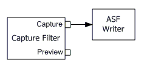

# Capturing Video to a Windows Media File

To capture video and encode it to a Windows Media Video (WMV) file, connect the capture pin to the [WM ASF Writer](wm-asf-writer-filter.md) filter, as shown in the following diagram.



The easiest way to build this graph is by specifing MEDIASUBTYPE\_Asf in the [**ICaptureGraphBuilder2::SetOutputFileName**](/windows/desktop/api/Strmif/nf-strmif-icapturegraphbuilder2-setoutputfilename) method:


```C++
IBaseFilter* pASFWriter = 0;
hr = pBuild->SetOutputFileName(
    &MEDIASUBTYPE_Asf,   // Create a Windows Media file.
    L"C:\\VidCap.wmv",   // File name.
    &pASFWriter,         // Receives a pointer to the filter.
    NULL);  // Receives an IFileSinkFilter interface pointer (optional).
```


The value MEDIASUBTYPE\_Asf tells the Capture Graph Builder to use the WM ASF Writer filter as the file sink. The Capture Graph Builder creates the filter, adds it to the graph, and calls [**IFileSinkFilter::SetFileName**](/windows/desktop/api/Strmif/nf-strmif-ifilesinkfilter-setfilename) to set the name of the output file. It returns a pointer to the filter as an outgoing parameter (


```
pASFWriter
```


in the previous example).

Use the [**IConfigAsfWriter**](/previous-versions/windows/desktop/api/Dshowasf/nn-dshowasf-iconfigasfwriter) interface on the WM ASF Writer to set the Windows Media profile. You must do this before you connect any pins on the WM ASF Writer.


```C++
IConfigAsfWriter *pConfig = 0;
hr = pASFWriter->QueryInterface(IID_IConfigAsfWriter, (void**)&pConfig);
if (SUCCEEDED(hr))
{
     // Configure the ASF Writer filter.
    pConfig->Release();
}
```


For more information about setting the profile, see [Creating ASF Files in DirectShow](creating-asf-files-in-directshow.md).

Call [**ICaptureGraphBuilder2::RenderStream**](/windows/desktop/api/Strmif/nf-strmif-icapturegraphbuilder2-renderstream) to connect the capture filter to the ASF Writer:


```C++
hr = pBuild->RenderStream(
    &PIN_CATEGORY_CAPTURE,   // Capture pin.
    &MEDIATYPE_Video,        // Video. Use MEDIATYPE_Audio for audio.
    pCap,                    // Pointer to the capture filter. 
    0, 
    pASFWriter);             // Pointer to the sink filter (ASF Writer).
```


Each input pin on the WM ASF Writer filter corresponds to a stream in the Windows Media profile. You must connect every pin, so that the file content matches the profile.

## Related topics

<dl> <dt>

[Capturing Video to a File](capturing-video-to-a-file.md)
</dt> </dl>

 

 


