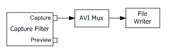

# Capturing Video to an AVI File

\[The feature associated with this page, [DirectShow](/windows/win32/directshow/directshow), is a legacy feature. It has been superseded by [MediaPlayer](/uwp/api/Windows.Media.Playback.MediaPlayer) and [IMFMediaEngine](/windows/win32/api/mfmediaengine/nn-mfmediaengine-imfmediaengine). **MediaPlayer** and **IMFMediaEngine** have been optimized for Windows 10 and Windows 11. Microsoft strongly recommends that new code use **MediaPlayer** and **IMFMediaEngine** instead of **DirectShow**, when possible. Microsoft suggests that existing code that uses the legacy APIs be rewritten to use the new APIs if possible.\]

The following illustration shows the simplest possible graph for capturing video to an AVI file.



The [AVI Mux](avi-mux-filter.md) filter takes the video stream from the capture pin and packages it into an AVI stream. An audio stream could also be connected to the AVI Mux filter, in which case the mux would interleave the two streams. The [File Writer](file-writer-filter.md) filter writes the AVI stream to disk.

To build the graph, start by calling the [**ICaptureGraphBuilder2::SetOutputFileName**](/windows/desktop/api/Strmif/nf-strmif-icapturegraphbuilder2-setoutputfilename) method, as follows:


```C++
IBaseFilter *pMux;
hr = pBuild->SetOutputFileName(
    &MEDIASUBTYPE_Avi,  // Specifies AVI for the target file.
    L"C:\\Example.avi", // File name.
    &pMux,              // Receives a pointer to the mux.
    NULL);              // (Optional) Receives a pointer to the file sink.
```


The first parameter specifies the file type — in this case, AVI. The second parameter gives the file name. For AVI, the SetOutputFileName method cocreates the AVI Mux filter and the File Writer filter and adds them to the graph. It also sets the file name on the File Writer filter, by calling the [**IFileSinkFilter::SetFileName**](/windows/desktop/api/Strmif/nf-strmif-ifilesinkfilter-setfilename) method, and connects the two filters. The method returns a pointer to the AVI Mux in the third parameter. Optionally, it returns a pointer to the [**IFileSinkFilter**](/windows/desktop/api/Strmif/nn-strmif-ifilesinkfilter) interface in the fourth parameter. If you don't need this interface, you can set this parameter to **NULL**, as shown in the previous example.

Next, call the [**ICaptureGraphBuilder2::RenderStream**](/windows/desktop/api/Strmif/nf-strmif-icapturegraphbuilder2-renderstream) method to connect the capture filter to the AVI Mux, as follows:


```C++
hr = pBuild->RenderStream(
    &PIN_CATEGORY_CAPTURE, // Pin category.
    &MEDIATYPE_Video,      // Media type.
    pCap,                  // Capture filter.
    NULL,                  // Intermediate filter (optional).
    pMux);                 // Mux or file sink filter.

// Release the mux filter.
pMux->Release();
```


The first parameter gives the pin category, which is PIN\_CATEGORY\_CAPTURE for capture. The second parameter gives the media type. The third parameter is a pointer to the capture filter's [**IBaseFilter**](/windows/desktop/api/Strmif/nn-strmif-ibasefilter) interface. The fourth parameter is optional; it lets you route the video stream through an intermediate filter, such as an encoder, before passing it to the mux filter. Otherwise, set this parameter to **NULL**, as shown in the previous example. The fifth parameter is the pointer to the mux filter. This pointer is obtained by calling the SetOutputFileName method.

To capture audio, call RenderStream with the media type MEDIATYPE\_Audio. If you are capturing audio and video from two separate devices, it is a good idea to make the audio stream the master stream. This helps to prevent drift between the two streams, because the AVI Mux filter adjust the playback rate on the video stream to match the audio stream. To set the master stream, call the [**IConfigAviMux::SetMasterStream**](/windows/desktop/api/Strmif/nf-strmif-iconfigavimux-setmasterstream) method on the AVI Mux filter:


```C++
IConfigAviMux *pConfigMux = NULL;
hr = pMux->QueryInterface(IID_IConfigAviMux, (void**)&pConfigMux);
if (SUCCEEDED(hr))
{
    pConfigMux->SetMasterStream(1);
    pConfigMux->Release();
}
```


The parameter to SetMasterStream is the stream number, which is determined by the order in which you call RenderStream. For example, if you call RenderStream first for video and then for audio, the video is stream 0 and the audio is stream 1.

You may also want to set how the AVI Mux filter interleaves the audio and video streams, by calling the [**IConfigInterleaving::put\_Mode**](/windows/desktop/api/Strmif/nf-strmif-iconfiginterleaving-put_mode) method.


```C++
IConfigInterleaving *pInterleave = NULL;
hr = pMux->QueryInterface(IID_IConfigInterleaving, (void**)&pInterleave);
if (SUCCEEDED(hr))
{
    pInterleave->put_Mode(INTERLEAVE_CAPTURE);
    pInterleave->Release();
}
```


With the INTERLEAVE\_CAPTURE flag, the AVI Mux performs interleaving at a rate that is suitable for video capture. You can also use INTERLEAVE\_NONE, which means no interleaving — the AVI Mux will simply write the data in the order that it arrives. The INTERLEAVE\_FULL flag means the AVI Mux performs full interleaving; however, this mode is less suitable for video capture because it requires the most overheard.

Encoding the Video Stream

You can encode the video stream by inserting an encoder filter between the capture filter and the AVI Mux filter. Use the [System Device Enumerator](system-device-enumerator.md) or the [Filter Mapper](filter-mapper.md) to select an encoder filter. (For more information, see [Enumerating Devices and Filters](enumerating-devices-and-filters.md).)

Specify the encoder filter as the fourth parameter to RenderStream, shown in bold in the following example:


```C++
IBaseFilter *pEncoder;
/* Create the encoder filter (not shown). */
// Add it to the filter graph.
pGraph->AddFilter(pEncoder, L"Encoder");

/* Call SetOutputFileName as shown previously. */

// Render the stream.
hr = pBuild->RenderStream(&PIN_CATEGORY_CAPTURE, &MEDIATYPE_Video, 
    pCap, 
pEncoder, pMux);
pEncoder->Release();
```


The encoder filter might support [**IAMVideoCompression**](/windows/desktop/api/Strmif/nn-strmif-iamvideocompression) or other interfaces for setting the encoding parameters. For a list of possible interfaces, see [File Encoding and Decoding Interfaces](file-encoding-and-decoding-interfaces.md).

## Related topics

<dl> <dt>

[Capturing Video to a File](capturing-video-to-a-file.md)
</dt> </dl>

 

 


