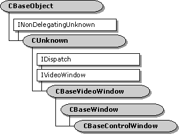

# CBaseControlWindow class

\[The feature associated with this page, [DirectShow](/windows/win32/directshow/directshow), is a legacy feature. It has been superseded by [MediaPlayer](/uwp/api/Windows.Media.Playback.MediaPlayer), [IMFMediaEngine](/windows/win32/api/mfmediaengine/nn-mfmediaengine-imfmediaengine), and [Audio/Video Capture in Media Foundation](/windows/win32/medfound/audio-video-capture-in-media-foundation). Those features have been optimized for Windows 10 and Windows 11. Microsoft strongly recommends that new code use **MediaPlayer**, **IMFMediaEngine** and **Audio/Video Capture in Media Foundation** instead of **DirectShow**, when possible. Microsoft suggests that existing code that uses the legacy APIs be rewritten to use the new APIs if possible.\]

The **CBaseControlWindow** class implements the [**IVideoWindow**](/windows/desktop/api/Control/nn-control-ivideowindow) interface and controls external access to its associated filter. You must synchronize the **CBaseControlWindow** object with the filter by passing it a pointer to a critical section synchronization object. The **CBaseControlWindow** class provides a number of methods that return property settings without dealing with this critical section. For example, calling [**CBaseControlWindow::get\_AutoShow**](cbasecontrolwindow-get-autoshow.md) to retrieve the value of the **m\_bAutoShow** data member locks the critical section. The filter might already have a locked internal critical section, however, which could violate the filter's lock hierarchy. Instead, calling the [**CBaseControlWindow::IsAutoShowEnabled**](cbasecontrolwindow-isautoshowenabled.md) member function returns the required value without affecting the critical section.

All **CBaseControlWindow** implemented [**IVideoWindow**](/windows/desktop/api/Control/nn-control-ivideowindow) methods require that the filter be connected correctly with its upstream filter. For this reason, class objects require a synchronization pin, which you set by calling the [**CBaseControlWindow::SetControlWindowPin**](cbasecontrolwindow-setcontrolwindowpin.md) method. Whenever you call an **IVideoWindow** method, the **CBaseControlWindow** object checks that the pin is still connected.

| Protected Data Members                                                     | Description                                                                                                                                 |
|----------------------------------------------------------------------------|---------------------------------------------------------------------------------------------------------------------------------------------|
| m\_bAutoShow                                                               | Result when the state changes.                                                                                                              |
| m\_bCursorHidden                                                           | Determination of whether the cursor is displayed or hidden.                                                                                 |
| m\_BorderColour                                                            | Color of the current window border.                                                                                                         |
| m\_hwndDrain                                                               | Window handle to which messages received are posted.                                                                                        |
| m\_hwndOwner                                                               | Owning window.                                                                                                                              |
| m\_pFilter                                                                 | Pointer to the owning media filter.                                                                                                         |
| m\_pInterfaceLock                                                          | Externally defined critical section.                                                                                                        |
| m\_pPin                                                                    | Control of the media types for connection.                                                                                                  |
| Member Functions                                                           | Description                                                                                                                                 |
| [**CBaseControlWindow**](cbasecontrolwindow-cbasecontrolwindow.md)        | Constructs a **CBaseControlWindow** object.                                                                                                 |
| [**DoGetWindowStyle**](cbasecontrolwindow-dogetwindowstyle.md)            | Retrieves either the typical or extended window styles.                                                                                     |
| [**DoSetWindowStyle**](cbasecontrolwindow-dosetwindowstyle.md)            | Sets the typical or extended window styles.                                                                                                 |
| [**GetBorderColour**](cbasecontrolwindow-getbordercolour.md)              | Retrieves the current border color. This is a helper member function.                                                                       |
| [**GetOwnerWindow**](cbasecontrolwindow-getownerwindow.md)                | Retrieves the owning window. This is a helper member function.                                                                              |
| [**IsAutoShowEnabled**](cbasecontrolwindow-isautoshowenabled.md)          | Retrieves information about whether the video window automatically appears when the rendering filter pauses or runs.                        |
| [**IsCursorHidden**](cbasecontrolwindow-iscursorhidden.md)                | Retrieves the current state of the **m\_bCursorHidden** data member without locking the critical section. This is a helper member function. |
| [**PossiblyEatMessage**](cbasecontrolwindow-possiblyeatmessage.md)        | Distributes messages to the parent window.                                                                                                  |
| [**SetControlWindowPin**](cbasecontrolwindow-setcontrolwindowpin.md)      | Notifies the object of the pin to which it applies.                                                                                         |
| IVideoWindow Methods                                                       | Description                                                                                                                                 |
| [**get\_AutoShow**](cbasecontrolwindow-get-autoshow.md)                   | Retrieves the current AutoShow flag setting.                                                                                                |
| [**get\_BackgroundPalette**](cbasecontrolwindow-get-backgroundpalette.md) | Retrieves the realized palette in the background flag.                                                                                      |
| [**get\_BorderColor**](cbasecontrolwindow-get-bordercolor.md)             | Retrieves the current border color.                                                                                                         |
| [**get\_Caption**](cbasecontrolwindow-get-caption.md)                     | Retrieves the current window caption.                                                                                                       |
| [**get\_ FullScreenMode**](cbasecontrolwindow-get-fullscreenmode.md)      | Retrieves the current full-screen mode.                                                                                                     |
| [**get\_Height**](cbasecontrolwindow-get-height.md)                       | Retrieves the current window height.                                                                                                        |
| [**get\_Left**](cbasecontrolwindow-get-left.md)                           | Retrieves the current left window coordinate.                                                                                               |
| [**GetMaxIdealImageSize**](cbasecontrolwindow-getmaxidealimagesize.md)    | Retrieves the maximum size of the ideal image.                                                                                              |
| [**get\_MessageDrain**](cbasecontrolwindow-get-messagedrain.md)           | Retrieves the current message drain.                                                                                                        |
| [**GetMinIdealImageSize**](cbasecontrolwindow-getminidealimagesize.md)    | Retrieves the minimum size of the ideal image.                                                                                              |
| [**get\_Owner**](cbasecontrolwindow-get-owner.md)                         | Retrieves the parent window handle.                                                                                                         |
| [**GetRestorePosition**](cbasecontrolwindow-getrestoreposition.md)        | Retrieves the position to which the window will be restored when maximized or minimized.                                                    |
| [**get\_Top**](cbasecontrolwindow-get-top.md)                             | Retrieves the y-coordinate for the top of the window.                                                                                       |
| [**get\_Visible**](cbasecontrolwindow-get-visible.md)                     | Retrieves the current visibility setting of the window.                                                                                     |
| [**get\_Width**](cbasecontrolwindow-get-width.md)                         | Retrieves the width of the window.                                                                                                          |
| [**GetWindowPosition**](cbasecontrolwindow-getwindowposition.md)          | Retrieves the current window coordinates.                                                                                                   |
| [**get\_WindowState**](cbasecontrolwindow-get-windowstate.md)             | Retrieves the current state of the window.                                                                                                  |
| [**get\_WindowStyle**](cbasecontrolwindow-get-windowstyle.md)             | Retrieves the standard window styles.                                                                                                       |
| [**get\_WindowStyleEx**](cbasecontrolwindow-get-windowstyleex.md)         | Retrieves the extended window styles.                                                                                                       |
| [**HideCursor**](cbasecontrolwindow-hidecursor.md)                        | Hides or displays the cursor.                                                                                                               |
| [**IsCursorHidden**](cbasecontrolwindow-iscursorhidden.md)                | Retrieves the current state of the **m\_bCursorHidden** data member.                                                                        |
| [**NotifyOwnerMessage**](cbasecontrolwindow-notifyownermessage.md)        | Passes on messages that are sent to owning windows.                                                                                         |
| [**put\_AutoShow**](cbasecontrolwindow-put-autoshow.md)                   | Sets the AutoShow property.                                                                                                                 |
| [**put\_BackgroundPalette**](cbasecontrolwindow-put-backgroundpalette.md) | Sets a flag to realize the palette in the background.                                                                                       |
| [**put\_BorderColor**](cbasecontrolwindow-put-bordercolor.md)             | Sets the current border color.                                                                                                              |
| [**put\_Caption**](cbasecontrolwindow-put-caption.md)                     | Sets the current window caption.                                                                                                            |
| [**put\_ FullScreenMode**](cbasecontrolwindow-put-fullscreenmode.md)      | Sets the full-screen mode.                                                                                                                  |
| [**put\_Height**](cbasecontrolwindow-put-height.md)                       | Sets the current window height.                                                                                                             |
| [**put\_Left**](cbasecontrolwindow-put-left.md)                           | Sets the left coordinate for the window.                                                                                                    |
| [**put\_MessageDrain**](cbasecontrolwindow-put-messagedrain.md)           | Sets the message drain window.                                                                                                              |
| [**put\_Owner**](cbasecontrolwindow-put-owner.md)                         | Sets the Microsoft Win32 parent window handle.                                                                                              |
| [**put\_Top**](cbasecontrolwindow-put-top.md)                             | Sets the position for the top of the window.                                                                                                |
| [**put\_Visible**](cbasecontrolwindow-put-visible.md)                     | Hides or shows the window.                                                                                                                  |
| [**put\_Width**](cbasecontrolwindow-put-width.md)                         | Sets the width of the window.                                                                                                               |
| [**put\_WindowState**](cbasecontrolwindow-put-windowstate.md)             | Sets the state of the window.                                                                                                               |
| [**put\_WindowStyle**](cbasecontrolwindow-put-windowstyle.md)             | Sets the standard window styles.                                                                                                            |
| [**put\_WindowStyleEx**](cbasecontrolwindow-put-windowstyleex.md)         | Sets the extended window styles.                                                                                                            |
| [**SetWindowForeground**](cbasecontrolwindow-setwindowforeground.md)      | Sets the window in the foreground.                                                                                                          |
| [**SetWindowPosition**](cbasecontrolwindow-setwindowposition.md)          | Sets the window position.                                                                                                                   |

 

## See also

<dl> <dt>

[DirectShow Base Classes](directshow-base-classes.md)
</dt> </dl>

 

 

