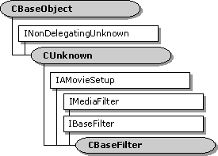

# CBaseFilter class

\[The feature associated with this page, [DirectShow](/windows/win32/directshow/directshow), is a legacy feature. It has been superseded by [MediaPlayer](/uwp/api/Windows.Media.Playback.MediaPlayer) and [IMFMediaEngine](/windows/win32/api/mfmediaengine/nn-mfmediaengine-imfmediaengine). **MediaPlayer** and **IMFMediaEngine** have been optimized for Windows 10 and Windows 11. Microsoft strongly recommends that new code use **MediaPlayer** and **IMFMediaEngine** instead of **DirectShow**, when possible. Microsoft suggests that existing code that uses the legacy APIs be rewritten to use the new APIs if possible.\]

The `CBaseFilter` class is an abstract class for implementing filters. To implement a filter using this class, you must perform at least the following steps:

-   Derive a new class from `CBaseFilter`.
-   Include member variables that define the pins on the filter. The pins must inherit from the [**CBasePin**](cbasepin.md) class.
-   Override the pure virtual method [**CBaseFilter::GetPin**](cbasefilter-getpin.md), which retrieves pins on the filter.
-   Override the pure virtual method [**CBaseFilter::GetPinCount**](cbasefilter-getpincount.md), which retrieves the number of pins.
-   Provide methods for generating, processing, or rendering media samples.

Several base classes derive from `CBaseFilter`, including [**CSource**](csource.md), [**CBaseRenderer**](cbaserenderer.md), and [**CTransformFilter**](ctransformfilter.md). It is usually easier to implement a filter with one of these specialized classes, rather than use `CBaseFilter` directly.

| Protected Member Variables                                     | Description                                                                                        |
|----------------------------------------------------------------|----------------------------------------------------------------------------------------------------|
| [**m\_State**](cbasefilter-m-state.md)                        | Current state of the filter.                                                                       |
| [**m\_pClock**](cbasefilter-m-pclock.md)                      | Pointer to the filter's reference clock.                                                           |
| [**m\_tStart**](cbasefilter-m-tstart.md)                      | Reference time that corresponds to stream time 0.                                                  |
| [**m\_clsid**](cbasefilter-m-clsid.md)                        | Class identifier (CLSID) of the filter.                                                            |
| [**m\_pLock**](cbasefilter-m-plock.md)                        | Pointer to a critical section that is used to serialize state changes.                             |
| [**m\_pName**](cbasefilter-m-pname.md)                        | Filter name.                                                                                       |
| [**m\_pGraph**](cbasefilter-m-pgraph.md)                      | Pointer to the filter graph manager.                                                               |
| [**m\_pSink**](cbasefilter-m-psink.md)                        | Pointer to the [**IMediaEventSink**](/windows/desktop/api/Strmif/nn-strmif-imediaeventsink) interface on the filter graph manager.   |
| [**m\_PinVersion**](cbasefilter-m-pinversion.md)              | Current version of the set of pins on this filter.                                                 |
| Public Methods                                                 | Description                                                                                        |
| [**CBaseFilter**](cbasefilter-cbasefilter.md)                 | Constructor method.                                                                                |
| [**~ CBaseFilter**](cbasefilter--cbasefilter.md)              | Destructor method.                                                                                 |
| [**StreamTime**](cbasefilter-streamtime.md)                   | Retrieves the current stream time. Virtual.                                                        |
| [**IsActive**](cbasefilter-isactive.md)                       | Determines whether the filter is currently active (running or paused).                             |
| [**IsStopped**](cbasefilter-isstopped.md)                     | Determines whether the filter is currently stopped.                                                |
| [**NotifyEvent**](cbasefilter-notifyevent.md)                 | Sends an event notification to the filter graph manager.                                           |
| [**GetFilterGraph**](cbasefilter-getfiltergraph.md)           | Retrieves a pointer to the filter graph manager.                                                   |
| [**ReconnectPin**](cbasefilter-reconnectpin.md)               | Breaks an existing pin connection and reconnects it to the same pin, using a specified media type. |
| [**GetPinVersion**](cbasefilter-getpinversion.md)             | Retrieves a version number for the set of pins on this filter. Virtual.                            |
| [**IncrementPinVersion**](cbasefilter-incrementpinversion.md) | Increments the version number on the set of pins.                                                  |
| [**GetSetupData**](cbasefilter-getsetupdata.md)               | Retrieves the registration data for the filter. Virtual.                                           |
| Pure Virtual Methods                                           | Description                                                                                        |
| [**GetPinCount**](cbasefilter-getpincount.md)                 | Retrieves the number of pins.                                                                      |
| [**GetPin**](cbasefilter-getpin.md)                           | Retrieves a pin.                                                                                   |
| IPersist Methods                                               | Description                                                                                        |
| [**GetClassID**](cbasefilter-getclassid.md)                   | Retrieves the class identifier.                                                                    |
| IMediaFilter Methods                                           | Description                                                                                        |
| [**GetState**](cbasefilter-getstate.md)                       | Retrieves the filter's state (running, stopped, or paused).                                        |
| [**SetSyncSource**](cbasefilter-setsyncsource.md)             | Sets a reference clock for the filter.                                                             |
| [**GetSyncSource**](cbasefilter-getsyncsource.md)             | Retrieves the reference clock that the filter is using.                                            |
| [**Stop**](cbasefilter-stop.md)                               | Stops the filter.                                                                                  |
| [**Pause**](cbasefilter-pause.md)                             | Pauses the filter.                                                                                 |
| [**Run**](cbasefilter-run.md)                                 | Runs the filter.                                                                                   |
| IBaseFilter Methods                                            | Description                                                                                        |
| [**EnumPins**](cbasefilter-enumpins.md)                       | Enumerates the pins on this filter.                                                                |
| [**FindPin**](cbasefilter-findpin.md)                         | Retrieves the pin with the specified identifier.                                                   |
| [**QueryFilterInfo**](cbasefilter-queryfilterinfo.md)         | Retrieves information about the filter.                                                            |
| [**JoinFilterGraph**](cbasefilter-joinfiltergraph.md)         | Notifies the filter that it has joined or left a filter graph.                                     |
| [**QueryVendorInfo**](cbasefilter-queryvendorinfo.md)         | Retrieves a string containing vendor information.                                                  |
| IAMovieSetup Methods                                           | Description                                                                                        |
| [**Register**](cbasefilter-register.md)                       | Adds the filter to the registry.                                                                   |
| [**Unregister**](cbasefilter-unregister.md)                   | Removes the filter from the registry.                                                              |

 

## Requirements

| Requirement | Value |
|--------------------|--------------------------------------------------------------------------------------------------------------------------------------------------------------------------------------------|
| Header   | <dl> <dt>Amfilter.h (include Streams.h)</dt> </dl>                                                                                  |
| Library  | <dl> <dt>Strmbase.lib (retail builds); </dt> <dt>Strmbasd.lib (debug builds)</dt> </dl> |

 

 

