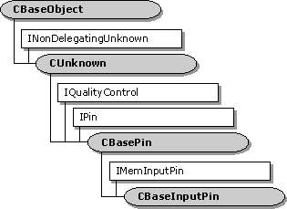

# CBaseInputPin class

\[The feature associated with this page, [DirectShow](/windows/win32/directshow/directshow), is a legacy feature. It has been superseded by [MediaPlayer](/uwp/api/Windows.Media.Playback.MediaPlayer), [IMFMediaEngine](/windows/win32/api/mfmediaengine/nn-mfmediaengine-imfmediaengine), and [Audio/Video Capture in Media Foundation](/windows/win32/medfound/audio-video-capture-in-media-foundation). Those features have been optimized for Windows 10 and Windows 11. Microsoft strongly recommends that new code use **MediaPlayer**, **IMFMediaEngine** and **Audio/Video Capture in Media Foundation** instead of **DirectShow**, when possible. Microsoft suggests that existing code that uses the legacy APIs be rewritten to use the new APIs if possible.\]

The `CBaseInputPin` class is an abstract base class for implementing input pins. This class adds support for the [**IMemInputPin**](/windows/desktop/api/Strmif/nn-strmif-imeminputpin) interface, in addition to the [**IPin**](/windows/desktop/api/Strmif/nn-strmif-ipin) interface support provided by [**CBasePin**](cbasepin.md).

To use this class, derive a new class and override at least the following methods:

-   [**CBaseInputPin::BeginFlush**](cbaseinputpin-beginflush.md)
-   [**CBaseInputPin::EndFlush**](cbaseinputpin-endflush.md)
-   [**CBaseInputPin::Receive**](cbaseinputpin-receive.md)
-   [**CBasePin::CheckMediaType**](cbasepin-checkmediatype.md)
-   [**CBasePin::GetMediaType**](cbasepin-getmediatype.md)

Depending on the function of the pin, you might need to override additional methods in `CBaseInputPin` or **CBasePin**.

| Protected Member Variables                                                 | Description                                                                                                 |
|----------------------------------------------------------------------------|-------------------------------------------------------------------------------------------------------------|
| [**m\_pAllocator**](cbaseinputpin-m-pallocator.md)                        | Pointer to the memory allocator.                                                                            |
| [**m\_bReadOnly**](cbaseinputpin-m-breadonly.md)                          | Flag that indicates whether the allocator produces read-only media samples.                                 |
| [**m\_bFlushing**](cbaseinputpin-m-bflushing.md)                          | Flag that indicates whether the pin is currently flushing.                                                  |
| [**m\_SampleProps**](cbaseinputpin-m-sampleprops.md)                      | Properties of the most recent sample.                                                                       |
| Public Methods                                                             | Description                                                                                                 |
| [**CBaseInputPin**](cbaseinputpin-cbaseinputpin.md)                       | Constructor method.                                                                                         |
| [**~CBaseInputPin**](cbaseinputpin--cbaseinputpin.md)                     | Destructor method.                                                                                          |
| [**BreakConnect**](cbaseinputpin-breakconnect.md)                         | Releases the pin from a connection.                                                                         |
| [**IsReadOnly**](cbaseinputpin-isreadonly.md)                             | Queries whether the allocator uses read-only media samples.                                                 |
| [**IsFlushing**](cbaseinputpin-isflushing.md)                             | Queries whether the filter is currently flushing.                                                           |
| [**CheckStreaming**](cbaseinputpin-checkstreaming.md)                     | Determines whether the pin can accept samples. Virtual.                                                     |
| [**PassNotify**](cbaseinputpin-passnotify.md)                             | Passes a quality-control message to the appropriate object.                                                 |
| [**Inactive**](cbaseinputpin-inactive.md)                                 | Notifies the pin that the filter is no longer active. Virtual.                                              |
| [**SampleProps**](cbaseinputpin-sampleprops.md)                           | Retrieves the properties of the most recent sample.                                                         |
| IPin Methods                                                               | Description                                                                                                 |
| [**BeginFlush**](cbaseinputpin-beginflush.md)                             | Begins a flush operation.                                                                                   |
| [**EndFlush**](cbaseinputpin-endflush.md)                                 | Ends a flush operation.                                                                                     |
| IMemInputPin Methods                                                       | Description                                                                                                 |
| [**GetAllocator**](cbaseinputpin-getallocator.md)                         | Retrieves the memory allocator proposed by this pin.                                                        |
| [**NotifyAllocator**](cbaseinputpin-notifyallocator.md)                   | Specifies an allocator for the connection.                                                                  |
| [**GetAllocatorRequirements**](cbaseinputpin-getallocatorrequirements.md) | Retrieves the allocator properties requested by the input pin.                                              |
| [**Receive**](cbaseinputpin-receive.md)                                   | Receives the next media sample in the stream.                                                               |
| [**ReceiveMultiple**](cbaseinputpin-receivemultiple.md)                   | Receives multiple samples in the stream.                                                                    |
| [**ReceiveCanBlock**](cbaseinputpin-receivecanblock.md)                   | Determines whether calls to the [**CBaseInputPin::Receive**](cbaseinputpin-receive.md) method might block. |
| IQualityControl Methods                                                    | Description                                                                                                 |
| [**Notify**](cbaseinputpin-notify.md)                                     | Receives a quality-control message.                                                                         |

 

## Requirements

| Requirement | Value |
|--------------------|--------------------------------------------------------------------------------------------------------------------------------------------------------------------------------------------|
| Header   | <dl> <dt>Amfilter.h (include Streams.h)</dt> </dl>                                                                                  |
| Library  | <dl> <dt>Strmbase.lib (retail builds); </dt> <dt>Strmbasd.lib (debug builds)</dt> </dl> |

 

 

