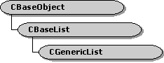

# CBaseList class

\[The feature associated with this page, [DirectShow](/windows/win32/directshow/directshow), is a legacy feature. It has been superseded by [MediaPlayer](/uwp/api/Windows.Media.Playback.MediaPlayer) and [IMFMediaEngine](/windows/win32/api/mfmediaengine/nn-mfmediaengine-imfmediaengine). **MediaPlayer** and **IMFMediaEngine** have been optimized for Windows 10 and Windows 11. Microsoft strongly recommends that new code use **MediaPlayer** and **IMFMediaEngine** instead of **DirectShow**, when possible. Microsoft suggests that existing code that uses the legacy APIs be rewritten to use the new APIs if possible.\]

The **CBaseList** method implements an abtract list. The [**CGenericList**](cgenericlist.md) class template, which derives from **CBaseList**, provides type checking and a simpler interface than the **CBaseList** class.

The **CBaseList** class is modeled after the **CObList** class in the Microsoft Foundation Classes (MFC) library. Positions within the list are represented by a POSITION structure. The caller should not access the internal members of the POSITION structure; treat it as a pointer to a list node. The position of an object in the list remains valid until the object is deleted.

The list does not require any support by the objects it contains. It performs no storage management or copying on the objects. Objects can be in multiple lists.

Roughly half of the methods in this class act on single objects. These methods have the suffix - I in the method name. The other methods act on entire lists. For example, the [**CBaseList::AddAfter**](cbaselist-addafter.md) method appends a list to another list. Single-object operations return POSITION values, or **NULL** on failure. List operations return **TRUE** if successful or **FALSE** otherwise.

| Protected Member Variables                             | Description                                                               |
|--------------------------------------------------------|---------------------------------------------------------------------------|
| [**m\_Count**](cbaselist-m-count.md)                  | Number of items in the list.                                              |
| [**m\_pFirst**](cbaselist-m-pfirst.md)                | Pointer to the first node in the list.                                    |
| [**m\_pLast**](cbaselist-m-plast.md)                  | Pointer to the last node in the list.                                     |
| Protected Methods                                      | Description                                                               |
| [**GetNextI**](cbaselist-getnexti.md)                 | Retrieves the item at the specified position, and advances the position.  |
| [**GetI**](cbaselist-geti.md)                         | Retrieves the item at the specified position.                             |
| [**FindI**](cbaselist-findi.md)                       | Retrieves the first position that holds the specified item.               |
| [**RemoveHeadI**](cbaselist-removeheadi.md)           | Removes the first item in the list.                                       |
| [**RemoveTailI**](cbaselist-removetaili.md)           | Removes the last item in the list.                                        |
| [**RemoveI**](cbaselist-removei.md)                   | Removes the item at the specified position.                               |
| [**AddTailI**](cbaselist-addtaili.md)                 | Adds an item to the end of the list.                                      |
| [**AddHeadI**](cbaselist-addheadi.md)                 | Adds an item to the front of the list.                                    |
| [**AddAfterI**](cbaselist-addafteri.md)               | Inserts an item after the specified position.                             |
| [**AddBeforeI**](cbaselist-addbeforei.md)             | Inserts an item before the specified position.                            |
| Public Methods                                         | Description                                                               |
| [**CBaseList**](cbaselist-cbaselist.md)               | Constructor method.                                                       |
| [**~ CBaseList**](cbaselist--cbaselist.md)            | Destructor method.                                                        |
| [**RemoveAll**](cbaselist-removeall.md)               | Removes all nodes from the list.                                          |
| [**GetHeadPositionI**](cbaselist-getheadpositioni.md) | Retrieves the position of the first item in the list.                     |
| [**GetTailPositionI**](cbaselist-gettailpositioni.md) | Retrieves the position of the last item of the list.                      |
| [**GetCountI**](cbaselist-getcounti.md)               | Retrieves the number of items in the list.                                |
| [**Next**](cbaselist-next.md)                         | Retrieves the next position in the list.                                  |
| [**Prev**](cbaselist-prev.md)                         | Retrieves the previous position in the list.                              |
| [**AddHead**](cbaselist-addhead.md)                   | Inserts another list at the front of this list.                           |
| [**AddTail**](cbaselist-addtail.md)                   | Appends another list to the end of this list.                             |
| [**AddAfter**](cbaselist-addafter.md)                 | Inserts a list after the specified position.                              |
| [**AddBefore**](cbaselist-addbefore.md)               | Inserts a list before the specified position.                             |
| [**MoveToTail**](cbaselist-movetotail.md)             | Splits the list and appends the head portion to the tail of another list. |
| [**MoveToHead**](cbaselist-movetohead.md)             | Splits the list and inserts the tail portion at the head of another list. |
| [**Reverse**](cbaselist-reverse.md)                   | Reverses the order of the list.                                           |

 

## Requirements

| Requirement | Value |
|--------------------|--------------------------------------------------------------------------------------------------------------------------------------------------------------------------------------------|
| Header   | <dl> <dt>Wxlist.h (include Streams.h)</dt> </dl>                                                                                    |
| Library  | <dl> <dt>Strmbase.lib (retail builds); </dt> <dt>Strmbasd.lib (debug builds)</dt> </dl> |

## See also

<dl> <dt>

[DirectShow Base Classes](directshow-base-classes.md)
</dt> </dl>

 

 

