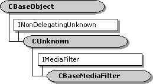

# CBaseMediaFilter class

\[The feature associated with this page, [DirectShow](/windows/win32/directshow/directshow), is a legacy feature. It has been superseded by [MediaPlayer](/uwp/api/Windows.Media.Playback.MediaPlayer), [IMFMediaEngine](/windows/win32/api/mfmediaengine/nn-mfmediaengine-imfmediaengine), and [Audio/Video Capture in Media Foundation](/windows/win32/medfound/audio-video-capture-in-media-foundation). Those features have been optimized for Windows 10 and Windows 11. Microsoft strongly recommends that new code use **MediaPlayer**, **IMFMediaEngine** and **Audio/Video Capture in Media Foundation** instead of **DirectShow**, when possible. Microsoft suggests that existing code that uses the legacy APIs be rewritten to use the new APIs if possible.\]

The `CBaseMediaFilter` class implements the [**IMediaFilter**](/windows/desktop/api/Strmif/nn-strmif-imediafilter) interface. Use this class for plug-in distributors or other objects that need to support **IMediaFilter** without supporting the [**IBaseFilter**](/windows/desktop/api/Strmif/nn-strmif-ibasefilter) interface. Do not use this class for filters. Instead, use the [**CBaseFilter**](cbasefilter.md) class, or a base class derived from **CBaseFilter**.

| Protected Member Variables                                       | Description                                                  |
|------------------------------------------------------------------|--------------------------------------------------------------|
| [**m\_State**](cbasemediafilter-m-state.md)                     | Current state of the object.                                 |
| [**m\_pClock**](cbasemediafilter-m-pclock.md)                   | Pointer to the object's reference clock.                     |
| [**m\_tStart**](cbasemediafilter-m-tstart.md)                   | Reference time that corresponds to stream time 0.            |
| [**m\_clsid**](cbasemediafilter-m-clsid.md)                     | Class identifier (CLSID) of the object.                      |
| [**m\_pLock**](cbasemediafilter-m-plock.md)                     | Pointer to a critical section.                               |
| Public Methods                                                   | Description                                                  |
| [**CBaseMediaFilter**](cbasemediafilter-cbasemediafilter.md)    | Constructor method.                                          |
| [**~ CBaseMediaFilter**](cbasemediafilter--cbasemediafilter.md) | Destructor method. Virtual.                                  |
| [**StreamTime**](cbasemediafilter-streamtime.md)                | Retrieves the current stream time. Virtual.                  |
| [**IsActive**](cbasemediafilter-isactive.md)                    | Determines whether the object is active (running or paused). |
| IPersist Methods                                                 | Description                                                  |
| [**GetClassID**](cbasemediafilter-getclassid.md)                | Retrieves the class identifier.                              |
| IMediaFilter Methods                                             | Description                                                  |
| [**GetState**](cbasemediafilter-getstate.md)                    | Retrieves the object's state (running, stopped, or paused).  |
| [**SetSyncSource**](cbasemediafilter-setsyncsource.md)          | Sets a reference clock for the object.                       |
| [**GetSyncSource**](cbasemediafilter-getsyncsource.md)          | Retrieves the reference clock that the object is using.      |
| [**Stop**](cbasemediafilter-stop.md)                            | Stops the object.                                            |
| [**Pause**](cbasemediafilter-pause.md)                          | Pauses the object.                                           |
| [**Run**](cbasemediafilter-run.md)                              | Runs the object.                                             |

 

## Requirements

| Requirement | Value |
|--------------------|--------------------------------------------------------------------------------------------------------------------------------------------------------------------------------------------|
| Header   | <dl> <dt>Amfilter.h (include Streams.h)</dt> </dl>                                                                                  |
| Library  | <dl> <dt>Strmbase.lib (retail builds); </dt> <dt>Strmbasd.lib (debug builds)</dt> </dl> |

 

 

