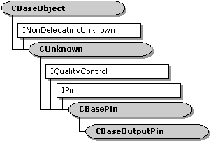

# CBaseOutputPin class

\[The feature associated with this page, [DirectShow](/windows/win32/directshow/directshow), is a legacy feature. It has been superseded by [MediaPlayer](/uwp/api/Windows.Media.Playback.MediaPlayer), [IMFMediaEngine](/windows/win32/api/mfmediaengine/nn-mfmediaengine-imfmediaengine), and [Audio/Video Capture in Media Foundation](/windows/win32/medfound/audio-video-capture-in-media-foundation). Those features have been optimized for Windows 10 and Windows 11. Microsoft strongly recommends that new code use **MediaPlayer**, **IMFMediaEngine** and **Audio/Video Capture in Media Foundation** instead of **DirectShow**, when possible. Microsoft suggests that existing code that uses the legacy APIs be rewritten to use the new APIs if possible.\]

The `CBaseOutputPin` class is an abstract base class that implements an output pin.

This class derives from [**CBasePin**](cbasepin.md). It differs from **CBasePin** in the following respects:

-   It connects only to input pins that support the [**IMemInputPin**](/windows/desktop/api/Strmif/nn-strmif-imeminputpin) interface.
-   It supports local memory transport through the [**IMemAllocator**](/windows/desktop/api/Strmif/nn-strmif-imemallocator) interface.
-   It rejects end-of-stream, flush, and new-segment notifications. (These should not be sent to an output pin.)
-   It provides methods for delivering samples downstream.

When the pin connects, it requests a memory allocator from the input pin. Failing that, it creates a new allocator object. The output pin is responsible for setting the allocator properties. It does this through the pure virtual method [**CBaseOutputPin::DecideBufferSize**](cbaseoutputpin-decidebuffersize.md). Override this method in your derived class. If the input pin has any buffer requirements, they are passed to the **DecideBufferSize** method.

Call the [**CBaseOutputPin::GetDeliveryBuffer**](cbaseoutputpin-getdeliverybuffer.md) method to obtain an empty media sample. Call the [**CBaseOutputPin::Deliver**](cbaseoutputpin-deliver.md) method to deliver samples downstream.

Your derived class must override the pure virtual [**CBasePin::CheckMediaType**](cbasepin-checkmediatype.md) method to validate the media type during pin connections.

| Protected Member Variables                                      | Description                                                                |
|-----------------------------------------------------------------|----------------------------------------------------------------------------|
| [**m\_pAllocator**](cbaseoutputpin-m-pallocator.md)            | Pointer to the memory allocator.                                           |
| [**m\_pInputPin**](cbaseoutputpin-m-pinputpin.md)              | Pointer to the input pin connected to this pin.                            |
| Public Methods                                                  | Description                                                                |
| [**CBaseOutputPin**](cbaseoutputpin-cbaseoutputpin.md)         | Constructor method.                                                        |
| [**CompleteConnect**](cbaseoutputpin-completeconnect.md)       | Completes a connection to an input pin. Virtual.                           |
| [**DecideAllocator**](cbaseoutputpin-decideallocator.md)       | Selects a memory allocator. Virtual.                                       |
| [**GetDeliveryBuffer**](cbaseoutputpin-getdeliverybuffer.md)   | Retrieves a media sample that contains an empty buffer. Virtual.           |
| [**Deliver**](cbaseoutputpin-deliver.md)                       | Delivers a media sample to the connected input pin. Virtual.               |
| [**InitAllocator**](cbaseoutputpin-initallocator.md)           | Creates a memory allocator. Virtual.                                       |
| [**CheckConnect**](cbaseoutputpin-checkconnect.md)             | Determines whether a pin connection is suitable.                           |
| [**BreakConnect**](cbaseoutputpin-breakconnect.md)             | Releases the pin from a connection.                                        |
| [**Active**](cbaseoutputpin-active.md)                         | Notifies the pin that the filter is now active.                            |
| [**Inactive**](cbaseoutputpin-inactive.md)                     | Notifies the pin that the filter is no longer active.                      |
| [**DeliverEndOfStream**](cbaseoutputpin-deliverendofstream.md) | Delivers an end-of-stream notification to the connected input pin.Virtual. |
| [**DeliverBeginFlush**](cbaseoutputpin-deliverbeginflush.md)   | Requests the connected input pin to begin a flush operation. Virtual.      |
| [**DeliverEndFlush**](cbaseoutputpin-deliverendflush.md)       | Requests the connected input pin to end a flush operation. Virtual.        |
| [**DeliverNewSegment**](cbaseoutputpin-delivernewsegment.md)   | Delivers a new-segment notification to the connected input pin. Virtual.   |
| Pure Virtual Methods                                            | Description                                                                |
| [**DecideBufferSize**](cbaseoutputpin-decidebuffersize.md)     | Sets the buffer requirements.                                              |
| IPin Methods                                                    | Description                                                                |
| [**BeginFlush**](cbaseoutputpin-beginflush.md)                 | Begins a flush operation.                                                  |
| [**EndFlush**](cbaseoutputpin-endflush.md)                     | Ends a flush operation.                                                    |
| [**EndOfStream**](cbaseoutputpin-endofstream.md)               | Notifies the pin that no additional data is expected.                      |

 

## Requirements

| Requirement | Value |
|--------------------|--------------------------------------------------------------------------------------------------------------------------------------------------------------------------------------------|
| Header   | <dl> <dt>Amfilter.h (include Streams.h)</dt> </dl>                                                                                  |
| Library  | <dl> <dt>Strmbase.lib (retail builds); </dt> <dt>Strmbasd.lib (debug builds)</dt> </dl> |

 

 

