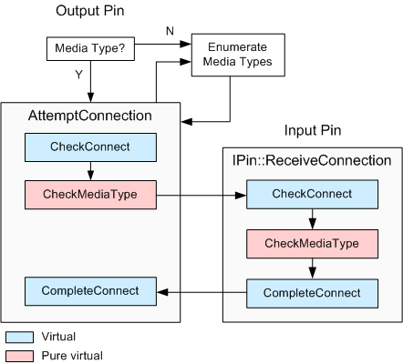

# CBasePin Connection Process

\[The feature associated with this page, [DirectShow](/windows/win32/directshow/directshow), is a legacy feature. It has been superseded by [MediaPlayer](/uwp/api/Windows.Media.Playback.MediaPlayer) and [IMFMediaEngine](/windows/win32/api/mfmediaengine/nn-mfmediaengine-imfmediaengine). **MediaPlayer** and **IMFMediaEngine** have been optimized for Windows 10 and Windows 11. Microsoft strongly recommends that new code use **MediaPlayer** and **IMFMediaEngine** instead of **DirectShow**, when possible. Microsoft suggests that existing code that uses the legacy APIs be rewritten to use the new APIs if possible.\]

This section describes how the [**CBasePin**](cbasepin.md) class implements the pin connection process.

The Filter Graph Manager initiates all pin connections. It calls the output pin's [**IPin::Connect**](/windows/desktop/api/Strmif/nf-strmif-ipin-connect) method, specifying the input pin. The output pin completes the connection by calling the input pin's [**IPin::ReceiveConnection**](/windows/desktop/api/Strmif/nf-strmif-ipin-receiveconnection) method. The input pin can accept or reject the connection.

The Filter Graph Manager can also specify a media type for the connection. If so, the pins try to connect with that type. If not, the pins must negotiate the type. The Filter Graph Manager may also specify a *partial* media type, which has the value GUID\_NULL for either the major type, subtype, or format type. In that case, the pins try to match whichever portions of the media type were specified; the value GUID\_NULL acts as a wildcard.

The [**CBasePin::Connect**](cbasepin-connect.md) method starts by verifying that the pin can accept a connection. For example, it checks that the pin is not already connected. It delegates the rest of the connection process to the [**CBasePin::AgreeMediaType**](cbasepin-agreemediatype.md) method. Everything that follows is performed by **AgreeMediaType**.

If the media type is fully specified, the pin calls the [**CBasePin::AttemptConnection**](cbasepin-attemptconnection.md) method to attempt the connection. Otherwise, it tries media types in the following order:

1.  The input pin's preferred types.
2.  The output pin's preferred types.

You can reverse this order by setting the [**CBasePin::m\_bTryMyTypesFirst**](cbasepin-m-btrymytypesfirst.md) flag to **TRUE**.

In each case, the pin calls [**IPin::EnumMediaTypes**](/windows/desktop/api/Strmif/nf-strmif-ipin-enummediatypes) to enumerate the media types. This method retrieves an enumerator object, which is passed to the [**CBasePin::TryMediaTypes**](cbasepin-trymediatypes.md) method. The **TryMediaTypes** method loops through each media type and calls [**AttemptConnection**](cbasepin-attemptconnection.md) for each type.

Within the [**AttemptConnection**](cbasepin-attemptconnection.md) method, the output pin calls the following methods:

-   It calls [**CBasePin::CheckConnect**](cbasepin-checkconnect.md) on itself, to check whether the input pin is suitable.
-   It calls [**CBasePin::CheckMediaType**](cbasepin-checkmediatype.md) on itself, to validate the media type.
-   It calls [**IPin::ReceiveConnection**](/windows/desktop/api/Strmif/nf-strmif-ipin-receiveconnection) on the input pin. The input pin uses this method to determine whether it should accept the connection.
-   It calls [**CBasePin::CompleteConnect**](cbasepin-completeconnect.md) on itself to completes the connection.

Note the following:

-   [**CheckConnect**](cbasepin-checkconnect.md) is a virtual method. In the base class, this method checks whether the pin directions are compatible. Output pins must connect to input pins, and vice versa. The derived pin class will typically override this method to perform other checks. For example, it might query the other pin for an interface that is required for the connection. If the derived class overrides **CheckConnect**, it should also call the [**CBasePin**](cbasepin.md) method.
-   [**CheckMediaType**](cbasepin-checkmediatype.md) is a pure virtual method, which the derived class must implement.
-   [**CompleteConnect**](cbasepin-completeconnect.md) is a virtual method that does nothing in the base class. Derived classes can override this method to perform any additional work needed to complete the connection, such as deciding a memory allocator.

If any of these steps fails, the output pin calls the [**CBasePin::BreakConnect**](cbasepin-breakconnect.md) method to undo whatever steps were taken by [**CheckConnect**](cbasepin-checkconnect.md).

The input pin's [**ReceiveConnection**](cbasepin-receiveconnection.md) method calls the input pin's [**CheckConnect**](cbasepin-checkconnect.md), [**CheckMediaType**](cbasepin-checkmediatype.md), and [**CompleteConnect**](cbasepin-completeconnect.md) methods. If any of these fail, the connection attempt also fails.

The following diagram shows the connection process in [**CBasePin**](cbasepin.md):

## Related topics

<dl> <dt>

[**CBasePin**](cbasepin.md)
</dt> </dl>

 

 

