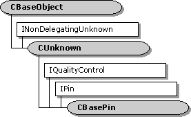

# CBasePin class

The `CBasePin` class is an abstract class that implements a generic pin.

The following topics describe how to use this class:

-   [CBasePin Connection Process](cbasepin-connection-process.md)
-   [Notifying CBasePin of Filter State Changes](notifying-cbasepin-of-filter-state-changes.md)
-   [Deriving from CBasePin](deriving-from-cbasepin.md)

| Protected Member Variables                                               | Description                                                                                                |
|--------------------------------------------------------------------------|------------------------------------------------------------------------------------------------------------|
| [**m\_pName**](cbasepin-m-pname.md)                                     | Pin name.                                                                                                  |
| [**m\_Connected**](cbasepin-m-connected.md)                             | Pointer to the pin that is connected to this pin.                                                          |
| [**m\_dir**](cbasepin-m-dir.md)                                         | Direction of the pin.                                                                                      |
| [**m\_pLock**](cbasepin-m-plock.md)                                     | Pointer to a critical section object.                                                                      |
| [**m\_bRunTimeError**](cbasepin-m-bruntimeerror.md)                     | Flag that indicates whether a run-time error has occurred.                                                 |
| [**m\_bCanReconnectWhenActive**](cbasepin-m-bcanreconnectwhenactive.md) | Flag that indicates whether the pin supports dynamic reconnection.                                         |
| [**m\_bTryMyTypesFirst**](cbasepin-m-btrymytypesfirst.md)               | Flag that indicates whether the pin tries its own preferred media types before those of the receiving pin. |
| [**m\_pFilter**](cbasepin-m-pfilter.md)                                 | Pointer to the filter that created the pin.                                                                |
| [**m\_pQSink**](cbasepin-m-pqsink.md)                                   | Pointer to the object that handles quality messages.                                                       |
| [**m\_TypeVersion**](cbasepin-m-typeversion.md)                         | Current version of the set of preferred media types.                                                       |
| [**m\_mt**](cbasepin-m-mt.md)                                           | Media type for the current pin connection.                                                                 |
| [**m\_tStart**](cbasepin-m-tstart.md)                                   | Segment start time.                                                                                        |
| [**m\_tStop**](cbasepin-m-tstop.md)                                     | Segment stop time.                                                                                         |
| [**m\_dRate**](cbasepin-m-drate.md)                                     | Segment rate.                                                                                              |
| Protected Methods                                                        | Description                                                                                                |
| [**DisplayPinInfo**](cbasepin-displaypininfo.md)                        | Traces a pin connection during debugging.                                                                  |
| [**DisplayTypeInfo**](cbasepin-displaytypeinfo.md)                      | Displays media type information during debugging.                                                          |
| [**AttemptConnection**](cbasepin-attemptconnection.md)                  | Connects to another pin using a specified media type.                                                      |
| [**TryMediaTypes**](cbasepin-trymediatypes.md)                          | Given a list of media types, tries to complete a connection using one of those types.                      |
| [**AgreeMediaType**](cbasepin-agreemediatype.md)                        | Searches for a media type to make a pin connection.                                                        |
| [**DisconnectInternal**](cbasepin-disconnectinternal.md)                | Breaks the current pin connection.                                                                         |
| Public Methods                                                           | Description                                                                                                |
| [**CBasePin**](cbasepin-cbasepin.md)                                    | Constructor method.                                                                                        |
| [**~ CBasePin**](cbasepin--cbasepin.md)                                 | Destructor method. Virtual.                                                                                |
| [**IsConnected**](cbasepin-isconnected.md)                              | Determines whether the pin is connected to another pin.                                                    |
| [**GetConnected**](cbasepin-getconnected.md)                            | Retrieves the pin that is connected to this pin.                                                           |
| [**IsStopped**](cbasepin-isstopped.md)                                  | Determines whether the filter containing this pin is stopped.                                              |
| [**GetMediaTypeVersion**](cbasepin-getmediatypeversion.md)              | Retrieves a version number for the set of preferred media types. Virtual.                                  |
| [**IncrementTypeVersion**](cbasepin-incrementtypeversion.md)            | Increments the version number on the set of preferred media types.                                         |
| [**Active**](cbasepin-active.md)                                        | Notifies the pin that the filter is now active. Virtual.                                                   |
| [**Inactive**](cbasepin-inactive.md)                                    | Notifies the pin that the filter is no longer active. Virtual.                                             |
| [**Run**](cbasepin-run.md)                                              | Notifies the pin that the filter is now running. Virtual.                                                  |
| [**SetMediaType**](cbasepin-setmediatype.md)                            | Sets the media type for the connection. Virtual.                                                           |
| [**CheckConnect**](cbasepin-checkconnect.md)                            | Determines whether a pin connection is suitable. Virtual.                                                  |
| [**BreakConnect**](cbasepin-breakconnect.md)                            | Releases the pin from a connection. Virtual.                                                               |
| [**CompleteConnect**](cbasepin-completeconnect.md)                      | Completes a connection to another pin. Virtual.                                                            |
| [**GetMediaType**](cbasepin-getmediatype.md)                            | Retrieves a preferred media type, by index value. Virtual.                                                 |
| [**CurrentStopTime**](cbasepin-currentstoptime.md)                      | Retrieves the segment stop time.                                                                           |
| [**CurrentStartTime**](cbasepin-currentstarttime.md)                    | Retrieves the segment start time.                                                                          |
| [**CurrentRate**](cbasepin-currentrate.md)                              | Retrieves the segment rate.                                                                                |
| [**Name**](cbasepin-name.md)                                            | Retrieves the pin identifier.                                                                              |
| [**SetReconnectWhenActive**](cbasepin-setreconnectwhenactive.md)        | Specifies whether the pin supports dynamic reconnections.                                                  |
| [**CanReconnectWhenActive**](cbasepin-canreconnectwhenactive.md)        | Queries whether the pin supports dynamic reconnections.                                                    |
| Pure Virtual Methods                                                     | Description                                                                                                |
| [**CheckMediaType**](cbasepin-checkmediatype.md)                        | Determines if the pin accepts a specific media type.                                                       |
| IPin Methods                                                             | Description                                                                                                |
| [**Connect**](cbasepin-connect.md)                                      | Connects the pin to another pin.                                                                           |
| [**ReceiveConnection**](cbasepin-receiveconnection.md)                  | Accepts a connection from another pin.                                                                     |
| [**Disconnect**](cbasepin-disconnect.md)                                | Breaks the current pin connection.                                                                         |
| [**ConnectedTo**](cbasepin-connectedto.md)                              | Retrieves the pin connected to this pin.                                                                   |
| [**ConnectionMediaType**](cbasepin-connectionmediatype.md)              | Retrieves the media type for the current pin connection, if any.                                           |
| [**QueryPinInfo**](cbasepin-querypininfo.md)                            | Retrieves information about the pin.                                                                       |
| [**QueryDirection**](cbasepin-querydirection.md)                        | Retrieves the direction of the pin (input or output).                                                      |
| [**QueryId**](cbasepin-queryid.md)                                      | Retrieves the pin identifier.                                                                              |
| [**QueryAccept**](cbasepin-queryaccept.md)                              | Determines whether the pin accepts a specified media type.                                                 |
| [**EnumMediaTypes**](cbasepin-enummediatypes.md)                        | Enumerates the pin's preferred media types.                                                                |
| [**QueryInternalConnections**](cbasepin-queryinternalconnections.md)    | Retrieves the pins that are connected internally to this pin (within the filter).                          |
| [**EndOfStream**](cbasepin-endofstream.md)                              | Notifies the pin that no additional data is expected.                                                      |
| [**NewSegment**](cbasepin-newsegment.md)                                | Notifies the pin that media samples received after this call are grouped as a segment.                     |
| IQualityControl Methods                                                  | Description                                                                                                |
| [**Notify**](cbasepin-notify.md)                                        | Notifies the pin that a quality change is requested.                                                       |
| [**SetSink**](cbasepin-setsink.md)                                      | Sets an external quality manager.                                                                          |

 

## Requirements

| Requirement | Value |
|--------------------|--------------------------------------------------------------------------------------------------------------------------------------------------------------------------------------------|
| Header   | <dl> <dt>Amfilter.h (include Streams.h)</dt> </dl>                                                                                  |
| Library  | <dl> <dt>Strmbase.lib (retail builds); </dt> <dt>Strmbasd.lib (debug builds)</dt> </dl> |

 

 

