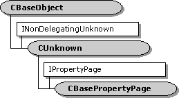

# CBasePropertyPage class



The `CBasePropertyPage` class is an abstract class for implementing a property page. Use this class if you are writing a filter (or other object) that supports property pages.


| Protected Member Variables                                             | Description                                                                                                                       |
|------------------------------------------------------------------------|-----------------------------------------------------------------------------------------------------------------------------------|
| [**m\_bDirty**](cbasepropertypage-m-bdirty.md)                        | Indicates whether any of the properties have changed.                                                                             |
| [**m\_DialogId**](cbasepropertypage-m-dialogid.md)                    | Resource identifier for the dialog.                                                                                               |
| [**m\_Dlg**](cbasepropertypage-m-dlg.md)                              | Handle to the dialog window.                                                                                                      |
| [**m\_hwnd**](cbasepropertypage-m-hwnd.md)                            | Handle to the dialog window.                                                                                                      |
| [**m\_pPageSite**](cbasepropertypage-m-ppagesite.md)                  | Pointer to the **IPropertyPageSite** interface of the property page site.                                                         |
| [**m\_TitleId**](cbasepropertypage-m-titleid.md)                      | Resource identifier for a string that contains the dialog title.                                                                  |
| Public Methods                                                         | Description                                                                                                                       |
| [**CBasePropertyPage**](cbasepropertypage-cbasepropertypage.md)       | Constructor method.                                                                                                               |
| [**~CBasePropertyPage**](cbasepropertypage--cbasepropertypage.md)     | Destructor method. Virtual.                                                                                                       |
| [**OnActivate**](cbasepropertypage-onactivate.md)                     | Called when the property page is activated. Virtual.                                                                              |
| [**OnApplyChanges**](cbasepropertypage-onapplychanges.md)             | Called when the user applies changes to the property page. Virtual.                                                               |
| [**OnConnect**](cbasepropertypage-onconnect.md)                       | Provides an **IUnknown** pointer to the object associated with the property page. Virtual.                                        |
| [**OnDeactivate**](cbasepropertypage-ondeactivate.md)                 | Called when the dialog box window is destroyed. Virtual.                                                                          |
| [**OnDisconnect**](cbasepropertypage-ondisconnect.md)                 | Called when the property page should release the associated object. Virtual.                                                      |
| [**OnReceiveMessage**](cbasepropertypage-onreceivemessage.md)         | Called when the dialog box receives a message. Virtual.                                                                           |
| IPropertyPage Methods                                                  | Description                                                                                                                       |
| [**Activate**](cbasepropertypage-activate.md)                         | Creates the dialog box window.                                                                                                    |
| [**Apply**](cbasepropertypage-apply.md)                               | Applies the current property page values to the object associated with the property page                                          |
| [**Deactivate**](cbasepropertypage-deactivate.md)                     | Destroys the dialog window.                                                                                                       |
| [**GetPageInfo**](cbasepropertypage-getpageinfo.md)                   | Retrieves information about the property page.                                                                                    |
| [**Help**](cbasepropertypage-help.md)                                 | Invokes the property page help.                                                                                                   |
| [**IsPageDirty**](cbasepropertypage-ispagedirty.md)                   | Indicates whether the property page has changed since it was activated or since the most recent call to **IPropertyPage::Apply**. |
| [**Move**](cbasepropertypage-move.md)                                 | Positions and resizes the dialog box.                                                                                             |
| [**SetObjects**](cbasepropertypage-setobjects.md)                     | Provides **IUnknown** pointers for the objects associated with the property page.                                                 |
| [**SetPageSite**](cbasepropertypage-setpagesite.md)                   | Initializes the property page.                                                                                                    |
| [**Show**](cbasepropertypage-show.md)                                 | Shows or hides the dialog box.                                                                                                    |
| [**TranslateAccelerator**](cbasepropertypage-translateaccelerator.md) | Instructs the property page to process a keystroke.                                                                               |


 

## Remarks

A property page is a COM object, so you must generate a GUID for the class identifier (CLSID) and provide an entry in the [**CFactoryTemplate**](cfactorytemplate.md) array. For more information, see [DirectShow and COM](directshow-and-com.md). The following example shows a typical class factory entry:


```
CFactoryTemplate g_Templates[] =
{   
    { 
        L"My Property Page",
        &CLSID_MyPropPage,
        CMyProp::CreateInstance,
        NULL,
        NULL
    },
    /* Also include the template for your filter (not shown). */
};

```


Your filter must expose the **ISpecifyPropertyPages** interface. This interface contains a single method, **GetPages**, which returns the CLSID of the property page. The following example shows how to implement this method:


```
STDMETHODIMP CMyFilter::GetPages(CAUUID *pPages)
{
    if (!pPages) return E_POINTER;

    pPages->cElems = 1;
    pPages->pElems = reinterpret_cast<GUID*>(CoTaskMemAlloc(sizeof(GUID)));
    if (pPages->pElems == NULL) 
    {
        return E_OUTOFMEMORY;
    }
    *(pPages->pElems) = CLSID_MyPropPage;
    return S_OK;
} 
```


Remember to override the filter's **NonDelegatingQueryInterface** method as well. For more information, see [DirectShow and COM](directshow-and-com.md) and [**INonDelegatingUnknown**](inondelegatingunknown.md).

Next, create the dialog as a resource in your project, and create a string resource that holds the dialog title. Both of these resource IDs are parameters to the **CBasePropertyPage** constructor. Keeping the title string in a resource makes it easier to localize your property page.

The **CBasePropertyPage** class provides a framework for the **IPropertyPage** interface. This framework calls a number of virtual methods, including [**CBasePropertyPage::OnActivate**](cbasepropertypage-onactivate.md), [**CBasePropertyPage::OnApplyChanges**](cbasepropertypage-onapplychanges.md), and so on. In the base class, these methods simply return S\_OK. Your derived class will need to override some or all of these virtual methods. For details, see the remarks for the individual methods.

For an extended example of how to use this class to create a property page, see [Creating a Filter Property Page](creating-a-filter-property-page.md).

## Requirements


| Requirement | Value |
|--------------------|--------------------------------------------------------------------------------------------------------------------------------------------------------------------------------------------|
| Header<br/>  | <dl> <dt>Cprop.h (include Streams.h)</dt> </dl>                                                                                     |
| Library<br/> | <dl> <dt>Strmbase.lib (retail builds); </dt> <dt>Strmbasd.lib (debug builds)</dt> </dl> |


 

 


