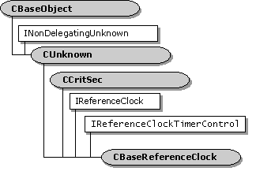

# CBaseReferenceClock class

\[The feature associated with this page, [DirectShow](/windows/win32/directshow/directshow), is a legacy feature. It has been superseded by [MediaPlayer](/uwp/api/Windows.Media.Playback.MediaPlayer), [IMFMediaEngine](/windows/win32/api/mfmediaengine/nn-mfmediaengine-imfmediaengine), and [Audio/Video Capture in Media Foundation](windows/win32/medfound/audio-video-capture-in-media-foundation). Those features have been optimized for Windows 10 and Windows 11. Microsoft strongly recommends that new code use **MediaPlayer**, **IMFMediaEngine** and **Audio/Video Capture in Media Foundation** instead of **DirectShow**, when possible. Microsoft suggests that existing code that uses the legacy APIs be rewritten to use the new APIs if possible.\]



The `CBaseReferenceClock` class implements a reference clock.


| Protected Member Variables                                                         | Description                                                                            |
|------------------------------------------------------------------------------------|----------------------------------------------------------------------------------------|
| [**m\_pSchedule**](cbasereferenceclock-m-pschedule.md)                            | [**CAMSchedule**](camschedule.md) object that handles scheduling tasks for the clock. |
| Protected Methods                                                                  | Description                                                                            |
| [**~CBaseReferenceClock**](cbasereferenceclock--cbasereferenceclock.md)           | Destructor method.                                                                     |
| Public Methods                                                                     | Description                                                                            |
| [**CBaseReferenceClock**](cbasereferenceclock-cbasereferenceclock.md)             | Constructor method.                                                                    |
| [**GetPrivateTime**](cbasereferenceclock-getprivatetime.md)                       | Retrieves the real time from the clock.                                                |
| [**SetTimeDelta**](cbasereferenceclock-settimedelta.md)                           | Adjusts the internal clock time.                                                       |
| [**GetSchedule**](cbasereferenceclock-getschedule.md)                             | Retrieves a pointer to the clock's scheduling object.                                  |
| [**TriggerThread**](cbasereferenceclock-triggerthread.md)                         | Wakes up the worker thread that handles scheduling.                                    |
| IReferenceClock Methods                                                            | Description                                                                            |
| [**GetTime**](cbasereferenceclock-gettime.md)                                     | Retrieves the current reference time.                                                  |
| [**AdviseTime**](cbasereferenceclock-advisetime.md)                               | Creates a one-shot advise request.                                                     |
| [**AdvisePeriodic**](cbasereferenceclock-adviseperiodic.md)                       | Creates a periodic advise request.                                                     |
| [**Unadvise**](cbasereferenceclock-unadvise.md)                                   | Removes a pending advise request.                                                      |
| IReferenceClockTimerControl Methods                                                | Description                                                                            |
| [**GetDefaultTimerResolution**](cbasereferenceclock-getdefaulttimerresolution.md) | Returns the current resolution of the reference clock's timer.                         |
| [**SetDefaultTimerResolution**](cbasereferenceclock-setdefaulttimerresolution.md) | Sets the resolution of the reference clock's timer.                                    |
| Helper Functions                                                                   | Description                                                                            |
| [**ConvertToMilliseconds**](converttomilliseconds.md)                             | Converts a reference time to milliseconds.                                             |


 

## Remarks

This class implements a reference clock that supports the [**IReferenceClock**](/windows/desktop/api/Strmif/nn-strmif-ireferenceclock) and [**IReferenceClockTimerControl**](/windows/desktop/api/Strmif/nn-strmif-ireferenceclocktimercontrol) interfaces. If a filter can provide a reference clock for the filter graph for example, by accessing a hardware device it can use this class to implement the clock.

The `CBaseReferenceClock` object maintains two distinct time values:

-   Internally, the [**CBaseReferenceClock::GetPrivateTime**](cbasereferenceclock-getprivatetime.md) method returns the actual time kept by the clock.
-   Externally, the [**CBaseReferenceClock::GetTime**](cbasereferenceclock-gettime.md) method returns the reference time for the filter graph.

It is valid for the internal clock to run backward over brief periods. For example, if the clock drifts forward, the filter can adjust it backward. (See [**CBaseReferenceClock::SetTimeDelta**](cbasereferenceclock-settimedelta.md).) The **GetTime** method uses the time values reported by **GetPrivateTime**. However, the reference time is monotonically increasing; in other words, it never runs backward. Therefore, if the internal clock runs backward, **GetTime** continues to report the old time until the internal clock catches up.

For example, the two methods might return the following sequences:

``` syntax
GetPrivateTime: 105, 106, 103, 104, 105, 106, 107, 108
GetTime:        105, 106, 106, 106, 106, 106, 107, 108
```

On the third clock tick, the internal clock jumps backward to 103. The **GetTime** method continues to report 106 until the internal clock catches up.

By default, **GetPrivateTime** returns the system time, through a call to the **timeGetTime** function. A filter that is providing a reference clock from an external device can do one of the following:

-   Override **GetPrivateTime** to return the time from the device.
-   Monitor the discrepancy between the device time and the system time, and call **SetTimeDelta** to make corrections.

This class uses a [**CAMSchedule**](camschedule.md) object to handle scheduling of advise requests. For details, see the documentation for the **CAMSchedule** class.

## Requirements


| Requirement | Value |
|--------------------|--------------------------------------------------------------------------------------------------------------------------------------------------------------------------------------------|
| Header<br/>  | <dl> <dt>Refclock.h (include Streams.h)</dt> </dl>                                                                                  |
| Library<br/> | <dl> <dt>Strmbase.lib (retail builds); </dt> <dt>Strmbasd.lib (debug builds)</dt> </dl> |


 

 


