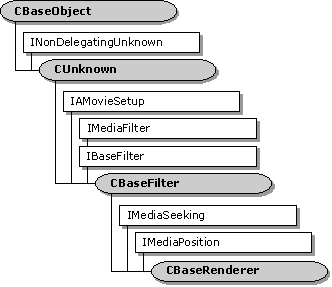

# CBaseRenderer class

\[The feature associated with this page, [DirectShow](/windows/win32/directshow/directshow), is a legacy feature. It has been superseded by [MediaPlayer](/uwp/api/Windows.Media.Playback.MediaPlayer), [IMFMediaEngine](/windows/win32/api/mfmediaengine/nn-mfmediaengine-imfmediaengine), and [Audio/Video Capture in Media Foundation](windows/win32/medfound/audio-video-capture-in-media-foundation). Those features have been optimized for Windows 10 and Windows 11. Microsoft strongly recommends that new code use **MediaPlayer**, **IMFMediaEngine** and **Audio/Video Capture in Media Foundation** instead of **DirectShow**, when possible. Microsoft suggests that existing code that uses the legacy APIs be rewritten to use the new APIs if possible.\]

The `CBaseRenderer` class is a base class for implementing renderer filters. It supports one input pin, implemented by the [**CRendererInputPin**](crendererinputpin.md) class. To use this class, declare a derived class that inherits `CBaseRenderer`. At a minimum, the derived class must implement the following methods, which are declared as pure virtual in the base class:

-   [**CBaseRenderer::CheckMediaType**](cbaserenderer-checkmediatype.md): Accepts or rejects proposed media types. The filter calls this method during the pin connection process.
-   [**CBaseRenderer::DoRenderSample**](cbaserenderer-dorendersample.md): Renders a sample. The filter calls this method for every sample that it receives while running.

The base class handles state changes and synchronization issues. It also schedules samples for rendering, although it does not implement any quality-control measures. The base class also declares several "handler" methods. These are methods that the filter calls at specific points in the streaming process. They do nothing in the base class, but the derived class can override them. In the table that follows, they are listed under the heading Public Methods: Handlers.

The [**CBaseRenderer::OnReceiveFirstSample**](cbaserenderer-onreceivefirstsample.md) handler deserves special mention. The filter calls this method if it receives a sample while the filter is paused. That can occur if the graph switches from stopped to paused, or if the graph is seeked while paused. Video renderers typically use the sample to display a still frame. When the filter switches from paused to running, it sends the same sample to the [**CBaseRenderer::DoRenderSample**](cbaserenderer-dorendersample.md) method, as the first sample in the stream.

The `CBaseRenderer` class exposes the **IMediaSeeking** and **IMediaPosition** interfaces through the [**CRendererPosPassThru**](crendererpospassthru.md) object. It passes all seek requests to the next filter upstream.

## Scheduling

When the upstream filter calls the input pin's [**IMemInputPin::Receive**](/windows/desktop/api/Strmif/nf-strmif-imeminputpin-receive) method to deliver a sample, the pin passes this call to the filter's [**CBaseRenderer::Receive**](cbaserenderer-receive.md) method. The filter either drops the sample, renders it immediately, or schedules it for rendering.

If the sample has no time stamps, or if no reference clock is available, the filter renders the sample immediately. Otherwise, the filter calls the [**CBaseRenderer::ShouldDrawSampleNow**](cbaserenderer-shoulddrawsamplenow.md) method to determine what to do. By default, the sample is scheduled based on its time stamps. The derived class can override **ShouldDrawSampleNow** to support quality control.

To schedule a sample, the filter calls the [**IReferenceClock::AdviseTime**](/windows/desktop/api/Strmif/nf-strmif-ireferenceclock-advisetime) method, which creates an advise request. The [**Receive**](/windows/desktop/api/Strmif/nf-strmif-imeminputpin-receive) method then blocks until the scheduled time, or until the filter changes state. Blocking prevents the upstream filter from delivering more samples until the current sample is rendered.

When the upstream filter calls the [**IPin::EndOfStream**](/windows/desktop/api/Strmif/nf-strmif-ipin-endofstream) method to signal the end of the stream, the filter sends an [**EC\_COMPLETE**](ec-complete.md) event to the filter graph manager. The filter waits for the current sample's stop time before sending the event.

| Protected Member Variables                                                   | Description                                                                                                                             |
|------------------------------------------------------------------------------|-----------------------------------------------------------------------------------------------------------------------------------------|
| [**m\_bAbort**](cbaserenderer-m-babort.md)                                  | Flag that indicates whether to stop rendering and reject further samples.                                                               |
| [**m\_bEOS**](cbaserenderer-m-beos.md)                                      | Flag that indicates whether end-of-stream was reached.                                                                                  |
| [**m\_bEOSDelivered**](cbaserenderer-m-beosdelivered.md)                    | Flag that indicates whether the filter has posted the EC\_COMPLETE event.                                                               |
| [**m\_bInReceive**](cbaserenderer-m-binreceive.md)                          | Flag that indicates whether the filter is processing a **Receive** call.                                                                |
| [**m\_bRepaintStatus**](cbaserenderer-m-brepaintstatus.md)                  | Flag that enables or disables repaint events.                                                                                           |
| [**m\_bStreaming**](cbaserenderer-m-bstreaming.md)                          | Flag that indicates whether the filter is streaming data.                                                                               |
| [**m\_dwAdvise**](cbaserenderer-m-dwadvise.md)                              | Identifier of the timer event that schedules rendering.                                                                                 |
| [**m\_EndOfStreamTimer**](cbaserenderer-m-endofstreamtimer.md)              | Timer-event identifier, for scheduling EC\_COMPLETE notifications.                                                                      |
| [**m\_evComplete**](cbaserenderer-m-evcomplete.md)                          | Event that is signaled when a state transition is complete.                                                                             |
| [**m\_InterfaceLock**](cbaserenderer-m-interfacelock.md)                    | Filter-state lock.                                                                                                                      |
| [**m\_ObjectCreationLock**](cbaserenderer-m-objectcreationlock.md)          | Lock to protect the creation of objects inside the filter.                                                                              |
| [**m\_pInputPin**](cbaserenderer-m-pinputpin.md)                            | Pointer to the filter's input pin.                                                                                                      |
| [**m\_pMediaSample**](cbaserenderer-m-pmediasample.md)                      | Pointer to the current media sample.                                                                                                    |
| [**m\_pPosition**](cbaserenderer-m-pposition.md)                            | Helper object to pass seek commands upstream.                                                                                           |
| [**m\_pQSink**](cbaserenderer-m-pqsink.md)                                  | Pointer to the object that receives quality-control messages.                                                                           |
| [**m\_RendererLock**](cbaserenderer-m-rendererlock.md)                      | Streaming lock.                                                                                                                         |
| [**m\_RenderEvent**](cbaserenderer-m-renderevent.md)                        | Event used to schedule rendering.                                                                                                       |
| [**m\_SignalTime**](cbaserenderer-m-signaltime.md)                          | Stop time on the current sample.                                                                                                        |
| [**m\_ThreadSignal**](cbaserenderer-m-threadsignal.md)                      | Event used to release the streaming thread.                                                                                             |
| Public Methods                                                               | Description                                                                                                                             |
| [**CancelNotification**](cbaserenderer-cancelnotification.md)               | Cancels the timer event that schedules rendering. Virtual.                                                                              |
| [**CBaseRenderer**](cbaserenderer-cbaserenderer.md)                         | Constructor method.                                                                                                                     |
| [**~CBaseRenderer**](cbaserenderer--cbaserenderer.md)                       | Destructor method.                                                                                                                      |
| [**GetMediaPositionInterface**](cbaserenderer-getmediapositioninterface.md) | Retrieves the filter's [**IMediaPosition**](/windows/desktop/api/Control/nn-control-imediaposition) and [**IMediaSeeking**](/windows/desktop/api/Strmif/nn-strmif-imediaseeking) interface pointers. Virtual. |
| [**GetPin**](cbaserenderer-getpin.md)                                       | Retrieves a pin. Virtual.                                                                                                               |
| [**GetPinCount**](cbaserenderer-getpincount.md)                             | Retrieves the number of pins. Virtual.                                                                                                  |
| [**GetSampleTimes**](cbaserenderer-getsampletimes.md)                       | Retrieves the time stamps from a sample. Virtual.                                                                                       |
| [**OnDisplayChange**](cbaserenderer-ondisplaychange.md)                     | Posts an [**EC\_DISPLAY\_CHANGED**](ec-display-changed.md) event to the filter graph manager.                                          |
| [**PrepareReceive**](cbaserenderer-preparereceive.md)                       | Prepares to render a sample. Virtual.                                                                                                   |
| [**Receive**](cbaserenderer-receive.md)                                     | Receives the next media sample in the stream. Virtual.                                                                                  |
| [**Render**](cbaserenderer-render.md)                                       | Renders a sample. Virtual.                                                                                                              |
| [**ScheduleSample**](cbaserenderer-schedulesample.md)                       | Schedules a sample for rendering. Virtual.                                                                                              |
| [**SendNotifyWindow**](cbaserenderer-sendnotifywindow.md)                   | Notifies the upstream filter of the video window handle.                                                                                |
| [**SendRepaint**](cbaserenderer-sendrepaint.md)                             | Sends a repaint event to the filter graph manager.                                                                                      |
| [**SetMediaType**](cbaserenderer-setmediatype.md)                           | Called when the pin's media type is set. Virtual.                                                                                       |
| [**SignalTimerFired**](cbaserenderer-signaltimerfired.md)                   | Clears the timer identifier used to schedule rendering.                                                                                 |
| [**SourceThreadCanWait**](cbaserenderer-sourcethreadcanwait.md)             | Holds or releases the streaming thread. Virtual.                                                                                        |
| [**WaitForReceiveToComplete**](cbaserenderer-waitforreceivetocomplete.md)   | Waits for the [**CBaseRenderer::Receive**](cbaserenderer-receive.md) method to complete.                                               |
| [**WaitForRenderTime**](cbaserenderer-waitforrendertime.md)                 | Waits for the current sample's presentation time. Virtual.                                                                              |
| Public Methods: Accessor Methods                                             | Description                                                                                                                             |
| [**ClearPendingSample**](cbaserenderer-clearpendingsample.md)               | Releases the current sample. Virtual.                                                                                                   |
| [**GetCurrentSample**](cbaserenderer-getcurrentsample.md)                   | Retrieves the current sample. Virtual.                                                                                                  |
| [**GetRealState**](cbaserenderer-getrealstate.md)                           | Retrieves the filter state.                                                                                                             |
| [**GetRenderEvent**](cbaserenderer-getrenderevent.md)                       | Retrieves the event that schedules rendering.                                                                                           |
| [**HaveCurrentSample**](cbaserenderer-havecurrentsample.md)                 | Determines whether the filter has a sample. Virtual.                                                                                    |
| [**IsEndOfStream**](cbaserenderer-isendofstream.md)                         | Queries whether the end-of-stream notification was received.                                                                            |
| [**IsEndOfStreamDelivered**](cbaserenderer-isendofstreamdelivered.md)       | Queries whether the EC\_COMPLETE event has been delivered to the filter graph manager.                                                  |
| [**IsStreaming**](cbaserenderer-isstreaming.md)                             | Queries whether the filter is streaming data.                                                                                           |
| [**SetAbortSignal**](cbaserenderer-setabortsignal.md)                       | Sets a flag which indicates whether to stop rendering and reject further samples.                                                       |
| [**SetRepaintStatus**](cbaserenderer-setrepaintstatus.md)                   | Enables or disables repaint events.                                                                                                     |
| Public Methods: State-Change Methods                                         | Description                                                                                                                             |
| [**Active**](cbaserenderer-active.md)                                       | Called when the state is switched to paused or running. Virtual.                                                                        |
| [**BeginFlush**](cbaserenderer-beginflush.md)                               | Begins a flush operation. Virtual.                                                                                                      |
| [**BreakConnect**](cbaserenderer-breakconnect.md)                           | Releases the input pin from a connection. Virtual.                                                                                      |
| [**CheckReady**](cbaserenderer-checkready.md)                               | Queries whether a state transition is complete.                                                                                         |
| [**CompleteConnect**](cbaserenderer-completeconnect.md)                     | Completes the input pin's connection to another pin. Virtual.                                                                           |
| [**CompleteStateChange**](cbaserenderer-completestatechange.md)             | Determines whether a transition to the paused state is complete. Virtual.                                                               |
| [**EndFlush**](cbaserenderer-endflush.md)                                   | Ends a flush operation. Virtual.                                                                                                        |
| [**Inactive**](cbaserenderer-inactive.md)                                   | Called when the state is switched to stopped. Virtual.                                                                                  |
| [**NotReady**](cbaserenderer-notready.md)                                   | Signals that a state transition is not yet complete.                                                                                    |
| [**Ready**](cbaserenderer-ready.md)                                         | Signals that a state transition is complete.                                                                                            |
| [**StartStreaming**](cbaserenderer-startstreaming.md)                       | Initiates streaming when the filter switches to a running state. Virtual.                                                               |
| [**StopStreaming**](cbaserenderer-stopstreaming.md)                         | Halts streaming when the filter switches out of the running state. Virtual.                                                             |
| Public Methods: End-of-Stream Methods                                        | Description                                                                                                                             |
| [**EndOfStream**](cbaserenderer-endofstream.md)                             | Notifies the filter that the input pin received an end-of-stream notification. Virtual.                                                 |
| [**NotifyEndOfStream**](cbaserenderer-notifyendofstream.md)                 | Posts an [**EC\_COMPLETE**](ec-complete.md) event to the filter graph manager.                                                         |
| [**ResetEndOfStream**](cbaserenderer-resetendofstream.md)                   | Resets the end-of-stream flags.                                                                                                         |
| [**ResetEndOfStreamTimer**](cbaserenderer-resetendofstreamtimer.md)         | Cancels the timer that schedules EC\_COMPLETE notifications. Virtual.                                                                   |
| [**SendEndOfStream**](cbaserenderer-sendendofstream.md)                     | If end-of-stream was reached, schedules an EC\_COMPLETE event for the filter graph manager. Virtual.                                    |
| [**TimerCallback**](cbaserenderer-timercallback.md)                         | Callback method for the end-of-stream timer event.                                                                                      |
| Public Methods: Handlers                                                     | Description                                                                                                                             |
| [**OnReceiveFirstSample**](cbaserenderer-onreceivefirstsample.md)           | Called when the filter receives a sample while paused. Virtual.                                                                         |
| [**OnRenderEnd**](cbaserenderer-onrenderend.md)                             | Called after a sample is rendered. Virtual.                                                                                             |
| [**OnRenderStart**](cbaserenderer-onrenderstart.md)                         | Called when rendering is about to start. Virtual.                                                                                       |
| [**OnStartStreaming**](cbaserenderer-onstartstreaming.md)                   | Called when the filter begins streaming. Virtual.                                                                                       |
| [**OnStopStreaming**](cbaserenderer-onstopstreaming.md)                     | Called when the filter stops streaming. Virtual.                                                                                        |
| [**OnWaitEnd**](cbaserenderer-onwaitend.md)                                 | Called when the filter is done waiting for a sample's presentation time. Virtual.                                                       |
| [**OnWaitStart**](cbaserenderer-onwaitstart.md)                             | Called when the filter starts waiting for a sample's presentation time. Virtual.                                                        |
| [**PrepareRender**](cbaserenderer-preparerender.md)                         | Called before the filter renders a sample. Virtual.                                                                                     |
| [**ShouldDrawSampleNow**](cbaserenderer-shoulddrawsamplenow.md)             | Determines how a sample is scheduled for rendering. Virtual.                                                                            |
| Pure Virtual Methods                                                         | Description                                                                                                                             |
| [**CheckMediaType**](cbaserenderer-checkmediatype.md)                       | Determines if the filter accepts a specific media type.                                                                                 |
| [**DoRenderSample**](cbaserenderer-dorendersample.md)                       | Renders a sample.                                                                                                                       |
| IMediaFilter Methods                                                         | Description                                                                                                                             |
| [**GetState**](cbaserenderer-getstate.md)                                   | Retrieves the filter's state (running, stopped, or paused).                                                                             |
| [**Pause**](cbaserenderer-pause.md)                                         | Pauses the filter.                                                                                                                      |
| [**Run**](cbaserenderer-run.md)                                             | Runs the filter.                                                                                                                        |
| [**Stop**](cbaserenderer-stop.md)                                           | Stops the filter.                                                                                                                       |
| IBaseFilter Methods                                                          | Description                                                                                                                             |
| [**FindPin**](cbaserenderer-findpin.md)                                     | Retrieves the pin with the specified identifier.                                                                                        |

 

## Requirements

| Requirement | Value |
|--------------------|--------------------------------------------------------------------------------------------------------------------------------------------------------------------------------------------|
| Header   | <dl> <dt>Renbase.h (include Streams.h)</dt> </dl>                                                                                   |
| Library  | <dl> <dt>Strmbase.lib (retail builds); </dt> <dt>Strmbasd.lib (debug builds)</dt> </dl> |

 

 

