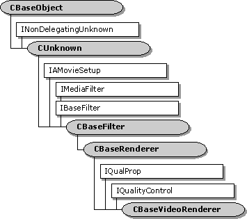

# CBaseVideoRenderer class

The `CBaseVideoRenderer` base class is used for building video renderer filters.

| Protected Data Members                                                                 | Description                                                                                                                                                                                                                          |
|----------------------------------------------------------------------------------------|--------------------------------------------------------------------------------------------------------------------------------------------------------------------------------------------------------------------------------------|
| m\_bDrawLateFrames                                                                     | Flag to signal that no frames are to be dropped. Debug only. This destroys synchronization.                                                                                                                                          |
| m\_bSupplierHandlingQuality                                                            | **TRUE** indicates quality control messages are being handled. This lets the renderer know to wait until as late as possible to drop frames itself, and to display the next frame very early after the supplier has dropped a frame. |
| m\_cFramesDrawn                                                                        | Total number of frames that have been drawn since streaming started.                                                                                                                                                                 |
| m\_cFramesDropped                                                                      | Cumulative frames that have been dropped in the renderer since streaming started. Frames can also be dropped upstream without the renderer recognizing them.                                                                         |
| m\_idDecision                                                                          | MSR\_id for the decision code of [**ShouldDrawSampleNow**](cbasevideorenderer-shoulddrawsamplenow.md).                                                                                                                              |
| m\_idDuration                                                                          | MSR\_id for the duration of a frame.                                                                                                                                                                                                 |
| m\_idFrameAccuracy                                                                     | Performance log identifier for the time in milliseconds that the frame was late.                                                                                                                                                     |
| m\_idFrameAvg                                                                          | Performance log identifier for the average frame time that is used for synchronization and quality control.                                                                                                                          |
| m\_idQualityRate                                                                       | MSR\_id for the quality rate requested.                                                                                                                                                                                              |
| m\_idQualityTime                                                                       | MSR\_id for the quality time requested.                                                                                                                                                                                              |
| m\_idRenderAvg                                                                         | Performance log identifier for the average renderer time recorded.                                                                                                                                                                   |
| m\_idSchLateTime                                                                       | MSR\_id for how late the frame was when scheduled.                                                                                                                                                                                   |
| m\_idSendQuality                                                                       | MSR\_id for timing the notifications (unused).                                                                                                                                                                                       |
| m\_idTimeStamp                                                                         | MSR\_id for a frame time stamp.                                                                                                                                                                                                      |
| m\_idWait                                                                              | Performance log identifier for the recorded wait time (unused).                                                                                                                                                                      |
| m\_idWaitReal                                                                          | Performance log identifier for the true wait time.                                                                                                                                                                                   |
| m\_iSumFrameTime                                                                       | Sum of the interframe times; needed for the property page.                                                                                                                                                                           |
| m\_iSumSqAcc                                                                           | Sum of the squares of the accuracies (in milliseconds) needed for the property page.                                                                                                                                                 |
| m\_iSumSqFrameTime                                                                     | Sum of the squares of interframe times; needed for the property page.                                                                                                                                                                |
| m\_iTotAcc                                                                             | Sum of the accuracies (in milliseconds) needed for the property page.                                                                                                                                                                |
| m\_nNormal                                                                             | Number of consecutive frames drawn at their scheduled time. A negative number indicates that a frame has just been dropped by the renderer.                                                                                          |
| m\_trDuration                                                                          | Duration of the last frame (difference between the start and end times).                                                                                                                                                             |
| m\_trEarliness                                                                         | How early a frame is allowed to be played when a frame has just been dropped.                                                                                                                                                        |
| m\_trFrame                                                                             | Most recently recorded time between frames. Used in statistical measurements.                                                                                                                                                        |
| m\_trFrameAvg                                                                          | Average interframe time in reference time units.                                                                                                                                                                                     |
| m\_trLastDraw                                                                          | Time of previous frame. Used for interframe time references.                                                                                                                                                                         |
| m\_trLate                                                                              | Amount of time that the current frame was late. Used in statistical measurements.                                                                                                                                                    |
| m\_trRenderAvg                                                                         | Time that frames are taking to perform the bit-block transfer.                                                                                                                                                                       |
| m\_trRenderLast                                                                        | Time for the last frame bit-block transfer.                                                                                                                                                                                          |
| m\_trRenderStart                                                                       | Time the bit-block transfer started. Used to get **m\_trRenderLast**.                                                                                                                                                                |
| m\_trThrottle                                                                          | Period to insert after rendering each frame, typically used when audio quality has been increased and video performance must be decreased to allow this.                                                                             |
| m\_trWaitAvg                                                                           | Average wait time in reference time units.                                                                                                                                                                                           |
| m\_tStreamingStart                                                                     | Used for property page statistics. Represents the start time of the current streaming process or the previous streaming process if not currently streaming.                                                                          |
| Member Functions                                                                       | Description                                                                                                                                                                                                                          |
| [**CBaseVideoRenderer**](cbasevideorenderer-cbasevideorenderer.md)                    | Constructs a **CBaseVideoRenderer** object.                                                                                                                                                                                          |
| [**GetStdDev**](cbasevideorenderer-getstddev.md)                                      | Estimates the standard deviation in milliseconds between when each frame is due and when it is actually rendered, for per-frame statistics.                                                                                          |
| [**PreparePerformanceData**](cbasevideorenderer-prepareperformancedata.md)            | Sets the **m\_trLate** and **m\_trFrame** values of the current frame.                                                                                                                                                               |
| [**ThrottleWait**](cbasevideorenderer-throttlewait.md)                                | Inserts a wait period after each frame.                                                                                                                                                                                              |
| Overridable Member Functions                                                           | Description                                                                                                                                                                                                                          |
| [**JoinFilterGraph**](cbasevideorenderer-joinfiltergraph.md)                          | Sends an [**EC\_WINDOW\_DESTROYED**](ec-window-destroyed.md) event when filter is removed from the filter graph.                                                                                                                    |
| [**OnDirectRender**](cbasevideorenderer-ondirectrender.md)                            | Collects timing information that controls synchronization and quality control.                                                                                                                                                       |
| [**OnRenderEnd**](cbasevideorenderer-onrenderend.md)                                  | Records information for quality control and synchronization.                                                                                                                                                                         |
| [**OnRenderStart**](cbasevideorenderer-onrenderstart.md)                              | Records information for quality control and synchronization.                                                                                                                                                                         |
| [**OnStartStreaming**](cbasevideorenderer-onstartstreaming.md)                        | Resets all times that control streaming.                                                                                                                                                                                             |
| [**OnStopStreaming**](cbasevideorenderer-onstopstreaming.md)                          | Called at the end of streaming to fix times for the property page report.                                                                                                                                                            |
| [**OnWaitEnd**](cbasevideorenderer-onwaitend.md)                                      | Called when a wait time ends. Performance logging only.                                                                                                                                                                              |
| [**OnWaitStart**](cbasevideorenderer-onwaitstart.md)                                  | Updates times spent waiting and not waiting. Performance logging only.                                                                                                                                                               |
| [**RecordFrameLateness**](cbasevideorenderer-recordframelateness.md)                  | Records how timely the rendering occurred and gathers statistics for the property page.                                                                                                                                              |
| [**ResetStreamingTimes**](cbasevideorenderer-resetstreamingtimes.md)                  | Resets all times that control the streaming.                                                                                                                                                                                         |
| [**ScheduleSample**](cbasevideorenderer-schedulesample.md)                            | Sets up an advise link with the clock.                                                                                                                                                                                               |
| [**SendQuality**](cbasevideorenderer-sendquality.md)                                  | Sends a quality message to indicate what the supplier should do about quality.                                                                                                                                                       |
| [**ShouldDrawSampleNow**](cbasevideorenderer-shoulddrawsamplenow.md)                  | Determines if the video should be drawn when it is due, without setting a timer advise link with the clock.                                                                                                                          |
| IQualProp Methods                                                                      | Description                                                                                                                                                                                                                          |
| [**get\_Avg FrameRate**](cbasevideorenderer-get-avgframerate.md)                      | Retrieves the average frame rate since streaming started in frames per 100 seconds.                                                                                                                                                  |
| [**get\_AvgSyncOffset**](cbasevideorenderer-get-avgsyncoffset.md)                     | Retrieves the average of the time in milliseconds between when each frame was due and when it was actually rendered. This applies to all frames since streaming started.                                                             |
| [**get\_DevSyncOffset**](cbasevideorenderer-get-devsyncoffset.md)                     | Retrieves the standard deviation of the time in milliseconds between when each frame was due and when it was actually rendered for all frames since streaming started.                                                               |
| [**get\_FramesDrawn**](cbasevideorenderer-get-framesdrawn.md)                         | Retrieves the number of frames drawn since streaming started.                                                                                                                                                                        |
| [**get\_FramesDroppedInRenderer**](cbasevideorenderer-get-framesdroppedinrenderer.md) | Retrieves the number of frames dropped by the renderer. Frames can also be dropped upstream.                                                                                                                                         |
| [**get\_Jitter**](cbasevideorenderer-get-jitter.md)                                   | Retrieves the standard deviation of the time in milliseconds between each frame and the next. This applies to all frames since streaming started.                                                                                    |
| IQualityControl Methods                                                                | Description                                                                                                                                                                                                                          |
| [**Notify**](cbasevideorenderer-notify.md)                                            | Notifies the recipient that a quality change is requested.                                                                                                                                                                           |
| [**SetSink**](cbasevideorenderer-setsink.md)                                          | Sets the [**IQualityControl**](/windows/desktop/api/Strmif/nn-strmif-iqualitycontrol) object that will receive quality messages.                                                                                                                                       |

 

 

 

