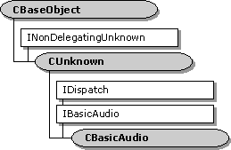

# CBasicAudio class

\[The feature associated with this page, [DirectShow](/windows/win32/directshow/directshow), is a legacy feature. It has been superseded by [MediaPlayer](/uwp/api/Windows.Media.Playback.MediaPlayer), [IMFMediaEngine](/windows/win32/api/mfmediaengine/nn-mfmediaengine-imfmediaengine), and [Audio/Video Capture in Media Foundation](windows/win32/medfound/audio-video-capture-in-media-foundation). Those features have been optimized for Windows 10 and Windows 11. Microsoft strongly recommends that new code use **MediaPlayer**, **IMFMediaEngine** and **Audio/Video Capture in Media Foundation** instead of **DirectShow**, when possible. Microsoft suggests that existing code that uses the legacy APIs be rewritten to use the new APIs if possible.\]

The `CBasicAudio` class implements the **IDispatch** methods of the [**IBasicAudio**](/windows/desktop/api/Control/nn-control-ibasicaudio) interface. The remaining **IBasicAudio** methods are left as pure virtual methods, and must be implemented by a derived class.

The **IDispatch** methods in this class are standard implementations, and are not described in detail here.

## Requirements

| Requirement | Value |
|--------------------|--------------------------------------------------------------------------------------------------------------------------------------------------------------------------------------------|
| Header   | <dl> <dt>Ctlutil.h (include Streams.h)</dt> </dl>                                                                                   |
| Library  | <dl> <dt>Strmbase.lib (retail builds); </dt> <dt>Strmbasd.lib (debug builds)</dt> </dl> |

## See also

<dl> <dt>

[**CBaseDispatch Class**](cbasedispatch.md)
</dt> </dl>

 

 

