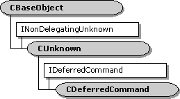

# CDeferredCommand class

\[The feature associated with this page, [DirectShow](/windows/win32/directshow/directshow), is a legacy feature. It has been superseded by [MediaPlayer](/uwp/api/Windows.Media.Playback.MediaPlayer), [IMFMediaEngine](/windows/win32/api/mfmediaengine/nn-mfmediaengine-imfmediaengine), and [Audio/Video Capture in Media Foundation](/windows/win32/medfound/audio-video-capture-in-media-foundation). Those features have been optimized for Windows 10 and Windows 11. Microsoft strongly recommends that new code use **MediaPlayer**, **IMFMediaEngine** and **Audio/Video Capture in Media Foundation** instead of **DirectShow**, when possible. Microsoft suggests that existing code that uses the legacy APIs be rewritten to use the new APIs if possible.\]

Deferred commands are queued by calls to methods on the [**IQueueCommand**](/windows/desktop/api/Control/nn-control-iqueuecommand) interface and are exposed by the filter graph manager and by some filters. A successful call to one of these methods returns an [**IDeferredCommand**](/windows/desktop/api/Control/nn-control-ideferredcommand) interface representing the queued command.

A `CDeferredCommand` object represents a single deferred command and exposes the [**IDeferredCommand**](/windows/desktop/api/Control/nn-control-ideferredcommand) interface as well as other methods that permit time checks and actual execution. A `CDeferredCommand` object contains a reference to the [**CCmdQueue**](ccmdqueue.md) object on which it is queued.

Reference counts control the lifetime of the `CDeferredCommand` class. When calling the [**CDeferredCommand::Invoke**](cdeferredcommand-invoke.md) member function, the calling application gets an interface pointer that is reference-counted, and the [**CCmdQueue**](ccmdqueue.md) object also holds a reference count on the deferred command. Calling the [**IDeferredCommand::Cancel**](/windows/desktop/api/Control/nf-control-ideferredcommand-cancel) member function takes the deferred command off the command queue and thus reduces the reference count by one. Once taken off the queue, the command cannot be put back on the queue.

| Protected Data Members                                        | Description                                                                                                             |
|---------------------------------------------------------------|-------------------------------------------------------------------------------------------------------------------------|
| m\_bStream                                                    | Flag for [**stream time**](stream-time.md) or presentation time. to be passed to the invoked method.                   |
| m\_Dispatch                                                   | Accesses the **ITypeInfo** interface.                                                                                   |
| m\_dispidMethod                                               | Method on the interface to run.                                                                                         |
| m\_DispParams                                                 | [**CDispParams**](cdispparams.md) object containing the **DISPPARAMS** parameter list                                  |
| m\_hrResult                                                   | Stores the returned **HRESULT** value.                                                                                  |
| m\_iid                                                        | Globally unique identifier (**GUID**) of the interface.                                                                 |
| m\_pQueue                                                     | Pointer to the [**CCmdQueue**](ccmdqueue.md) object that exposes the [**IQueueCommand**](/windows/desktop/api/Control/nn-control-iqueuecommand) interface. |
| m\_pUnk                                                       | **IUnknown** pointer to the interface on which the command will be run.                                                 |
| m\_pvarResult                                                 | Resulting information, if any, from the invoked method.                                                                 |
| m\_time                                                       | Time at which the command will be run.                                                                                  |
| m\_wFlags                                                     | Flags specifying the context of the invocation.                                                                         |
| Member Functions                                              | Description                                                                                                             |
| [**CDeferredCommand**](cdeferredcommand-cdeferredcommand.md) | Constructs a **CDeferredCommand** object.                                                                               |
| [**GetFlags**](cdeferredcommand-getflags.md)                 | Retrieves the context flags associated with the deferred command.                                                       |
| [**GetIID**](cdeferredcommand-getiid.md)                     | Retrieves the interface identifier (IID) of the interface on which the method will be run.                              |
| [**GetMethod**](cdeferredcommand-getmethod.md)               | Retrieves the dispatch identifier of the method to be run.                                                              |
| [**GetParams**](cdeferredcommand-getparams.md)               | Retrieves the **DISPPARAMS** argument list to the method.                                                               |
| [**GetResult**](cdeferredcommand-getresult.md)               | Retrieves the resulting argument list, if one exists.                                                                   |
| [**GetTime**](cdeferredcommand-gettime.md)                   | Retrieves the time when the method will be run.                                                                         |
| [**Invoke**](cdeferredcommand-invoke.md)                     | Provides access to methods and properties exposed by an object.                                                         |
| [**IsStreamTime**](cdeferredcommand-isstreamtime.md)         | Specifies whether the command is to be run at stream time or presentation time.                                         |
| IDeferredCommand Methods                                      | Description                                                                                                             |
| [**Cancel**](cdeferredcommand-cancel.md)                     | Cancels a previously queued [**CDeferredCommand::Invoke**](cdeferredcommand-invoke.md) request.                        |
| [**Confidence**](cdeferredcommand-confidence.md)             | Not currently implemented.                                                                                              |
| [**Postpone**](cdeferredcommand-postpone.md)                 | Specifies a new presentation time for a previously queued command.                                                      |
| [**GetHResult**](cdeferredcommand-gethresult.md)             | Retrieves the **HRESULT** value of the invoked method.                                                                  |

 

 

 

