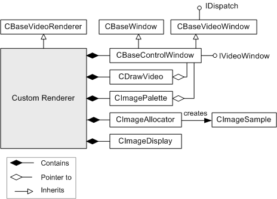

# CDrawImage class

\[The feature associated with this page, [DirectShow](/windows/win32/directshow/directshow), is a legacy feature. It has been superseded by [MediaPlayer](/uwp/api/Windows.Media.Playback.MediaPlayer), [IMFMediaEngine](/windows/win32/api/mfmediaengine/nn-mfmediaengine-imfmediaengine), and [Audio/Video Capture in Media Foundation](/windows/win32/medfound/audio-video-capture-in-media-foundation). Those features have been optimized for Windows 10 and Windows 11. Microsoft strongly recommends that new code use **MediaPlayer**, **IMFMediaEngine** and **Audio/Video Capture in Media Foundation** instead of **DirectShow**, when possible. Microsoft suggests that existing code that uses the legacy APIs be rewritten to use the new APIs if possible.\]

The `CDrawImage` class is a helper class that manages drawing for a video renderer filter. All drawing operations are performed using GDI. This class does not provide any support for rendering with DirectDraw. The `CDrawImage` class requires that the owning filter also use the [**CBaseWindow**](cbasewindow.md) class, which manages the video window. The `CDrawImage` constructor takes a pointer to the **CBaseWindow** object.

The following diagram shows the preferred way to use this class in a custom video renderer filter.

To use this class, do the following:

-   When the pins connect, call the [**CDrawImage::NotifyMediaType**](cdrawimage-notifymediatype.md) and [**CDrawImage::NotifyAllocator**](cdrawimage-notifyallocator.md) methods.
-   Whenever the media type changes, call **NotifyMediaType** again.
-   Before any rendering occurs, call [**CDrawImage::SetDrawContext**](cdrawimage-setdrawcontext.md).
-   Call [**CDrawImage::SetSourceRect**](cdrawimage-setsourcerect.md) if the source rectangle changes, and [**CDrawImage::SetTargetRect**](cdrawimage-settargetrect.md) if the target rectangle changes.
-   Manage the palette for palettized images, as described in the section on palettes that follows.

## Allocators

The filter shown in the previous diagram uses a custom allocator class, [**CImageAllocator**](cimageallocator.md). This allocator creates DIBs in shared memory, using the GDI **CreateDIBSection** function. The samples created by the allocator are [**CImageSample**](cimagesample.md) objects.

If the filter owns the allocator for the connection, then the media samples are guaranteed to be [**CImageSample**](cimagesample.md) objects. In that case, the **CDrawImage** object can optimize drawing by using **BitBlt** or StretchBlt. Otherwise, it must use the slower **SetDIBitsToDevice** or **StretchDIBits** functions. The faster option is implemented by the [**CDrawImage::FastRender**](cdrawimage-fastrender.md) method, the slower option by the [**CDrawImage::SlowRender**](cdrawimage-slowrender.md) method. (Despite the name, you probably won't see a large performance hit in **SlowRender**, especially on newer hardware.)

## Palettes

If the [**FastRender**](cdrawimage-fastrender.md) method is used for drawing and the image is palettized, then the filter needs to manage the palette, as follows:

-   The [**CImageSample**](cimagesample.md) class contains a palette version number, stored in the [**DIBDATA**](dibdata.md) structure. The value is initialized when the allocator creates the sample.
-   The **CDrawImage** class also contains a palette version number, which is initialized on creation.
-   Whenever the media type changes to a new palettized format, call [**CDrawImage::IncrementPaletteVersion**](cdrawimage-incrementpaletteversion.md). This method increments the **CDrawImage** object's palette version number. If the filter uses the [**CImagePalette**](cimagepalette.md) class to manage the palette information, you can simply call [**CImagePalette::PreparePalette**](cimagepalette-preparepalette.md) whenever the media type changes. The **PreparePalette** method increments the palette version only when necessary.
-   The [**FastRender**](cdrawimage-fastrender.md) method compares the **CDrawImage** palette version against the sample's palette version. If the sample's version number lags behind the **CDrawImage** version number, the **FastRender** method calls [**CDrawImage::UpdateColourTable**](cdrawimage-updatecolourtable.md). The **UpdateColourTable** method sets the color table in the device context, using the GDI **SetDIBColorTable** function. Also, the palette version on the sample is updated to the current version number.
-   If the pin reconnects, the filter should call [**CDrawImage::ResetPaletteVersion**](cdrawimage-resetpaletteversion.md) to reset the palette version. On pin reconnection, the allocator re-allocates all samples.

| Protected Member Variables                                            | Description                                                                                                                     |
|-----------------------------------------------------------------------|---------------------------------------------------------------------------------------------------------------------------------|
| [**m\_bStretch**](cdrawimage-m-bstretch.md)                          | Indicates whether the video image must be stretched to fit the destination window.                                              |
| [**m\_bUsingImageAllocator**](cdrawimage-m-busingimageallocator.md)  | Indicates whether the allocator for the pin connection is a **CImageAllocator** object.                                         |
| [**m\_EndSample**](cdrawimage-m-endsample.md)                        | Specifies the stop time of the most recent sample.                                                                              |
| [**m\_hdc**](cdrawimage-m-hdc.md)                                    | Handle to the device context of the owning window.                                                                              |
| [**m\_MemoryDC**](cdrawimage-m-memorydc.md)                          | Handle to the memory device context of the owning window.                                                                       |
| [**m\_PaletteVersion**](cdrawimage-m-paletteversion.md)              | Used to track when the palette changes.                                                                                         |
| [**m\_pBaseWindow**](cdrawimage-m-pbasewindow.md)                    | Pointer to the owning **CBaseWindow** object.                                                                                   |
| [**m\_pMediaType**](cdrawimage-m-pmediatype.md)                      | Pointer to the current media type.                                                                                              |
| [**m\_SourceRect**](cdrawimage-m-sourcerect.md)                      | Specifies the source rectangle for drawing.                                                                                     |
| [**m\_StartSample**](cdrawimage-m-startsample.md)                    | Specifies the start time of the most recent sample.                                                                             |
| [**m\_TargetRect**](cdrawimage-m-targetrect.md)                      | Specifies the target rectangle for drawing.                                                                                     |
| Protected Methods                                                     | Description                                                                                                                     |
| [**DisplaySampleTimes**](cdrawimage-displaysampletimes.md)           | Draws the time stamps of a media sample on top of the video image.                                                              |
| [**FastRender**](cdrawimage-fastrender.md)                           | Draws the video image using the **BitBlt** or **StretchBlt** functions.                                                         |
| [**SetStretchMode**](cdrawimage-setstretchmode.md)                   | Calculates whether the video image must be stretched.                                                                           |
| [**SlowRender**](cdrawimage-slowrender.md)                           | Draws the video image using the **SetDIBitsToDevice** or **StretchDIBits** functions.                                           |
| [**UpdateColourTable**](cdrawimage-updatecolourtable.md)             | Updates the color table with a new palette.                                                                                     |
| Public Methods                                                        | Description                                                                                                                     |
| [**CDrawImage**](cdrawimage-cdrawimage.md)                           | Constructor method.                                                                                                             |
| [**DrawImage**](cdrawimage-drawimage.md)                             | Draws a video frame on the video window.                                                                                        |
| [**DrawVideoImageHere**](cdrawimage-drawvideoimagehere.md)           | Draws an image from a media sample to a specified device context.                                                               |
| [**GetPaletteVersion**](cdrawimage-getpaletteversion.md)             | Retrieves the palette version.                                                                                                  |
| [**GetSourceRect**](cdrawimage-getsourcerect.md)                     | Retrieves the current source rectangle.                                                                                         |
| [**GetTargetRect**](cdrawimage-gettargetrect.md)                     | Retrieves the current destination rectangle.                                                                                    |
| [**IncrementPaletteVersion**](cdrawimage-incrementpaletteversion.md) | Increments the palette version.                                                                                                 |
| [**NotifyAllocator**](cdrawimage-notifyallocator.md)                 | Informs the `CDrawImage` object whether the allocator for the connection is a **CImageAllocator** object.                       |
| [**NotifyEndDraw**](cdrawimage-notifyenddraw.md)                     | Not supported.                                                                                                                  |
| [**NotifyMediaType**](cdrawimage-notifymediatype.md)                 | Notifies the object of the current media type.                                                                                  |
| [**NotifyStartDraw**](cdrawimage-notifystartdraw.md)                 | Not supported.                                                                                                                  |
| [**ResetPaletteVersion**](cdrawimage-resetpaletteversion.md)         | Resets the palette version.                                                                                                     |
| [**ScaleSourceRect**](cdrawimage-scalesourcerect.md)                 | Scales a specified source rectangle, if there is a difference between the native video size and the media type format. Virtual. |
| [**SetDrawContext**](cdrawimage-setdrawcontext.md)                   | Sets the device contexts used for drawing.                                                                                      |
| [**SetSourceRect**](cdrawimage-setsourcerect.md)                     | Sets the source rectangle.                                                                                                      |
| [**SetTargetRect**](cdrawimage-settargetrect.md)                     | Sets the target rectangle.                                                                                                      |
| [**UsingImageAllocator**](cdrawimage-usingimageallocator.md)         | Indicates whether the current allocator is a [**CImageAllocator**](cimageallocator.md) object.                                 |

 

## Requirements

| Requirement | Value |
|--------------------|--------------------------------------------------------------------------------------------------------------------------------------------------------------------------------------------|
| Header   | <dl> <dt>Winutil.h (include Streams.h)</dt> </dl>                                                                                   |
| Library  | <dl> <dt>Strmbase.lib (retail builds); </dt> <dt>Strmbasd.lib (debug builds)</dt> </dl> |

 

 

