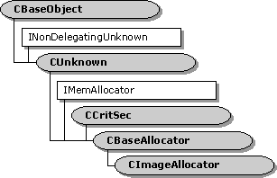

# CImageAllocator class

The `CImageAllocator` class implements an allocator that manages GDI device-independent bitmaps (DIBs). This class derives from the [**CBaseAllocator**](cbaseallocator.md) class. It creates media samples that are implemented using the [**CImageSample**](cimagesample.md) class.

An allocator is shared by two connected pins, but is always owned by one of the filters in the connection. A filter that uses `CImageAllocator` must keep track of whether the allocator was provided by itself or by the other filter. If the allocator was provided by itself, the owning filter can rely on the fact that all media samples from the allocator are **CImageSample** objects. It can therefore use the **CImageSample** object to obtain information about the DIB, which is stored in a [**DIBDATA**](dibdata.md) structure.

The owning filter should call **NotifyMediaType** whenever the media type changes.

| Protected Member Variables                                     | Description                                                              |
|----------------------------------------------------------------|--------------------------------------------------------------------------|
| [**m\_pFilter**](cimageallocator-m-pfilter.md)                | Pointer to the owning filter.                                            |
| [**m\_pMediaType**](cimageallocator-m-pmediatype.md)          | Pointer to the current media type.                                       |
| Protected Methods                                              | Description                                                              |
| [**Alloc**](cimageallocator-alloc.md)                         | Allocates memory for the buffers.                                        |
| [**CheckSizes**](cimageallocator-checksizes.md)               | Checks allocator properties against the current media type.              |
| [**CreateDIB**](cimageallocator-createdib.md)                 | Creates a DIB.                                                           |
| [**CreateImageSample**](cimageallocator-createimagesample.md) | Creates a media sample. Virtual.                                         |
| [**Free**](cimageallocator-free.md)                           | Releases all of the buffer memory.                                       |
| Public Methods                                                 | Description                                                              |
| [**CImageAllocator**](cimageallocator-cimageallocator.md)     | Constructor method.                                                      |
| [**NotifyMediaType**](cimageallocator-notifymediatype.md)     | Informs the object of the current media type.                            |
| IMemAllocator Methods                                          | Description                                                              |
| [**SetProperties**](cimageallocator-setproperties.md)         | Specifies the number of buffers to allocate and the size of each buffer. |

 

## Requirements

| Requirement | Value |
|--------------------|--------------------------------------------------------------------------------------------------------------------------------------------------------------------------------------------|
| Header   | <dl> <dt>Winutil.h (include Streams.h)</dt> </dl>                                                                                   |
| Library  | <dl> <dt>Strmbase.lib (retail builds); </dt> <dt>Strmbasd.lib (debug builds)</dt> </dl> |

## See also

<dl> <dt>

[**CDrawImage Class**](cdrawimage.md)
</dt> </dl>

 

 

