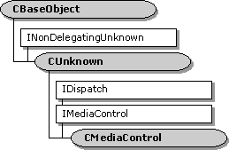

# CMediaControl class

\[The feature associated with this page, [DirectShow](/windows/win32/directshow/directshow), is a legacy feature. It has been superseded by [MediaPlayer](/uwp/api/Windows.Media.Playback.MediaPlayer), [IMFMediaEngine](/windows/win32/api/mfmediaengine/nn-mfmediaengine-imfmediaengine), and [Audio/Video Capture in Media Foundation](/windows/win32/medfound/audio-video-capture-in-media-foundation). Those features have been optimized for Windows 10 and Windows 11. Microsoft strongly recommends that new code use **MediaPlayer**, **IMFMediaEngine** and **Audio/Video Capture in Media Foundation** instead of **DirectShow**, when possible. Microsoft suggests that existing code that uses the legacy APIs be rewritten to use the new APIs if possible.\]

The `CMediaControl` class provides base class handling of the [**IDispatch**](/previous-versions/windows/desktop/api/oaidl/nn-oaidl-idispatch) methods of the dual-interface [**IMediaControl**](/windows/desktop/api/Control/nn-control-imediacontrol). It leaves as pure virtual the properties and methods of the **IMediaControl** interface.

Typically, the filter graph manager is the only object that implements the [**IMediaControl**](/windows/desktop/api/Control/nn-control-imediacontrol) interface. (filters implement the [**IMediaFilter**](/windows/desktop/api/Strmif/nn-strmif-imediafilter) interface, inherited by [**IBaseFilter**](/windows/desktop/api/Strmif/nn-strmif-ibasefilter), to receive control commands from the filter graph manager.) Therefore, this class library is of limited use to filter developers.

The [**CMediaControl::GetIDsOfNames**](cmediacontrol-getidsofnames.md), [**CMediaControl::GetTypeInfo**](cmediacontrol-gettypeinfo.md), [**CMediaControl::GetTypeInfoCount**](cmediacontrol-gettypeinfocount.md), and [**CMediaControl::Invoke**](cmediacontrol-invoke.md) member functions are standard implementations of the [**IDispatch**](/previous-versions/windows/desktop/api/oaidl/nn-oaidl-idispatch) methods using the [**CBaseDispatch**](cbasedispatch.md) class (and a type library) to parse the commands and pass them to the pure virtual methods of the [**IMediaControl**](/windows/desktop/api/Control/nn-control-imediacontrol) interface.

The [**IMediaControl**](/windows/desktop/api/Control/nn-control-imediacontrol) methods, defined in control.odl, are left as pure virtual.

| Member Functions                                           | Description                                                                                                                                                                                                                             |
|------------------------------------------------------------|-----------------------------------------------------------------------------------------------------------------------------------------------------------------------------------------------------------------------------------------|
| [**CMediaControl**](cmediacontrol-cmediacontrol.md)       | Constructs a **CMediaControl** object.                                                                                                                                                                                                  |
| IDispatch Methods                                          | Description                                                                                                                                                                                                                             |
| [**GetIDsOfNames**](cmediacontrol-getidsofnames.md)       | Maps a single member and an optional set of parameters to a corresponding set of integer dispatch identifiers (DISPIDs), which can be used during subsequent calls to the [**CMediaControl::Invoke**](cmediacontrol-invoke.md) method. |
| [**GetTypeInfo**](cmediacontrol-gettypeinfo.md)           | Retrieves a type-information object, which can retrieve the type information for an interface.                                                                                                                                          |
| [**GetTypeInfoCount**](cmediacontrol-gettypeinfocount.md) | Retrieves the number of type-information interfaces provided by an object.                                                                                                                                                              |
| [**Invoke**](cmediacontrol-invoke.md)                     | Provides access to properties and methods exposed by an object.                                                                                                                                                                         |

 

 

 
