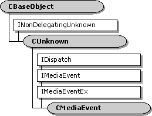

# CMediaEvent class

The `CMediaEvent` class provides base class implementation of the **IDispatch** methods of the dual-interface [**IMediaEvent**](/windows/desktop/api/Control/nn-control-imediaevent). It leaves as pure virtual the properties and methods of the **IMediaEvent** interface.

The `CMediaEvent` class also provides base class implementation of the [**IMediaEventEx**](/windows/desktop/api/Control/nn-control-imediaeventex) interface which derives from [**IMediaEvent**](/windows/desktop/api/Control/nn-control-imediaevent).

The [**CMediaEvent::GetIDsOfNames**](cmediaevent-getidsofnames.md), [**CMediaEvent::GetTypeInfo**](cmediaevent-gettypeinfo.md), [**CMediaEvent::GetTypeInfoCount**](cmediaevent-gettypeinfocount.md), and [**CMediaEvent::Invoke**](cmediaevent-invoke.md) member functions are standard implementations of the **IDispatch** interface using the [**CBaseDispatch**](cbasedispatch.md) class (and a type library) to parse the commands and pass them to the pure virtual methods of the [**IMediaEvent**](/windows/desktop/api/Control/nn-control-imediaevent) interface.

| Member Functions                                         | Description                                                                                                                                                                                   |
|----------------------------------------------------------|-----------------------------------------------------------------------------------------------------------------------------------------------------------------------------------------------|
| [**CMediaEvent**](cmediaevent-cmediaevent.md)           | Constructs a **CMediaEvent** object.                                                                                                                                                          |
| IDispatch Methods                                        | Description                                                                                                                                                                                   |
| [**GetIDsOfNames**](cmediaevent-getidsofnames.md)       | Maps a single member and an optional set of parameters to a corresponding set of integer dispatch identifiers, which can be used during subsequent calls to the **IDispatch::Invoke** method. |
| [**GetTypeInfo**](cmediaevent-gettypeinfo.md)           | Retrieves a type-information object, which retrieves the type information for an interface.                                                                                                   |
| [**GetTypeInfoCount**](cmediaevent-gettypeinfocount.md) | Retrieves the number of type-information interfaces provided by an object.                                                                                                                    |
| [**Invoke**](cmediaevent-invoke.md)                     | Provides access to properties and methods exposed by an object.                                                                                                                               |

 

 

 

