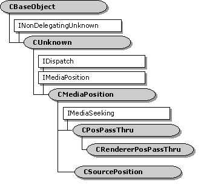

# CMediaPosition class

The **CMediaPosition** class handles the **IDispatch** methods of the [**IMediaPosition**](/windows/desktop/api/Control/nn-control-imediaposition) dual interface.

This class inherits the [**IMediaPosition**](/windows/desktop/api/Control/nn-control-imediaposition) interface but does not implement it. It implements **IDispatch** through the [**CBaseDispatch**](cbasedispatch.md) class and the DirectShow type library. Do not use this class directly. Instead, use one of the following classes:

-   Source filters: Use the [**CSourceSeeking**](csourceseeking.md) base class to implement seeking.
-   Transform filters: Use the [**CPosPassThru**](cpospassthru.md) class to pass seeking commands upstream.
-   Renderers: Use the [**CRendererPosPassThru**](crendererpospassthru.md) class to pass seeking commands upstream.

| Public Methods                                              | Description                                                                                                         |
|-------------------------------------------------------------|---------------------------------------------------------------------------------------------------------------------|
| [**CMediaPosition**](cmediaposition-cmediaposition.md)     | Constructor method.                                                                                                 |
| IDispatch Methods                                           | Description                                                                                                         |
| [**GetIDsOfNames**](cmediaposition-getidsofnames.md)       | Maps a set of names to a corresponding set of DISPIDs.                                                              |
| [**GetTypeInfo**](cmediaposition-gettypeinfo.md)           | Retrieves the type information for the object, which can then be used to get the type information for an interface. |
| [**GetTypeInfoCount**](cmediaposition-gettypeinfocount.md) | Retrieves the number of type information interfaces the object provides.                                            |
| [**Invoke**](cmediaposition-invoke.md)                     | Provides access to properties and methods exposed by the object.                                                    |

 

## Requirements

| Requirement | Value |
|--------------------|--------------------------------------------------------------------------------------------------------------------------------------------------------------------------------------------|
| Header   | <dl> <dt>Ctlutil.h (include Streams.h)</dt> </dl>                                                                                   |
| Library  | <dl> <dt>Strmbase.lib (retail builds); </dt> <dt>Strmbasd.lib (debug builds)</dt> </dl> |

## See also

<dl> <dt>

[DirectShow Base Classes](directshow-base-classes.md)
</dt> </dl>

 

 

