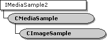

# CMediaSample class

\[The feature associated with this page, [DirectShow](/windows/win32/directshow/directshow), is a legacy feature. It has been superseded by [MediaPlayer](/uwp/api/Windows.Media.Playback.MediaPlayer), [IMFMediaEngine](/windows/win32/api/mfmediaengine/nn-mfmediaengine-imfmediaengine), and [Audio/Video Capture in Media Foundation](windows/win32/medfound/audio-video-capture-in-media-foundation). Those features have been optimized for Windows 10 and Windows 11. Microsoft strongly recommends that new code use **MediaPlayer**, **IMFMediaEngine** and **Audio/Video Capture in Media Foundation** instead of **DirectShow**, when possible. Microsoft suggests that existing code that uses the legacy APIs be rewritten to use the new APIs if possible.\]

The `CMediaSample` class defines a media sample that supports the [**IMediaSample2**](/windows/desktop/api/Strmif/nn-strmif-imediasample2) interface. The media sample contains a pointer to a memory buffer, and various properties stored as protected member variables.

Media samples are created by allocators, which are derived from the [**CBaseAllocator**](cbaseallocator.md) class. The `CMediaSample` constructor receives a pointer to an allocated buffer, along with the size of the buffer. Other properties are typically set and retrieved through [**IMediaSample**](/windows/desktop/api/Strmif/nn-strmif-imediasample) interface methods.

The life cycle of a media sample differs from that of most COM objects:

-   The allocator holds a list of free samples. When a filter needs a new sample, it calls the allocator's [**IMemAllocator::GetBuffer**](/windows/desktop/api/Strmif/nf-strmif-imemallocator-getbuffer) method. The allocator retrieves a sample from its free list, increments the sample's reference count, and returns a pointer to the sample.
-   After the filter is done with the sample, it calls the **IUnknown::Release** method on the sample. Unlike most objects, the sample does not delete itself when its reference count reaches zero. Instead, it calls the [**IMemAllocator::ReleaseBuffer**](/windows/desktop/api/Strmif/nf-strmif-imemallocator-releasebuffer) method on the allocator, and the allocator returns the sample to its free list.
-   The allocator does not destroy samples until the [**IMemAllocator::Decommit**](/windows/desktop/api/Strmif/nf-strmif-imemallocator-decommit) method is called.

| Protected Member Variables                                           | Description                                                                                     |
|----------------------------------------------------------------------|-------------------------------------------------------------------------------------------------|
| [**m\_dwFlags**](cmediasample-m-dwflags.md)                         | Sample property flags.                                                                          |
| [**m\_dwTypeSpecificFlags**](cmediasample-m-dwtypespecificflags.md) | Type-specific flags.                                                                            |
| [**m\_pBuffer**](cmediasample-m-pbuffer.md)                         | Pointer to the memory buffer that contains the media data.                                      |
| [**m\_lActual**](cmediasample-m-lactual.md)                         | Length of the valid data in the buffer, in bytes.                                               |
| [**m\_cbBuffer**](cmediasample-m-cbbuffer.md)                       | Size of the buffer, in bytes.                                                                   |
| [**m\_pAllocator**](cmediasample-m-pallocator.md)                   | Pointer to the allocator that created this sample.                                              |
| [**m\_pNext**](cmediasample-m-pnext.md)                             | Pointer to the next sample in the allocator's list of samples.                                  |
| [**m\_Start**](cmediasample-m-start.md)                             | Sample start time.                                                                              |
| [**m\_End**](cmediasample-m-end.md)                                 | Sample end time.                                                                                |
| [**m\_MediaStart**](cmediasample-m-mediastart.md)                   | Media start time.                                                                               |
| [**m\_MediaEnd**](cmediasample-m-mediaend.md)                       | Media stop time.                                                                                |
| [**m\_pMediaType**](cmediasample-m-pmediatype.md)                   | Pointer to the media type, if the type has changed from the previous sample in the data stream. |
| [**m\_dwStreamId**](cmediasample-m-dwstreamid.md)                   | Stream identifier.                                                                              |
| Public Member Variables                                              | Description                                                                                     |
| [**m\_cRef**](cmediasample-m-cref.md)                               | Reference count.                                                                                |
| Public Methods                                                       | Description                                                                                     |
| [**CMediaSample**](cmediasample-cmediasample.md)                    | Constructor method.                                                                             |
| [**~ CMediaSample**](cmediasample--cmediasample.md)                 | Destructor method. Virtual.                                                                     |
| [**SetPointer**](cmediasample-setpointer.md)                        | Sets the pointer to the memory buffer.                                                          |
| IMediaSample Methods                                                 | Description                                                                                     |
| [**GetPointer**](cmediasample-getpointer.md)                        | Retrieves a read/write pointer to the buffer.                                                   |
| [**GetSize**](cmediasample-getsize.md)                              | Retrieves the size of the buffer.                                                               |
| [**GetTime**](cmediasample-gettime.md)                              | Retrieves the stream times at which this sample should begin and finish.                        |
| [**SetTime**](cmediasample-settime.md)                              | Sets the stream times at which this sample should start and finish.                             |
| [**IsSyncPoint**](cmediasample-issyncpoint.md)                      | Determines if the beginning of the sample is a synchronization point.                           |
| [**SetSyncPoint**](cmediasample-setsyncpoint.md)                    | Specifies whether the beginning of this sample is a synchronization point.                      |
| [**IsPreroll**](cmediasample-ispreroll.md)                          | Determines if this sample is a preroll sample.                                                  |
| [**SetPreroll**](cmediasample-setpreroll.md)                        | Specifies whether this sample is a preroll sample.                                              |
| [**GetActualDataLength**](cmediasample-getactualdatalength.md)      | Retrieves the length of the valid data in the buffer.                                           |
| [**SetActualDataLength**](cmediasample-setactualdatalength.md)      | Sets the length of the valid data in the buffer.                                                |
| [**GetMediaType**](cmediasample-getmediatype.md)                    | Retrieves the media type, if the media type differs from the previous sample.                   |
| [**SetMediaType**](cmediasample-setmediatype.md)                    | Sets the media type for the sample.                                                             |
| [**IsDiscontinuity**](cmediasample-isdiscontinuity.md)              | Determines if this sample represents a break in the data stream.                                |
| [**SetDiscontinuity**](cmediasample-setdiscontinuity.md)            | Specifies whether this sample represents a break in the data stream.                            |
| [**GetMediaTime**](cmediasample-getmediatime.md)                    | Retrieves the media times for this sample.                                                      |
| [**SetMediaTime**](cmediasample-setmediatime.md)                    | Sets the media times for this sample.                                                           |
| IMediaSample2 Methods                                                | Description                                                                                     |
| [**GetProperties**](cmediasample-getproperties.md)                  | Retrieves the properties of the sample.                                                         |
| [**SetProperties**](cmediasample-setproperties.md)                  | Sets the properties of the sample.                                                              |

 

## Requirements

| Requirement | Value |
|--------------------|--------------------------------------------------------------------------------------------------------------------------------------------------------------------------------------------|
| Header   | <dl> <dt>Amfilter.h (include Streams.h)</dt> </dl>                                                                                  |
| Library  | <dl> <dt>Strmbase.lib (retail builds); </dt> <dt>Strmbasd.lib (debug builds)</dt> </dl> |

 

 

