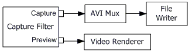
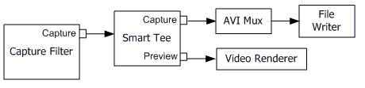

# Combining Video Capture and Preview

\[The feature associated with this page, [DirectShow](/windows/win32/directshow/directshow), is a legacy feature. It has been superseded by [MediaPlayer](/uwp/api/Windows.Media.Playback.MediaPlayer) and [IMFMediaEngine](/windows/win32/api/mfmediaengine/nn-mfmediaengine-imfmediaengine). **MediaPlayer** and **IMFMediaEngine** have been optimized for Windows 10 and Windows 11. Microsoft strongly recommends that new code use **MediaPlayer** and **IMFMediaEngine** instead of **DirectShow**, when possible. Microsoft suggests that existing code that uses the legacy APIs be rewritten to use the new APIs if possible.\]

The previous sections describe how to capture video to various file formats. The section [Previewing Video](previewing-video.md) describes how to build a live preview graph. However, many applications must do both at once. To build a combined preview and file-writing graph, simply make two calls to [**ICaptureGraphBuilder2::RenderStream**](/windows/desktop/api/Strmif/nf-strmif-icapturegraphbuilder2-renderstream):


```C++
// Render the preview stream to the video renderer.
hr = pBuild->RenderStream(&PIN_CATEGORY_PREVIEW, &MEDIATYPE_Video, pCap, 
    NULL, NULL);

// Render the capture stream to the mux.
hr = pBuild->RenderStream(&PIN_CATEGORY_CAPTURE, &MEDIATYPE_Video, pCap, 
    NULL, pMux);
```


In this code, the Capture Graph Builder is hiding some details:

-   If the capture filter has a preview pin or video port pin, plus a capture pin, the [**RenderStream**](/windows/desktop/api/Strmif/nf-strmif-icapturegraphbuilder2-renderstream) method simply renders both pins, as shown in the following illustration.

    

-   If the filter has only a capture pin, the Capture Graph Builder uses the [Smart Tee](smart-tee-filter.md) filter to split the capture stream. The following illustration shows the graph with a Smart Tee.

    

The Smart Tee filter has a capture pin and a preview pin. It takes a single video stream from the capture filter and splits it into two streams, one for capture and one for preview. To maintain throughput on the capture pin, the preview pin drops frames as needed. It also strips the time stamps from each sample before delivering it, for the reasons discussed in the topic [DirectShow Video Capture Filters](directshow-video-capture-filters.md).

Although the Smart Tee splits the stream, it does not physically duplicate the video data. Instead, it uses custom media sample objects that share the buffers. The samples are marked "read-only" to ensure that downstream filters do not write on the data.

If your capture graph has a preview window, several things can cause the Filter Graph Manager to stop the entire graph, including the capture stream:

-   Locking the computer.
-   Pressing CTRL+ALT+DELETE on a computer that is a member of a domain.
-   Running a full-screen Direct3D application, such as a game or screen saver.
-   Switching monitors or changing the display resolution.
-   Running a program that causes Windows to display a User Account Control (UAC) dialog. (Windows Vista or later.)
-   Running a full-screen DOS window.

Any of these events might interrupt the capture session, possibly causing data loss. (Here is what happens internally: The video renderer loses the Direct3D or DirectDraw resources that it needs. In the process of recovering those resources, the video renderer must reconnect with the upstream filter, causing the Filter Graph Manager to stop the graph.)

Two possible solutions to this problem are the following:

-   Do not include a preview stream. However, be aware that the [**ICaptureGraphBuilder2::RenderStream**](/windows/desktop/api/Strmif/nf-strmif-icapturegraphbuilder2-renderstream) method automatically adds a preview window when the capture device has a video port pin. See [Video Port Pins in File Capture](video-port-pins-in-file-capture.md).
-   Use the Stream Buffer Engine to send the preview stream to a graph in another process.

## Related topics

<dl> <dt>

[Capturing Video to a File](capturing-video-to-a-file.md)
</dt> </dl>

 

 


