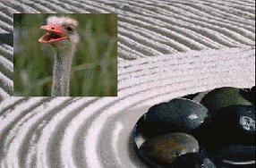
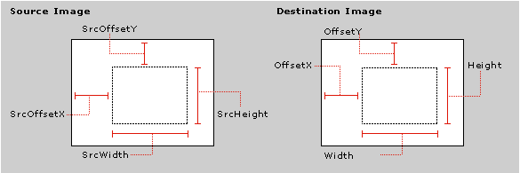

# Compositor Transition

\[The feature associated with this page, [DirectShow](/windows/win32/directshow/directshow), is a legacy feature. It has been superseded by [MediaPlayer](/uwp/api/Windows.Media.Playback.MediaPlayer), [IMFMediaEngine](/windows/win32/api/mfmediaengine/nn-mfmediaengine-imfmediaengine), and [Audio/Video Capture in Media Foundation](/windows/win32/medfound/audio-video-capture-in-media-foundation). Those features have been optimized for Windows 10 and Windows 11. Microsoft strongly recommends that new code use **MediaPlayer**, **IMFMediaEngine** and **Audio/Video Capture in Media Foundation** instead of **DirectShow**, when possible. Microsoft suggests that existing code that uses the legacy APIs be rewritten to use the new APIs if possible.\]

> [!Note]  
> \[Deprecated. This API may be removed from future releases of Windows.\]

 

The Compositor transition composites a subrectangle from the foreground into a designated rectangle on the background, without altering the rest of the background. Use this transition to create split-screen or picture-in-picture effects.

The following image shows the compositor transition:

Class ID (CLSID): {BB44391D-6ABD-422f-9E2E-385C9DFF51FC}

CLSID Variable Name: CLSID\_DxtCompositor

Friendly Name: "DxtCompositor"

Properties

| Property   | Type | Default | Description                                                    |
|------------|------|---------|----------------------------------------------------------------|
| Height     | long | 0       | Height of the target rectangle, in pixels.                     |
| OffsetX    | long | 0       | Horizontal offset of the target rectangle, in pixels.          |
| OffsetY    | long | 0       | Vertical offset of the target rectangle, in pixels.            |
| SrcHeight  | long | 0       | The height of the subrectangle on the source, in pixels.       |
| SrcOffsetX | long | 0       | The x-coordinate of the subrectangle on the source, in pixels. |
| SrcOffsetY | long | 0       | The y-coordinate of the subrectangle on the source, in pixels. |
| SrcWidth   | long | 0       | The width of the subrectangle on the source, in pixels.        |
| Width      | long | 0       | Width of the target rectangle, in pixels.                      |

 

The following diagram illustrates these properties:

## Related topics

<dl> <dt>

[Transitions and Effects](transitions-and-effects.md)
</dt> </dl>

 

 

