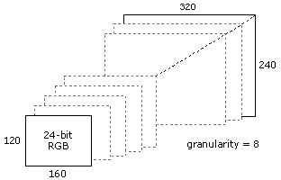

# Configure the Video Output Format

\[The feature associated with this page, [DirectShow](/windows/win32/directshow/directshow), is a legacy feature. It has been superseded by [MediaPlayer](/uwp/api/Windows.Media.Playback.MediaPlayer), [IMFMediaEngine](/windows/win32/api/mfmediaengine/nn-mfmediaengine-imfmediaengine), and [Audio/Video Capture in Media Foundation](windows/win32/medfound/audio-video-capture-in-media-foundation). Those features have been optimized for Windows 10 and Windows 11. Microsoft strongly recommends that new code use **MediaPlayer**, **IMFMediaEngine** and **Audio/Video Capture in Media Foundation** instead of **DirectShow**, when possible. Microsoft suggests that existing code that uses the legacy APIs be rewritten to use the new APIs if possible.\]

> [!Note]  
> The functionality described in this topic is deprecated. To configure a capture device's output format, an application should use the [**AM\_MEDIA\_TYPE**](/windows/win32/api/strmif/ns-strmif-am_media_type) structure returned by [**IAMStreamConfig::GetFormat**](/windows/desktop/api/Strmif/nf-strmif-iamstreamconfig-getformat) in the *pmt* parameter.

 

A capture device can support a range of output formats. For example, a device might support 16-bit RGB, 32-bit RGB, and YUYV. Within each of these formats, the device can support a range of frame sizes.

In a WDM device, the [**IAMStreamConfig**](/windows/desktop/api/Strmif/nn-strmif-iamstreamconfig) interface is used to report which formats the device supports, and to set the format. (For legacy VFW devices, use the Video Format VFW dialog box, as described in [Display VFW Capture Dialog Boxes](display-vfw-capture-dialog-boxes.md).) The **IAMStreamConfig** interface is exposed on the capture filter's capture pin, preview pin, or both. Use the [**ICaptureGraphBuilder2::FindInterface**](/windows/desktop/api/Strmif/nf-strmif-icapturegraphbuilder2-findinterface) method to get the interface pointer:


```C++
IAMStreamConfig *pConfig = NULL;
hr = pBuild->FindInterface(
    &PIN_CATEGORY_PREVIEW, // Preview pin.
    0,    // Any media type.
    pCap, // Pointer to the capture filter.
    IID_IAMStreamConfig, (void**)&pConfig);
```


The device has a list of media types that it supports. For each media type, the device also provides a set of capabilities. These include the range of frame sizes that are available for that format, how well the device can stretch or shrink the image, and the range of frame rates.

To get the number of media types, call the [**IAMStreamConfig::GetNumberOfCapabilities**](/windows/desktop/api/Strmif/nf-strmif-iamstreamconfig-getnumberofcapabilities) method. The method returns two values:

-   The number of media types.
-   The size of the structure that holds the capabilities information.

The size value is necessary because the [**IAMStreamConfig**](/windows/desktop/api/Strmif/nn-strmif-iamstreamconfig) interface is used for both audio and video (and could be extended to other media types). For video, the capabilities are described using the [**VIDEO\_STREAM\_CONFIG\_CAPS**](/windows/win32/api/strmif/ns-strmif-video_stream_config_caps) structure, while audio uses the [**AUDIO\_STREAM\_CONFIG\_CAPS**](/windows/win32/api/strmif/ns-strmif-audio_stream_config_caps) structure.

To enumerate the media types, call the [**IAMStreamConfig::GetStreamCaps**](/windows/desktop/api/Strmif/nf-strmif-iamstreamconfig-getstreamcaps) method with a zero-based index. The **GetStreamCaps** method returns a media type and the corresponding capability structure:


```C++
int iCount = 0, iSize = 0;
hr = pConfig->GetNumberOfCapabilities(&iCount, &iSize);

// Check the size to make sure we pass in the correct structure.
if (iSize == sizeof(VIDEO_STREAM_CONFIG_CAPS))
{
    // Use the video capabilities structure.

    for (int iFormat = 0; iFormat < iCount; iFormat++)
    {
        VIDEO_STREAM_CONFIG_CAPS scc;
        AM_MEDIA_TYPE *pmtConfig;
        hr = pConfig->GetStreamCaps(iFormat, &pmtConfig, (BYTE*)&scc);
        if (SUCCEEDED(hr))
        {
            /* Examine the format, and possibly use it. */

            // Delete the media type when you are done.
            DeleteMediaType(pmtConfig);
        }
}
```


Note how the structures are allocated for the [**GetStreamCaps**](/windows/desktop/api/Strmif/nf-strmif-iamstreamconfig-getstreamcaps) method. The method allocates the media type structure, whereas the caller allocates the capabilities structure. Coerce the capabilities structure to a byte array pointer. After you are done with the media type, delete the [**AM\_MEDIA\_TYPE**](/windows/win32/api/strmif/ns-strmif-am_media_type) structure, along with the media type's format block.

You can configure the device to use a format returned in the [**GetStreamCaps**](/windows/desktop/api/Strmif/nf-strmif-iamstreamconfig-getstreamcaps) method. Simply call [**IAMStreamConfig::SetFormat**](/windows/desktop/api/Strmif/nf-strmif-iamstreamconfig-setformat) with the media type:


```C++
hr = pConfig->SetFormat(pmtConfig);
```


If the pin is not connected, it will attempt to use this format when it does connect. If the pin is already connected, it attempts to reconnect using the new format. In either case, it is possible that the downstream filter will reject the format.

You can also modify the media type before passing it to the [**SetFormat**](/windows/desktop/api/Strmif/nf-strmif-iamstreamconfig-setformat) method. This is where the [**VIDEO\_STREAM\_CONFIG\_CAPS**](/windows/win32/api/strmif/ns-strmif-video_stream_config_caps) structure comes in. It describes all of the valid ways to change the media type. To use this information, you must understand the details of that particular media type.

For example, suppose that [**GetStreamCaps**](/windows/desktop/api/Strmif/nf-strmif-iamstreamconfig-getstreamcaps) returns a 24-bit RGB format, with a frame size of 320 x 240 pixels. You can get this information by examining the major type, subtype, and format block of the media type:


```C++
if ((pmtConfig.majortype == MEDIATYPE_Video) &&
    (pmtConfig.subtype == MEDIASUBTYPE_RGB24) &&
    (pmtConfig.formattype == FORMAT_VideoInfo) &&
    (pmtConfig.cbFormat >= sizeof (VIDEOINFOHEADER)) &&
    (pmtConfig.pbFormat != NULL))
{
    VIDEOINFOHEADER *pVih = (VIDEOINFOHEADER*)pmtConfig.pbFormat;
    // pVih contains the detailed format information.
    LONG lWidth = pVih->bmiHeader.biWidth;
    LONG lHeight = pVih->bmiHeader.biHeight;
}
```


The [**VIDEO\_STREAM\_CONFIG\_CAPS**](/windows/win32/api/strmif/ns-strmif-video_stream_config_caps) structure gives the minimum and maximum width and height that can be used for this media type. It also gives you the "step" size, which defines the increments by which you can adjust the width or height. For example, the device might return the following:

-   MinOutputSize: 160 x 120
-   MaxOutputSize: 320 x 240
-   OutputGranularityX: 8 pixels (horizontal step size)
-   OutputGranularityY: 8 pixels (vertical step size)

Given these numbers, you could set the width to anything in the range (160, 168, 176, ... 304, 312, 320) and the height to anything in the range (120, 128, 136, ... 104, 112, 120). The following diagram illustrates this process.



To set a new frame size, directly modify the [**AM\_MEDIA\_TYPE**](/windows/win32/api/strmif/ns-strmif-am_media_type) structure returned in [**GetStreamCaps**](/windows/desktop/api/Strmif/nf-strmif-iamstreamconfig-getstreamcaps):


```C++
pVih->bmiHeader.biWidth = 160;
pVih->bmiHeader.biHeight = 120;
pVih->bmiHeader.biSizeImage = DIBSIZE(pVih->bmiHeader);
```


Then pass the media type to the [**SetFormat**](/windows/desktop/api/Strmif/nf-strmif-iamstreamconfig-setformat) method, as described previously.

The **MinFrameInterval** and **MaxFrameInterval** members of [**VIDEO\_STREAM\_CONFIG\_CAPS**](/windows/win32/api/strmif/ns-strmif-video_stream_config_caps) are the minimum and maximum length of each video frame, which you can translate into frame rates as follows:

`frames per second = 10,000,000 / frame duration`

To request a particular frame rate, modify the value of **AvgTimePerFrame** in the [**VIDEOINFOHEADER**](/previous-versions/windows/desktop/api/amvideo/ns-amvideo-videoinfoheader) or [**VIDEOINFOHEADER2**](/previous-versions/windows/desktop/api/dvdmedia/ns-dvdmedia-videoinfoheader2) structure in the media type. The device may not support every possible value between the minimum and maximum, so the driver will use the closest value that it can. To see what value the driver actually used, call [**IAMStreamConfig::GetFormat**](/windows/desktop/api/Strmif/nf-strmif-iamstreamconfig-getformat) after you call [**SetFormat**](/windows/desktop/api/Strmif/nf-strmif-iamstreamconfig-setformat).

Some drivers may report **MAXLONGLONG** (0x7FFFFFFFFFFFFFFF) for the value of **MaxFrameInterval**, which in effect means there is no maximum duration. However, you might want to enforce a minimum frame rate in your application, such as 1 fps.

## Related topics

<dl> <dt>

[About Media Types](about-media-types.md)
</dt> <dt>

[Configuring a Video Capture Device](configuring-a-video-capture-device.md)
</dt> </dl>

 

 


