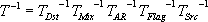
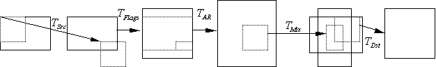

# Coordinate Mapping in the VMR

\[The feature associated with this page, [DirectShow](/windows/win32/directshow/directshow), is a legacy feature. It has been superseded by [MediaPlayer](/uwp/api/Windows.Media.Playback.MediaPlayer) and [IMFMediaEngine](/windows/win32/api/mfmediaengine/nn-mfmediaengine-imfmediaengine). **MediaPlayer** and **IMFMediaEngine** have been optimized for Windows 10 and Windows 11. Microsoft strongly recommends that new code use **MediaPlayer** and **IMFMediaEngine** instead of **DirectShow**, when possible. Microsoft suggests that existing code that uses the legacy APIs be rewritten to use the new APIs if possible.\]

This section describes the five transformations that are applied to a source image before it is mapped by the VMR onto the final output image.

1.  The transformation *T(Src)* maps the source rectangle to the destination rectangle. These are specified by the **rcSource** and **rcTarget** members of the [**VIDEOINFOHEADER**](/previous-versions/windows/desktop/api/amvideo/ns-amvideo-videoinfoheader) or [**VIDEOINFOHEADER2**](/previous-versions/windows/desktop/api/dvdmedia/ns-dvdmedia-videoinfoheader2) structure in the media type. This mapping preprocesses the source image as it passes to the VMR.
2.  The transformation *T(Flag)* performs any image manipulations specified by flags in the media sample. These included transformations such as the vertical translation and scale to accommodate the bob interlace flags. The interlace transformation doubles the image height and possibly translates the image by half of a video line if it is in the odd field.
3.  The transformation *T(AR)* adjusts the image to square pixels, based on the image aspect ratio. For **VIDEOINFOHEADER** media types, the aspect ratio is determined by the image size. For **VIDEOINFOHEADER2** types, the aspect ratio is determined by the **dwPictAspectRatioX** and **dwPictAspectRatioY** fields, unless the AMCONTROL\_PAD\_TO\_16x9 or AMCONTROL\_PAD\_TO\_4x3 flags are set. This transformation assumes that the monitor display setting matches the physical aspect ratio of the monitor. For example, if the user has a monitor with 4 x 3 aspect ratio, but sets the display to 1280 x 768 pixels (5 x 3), the image will not have the correct aspect ratio.
4.  The transformation *T(Mix)* transforms positions the image within the destination image, using the normalized rectangles specified in the [**IVMRMixerControl**](/windows/desktop/api/Strmif/nn-strmif-ivmrmixercontrol) methods. The normalized rectangles enable the application to organize how the source streams are positioned and scaled relative to each other. The VMR computes the destination image by computing the maximum dimensions of all the source images and centering each inside an overall bounding rectangle. The corners of the bounding rectangle are assigned the range (0,0) to (1,1). The bounding rectangle is fixed before the graph runs and remains constant even if streams are added or deleted. Destination rectangles for each stream can lie outside of the range (0,0) to (1,1) and still be valid.
5.  Finally, a portion of the mixed image can be transformed by the mapping *T(Dst)*, specified by the source and destination rectangles in the [**IBasicVideo**](/windows/desktop/api/Control/nn-control-ibasicvideo) interface on the VMR. If the Allocator-Presenter is replaced and the **IBasicVideo** interface is not used, the application must implement the [**IVMRWindowlessControl**](/windows/desktop/api/Strmif/nn-strmif-ivmrwindowlesscontrol) interface and map the coordinates back into a 2D linear space. The mouse coordinates returned to the DVD navigator must also be in this space. For example, if an application renders video onto a spinning cube, they would report back the entire display for the windowless control and return mouse coordinates relative to the display.

The overall image transformation from the source data to the final renderer is:

T = T(Src)\* T(Flag)T(Ar)T(Mix)\* T(Dst)\*

where \* indicates that the image could be clipped to the destination image at that stage. Note that these are all affine transformations, so the VMR can combine them into a single transformation.

The inverse of the transformation is:

The factor T(Src) T(Flag) T(Ar) is relative to the source resolution. In the factor T(Mix), the normalized source rectangle is relative to the aspect-corrected image. The normalized destination rectangle is relative to the output resolution. The following diagram shows these relationships.

## Related topics

<dl> <dt>

[Using the VMR for DirectShow Filter Developers](using-the-vmr-for-directshow-filter-developers.md)
</dt> </dl>

 

 

